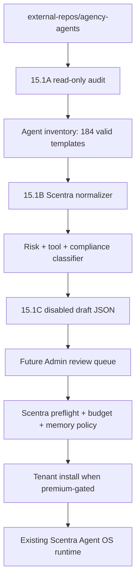
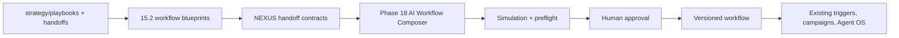
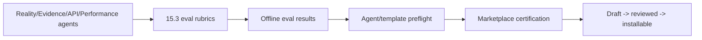

# AGENT_TEMPLATE_INTAKE

Scope: SaaS only.

Purpose: document how Scentra should safely use the local external repo at `external-repos/agency-agents/` without executing it or importing unsafe prompts directly.

## Current Source

- Local path: `external-repos/agency-agents/`
- License file detected: MIT
- Standalone Git metadata: not detected inside the folder
- Analysis mode: read-only
- Runtime integration: none

## Implemented Offline Pipeline

- Script: `saas-version/scripts/phase15-agent-template-intake.mjs`
- NEXUS/eval script: `saas-version/scripts/phase15-nexus-eval-harness.mjs`
- Output folder: `docs/phase15_1/`
- Runtime side effects: none
- Database writes: none
- External script execution: none

Generated artifacts:

- `agent_template_inventory.json`: normalized metadata for 184 valid agent files.
- `agent_template_inventory.csv`: compact review index.
- `agent_template_drafts.json`: 29 disabled draft metadata items.
- `agent_template_risk_report.md`: summary counts, selected drafts and guardrails.
- `nexus_handoff_contracts.json`: 7 offline handoff contracts from NEXUS templates.
- `nexus_playbooks.json`: 7 playbook blueprints and 4 scenario runbook blueprints.
- `agent_eval_rubrics.json`: 6 Scentra eval rubrics.
- `agent_eval_results.json`: eval results for 29 disabled draft templates.
- `phase15_2_15_3_report.md`: compact Phase 15.2/15.3 report.

## Intake Flow

## NEXUS / Workflow Flow

## Eval Flow

## Non-Negotiable Rules

- Do not execute external install or convert scripts.
- Do not install external agents globally into Codex, Claude, Gemini, Kimi or other tool folders.
- Do not run external plugin code in API/worker.
- Do not activate imported templates automatically.
- Do not map external `tools` fields directly to Scentra tool permissions.
- Preserve tenant isolation.
- Preserve one-AI-owner conversation behavior.
- Preserve existing preflight, budget, memory and approval governance.
- Preserve Meta template/quiet-hour/opt-out rules before any customer-facing message.

## Intake Checklist

- Source URL.
- Commit/tag or release version.
- LICENSE and attribution decision.
- Agent Markdown files.
- Strategy/playbook/handoff docs.
- Integration scripts.
- Examples.
- Contributor template/schema.
- Secret/data removal confirmation.

## Template Normalization Schema

Minimum normalized fields:

- `source_repo`
- `source_path`
- `source_license`
- `source_version`
- `name`
- `category`
- `industry`
- `role`
- `mission`
- `critical_rules`
- `workflow_steps`
- `deliverables`
- `success_metrics`
- `memory_policy`
- `approval_policy`
- `allowed_tools`
- `risk_level`
- `compliance_domain`
- `premium_pack`
- `draft_status`

## Output Artifacts

- Agent inventory JSON/CSV.
- Category-to-Scentra mapping.
- Risk matrix.
- Proposed import schema.
- Draft marketplace import plan.
- Eval rubric mapping.
- ADR before any runtime implementation.

## Phase 15.2/15.3 Runtime Boundary

The NEXUS and eval outputs are operational planning artifacts only:

- no Postgres insert
- no Admin endpoint
- no tenant-visible marketplace entry
- no active workflow
- no active agent
- no worker execution

They are intended to seed Phase 18 Workflow Composer and future marketplace certification after explicit approval.
