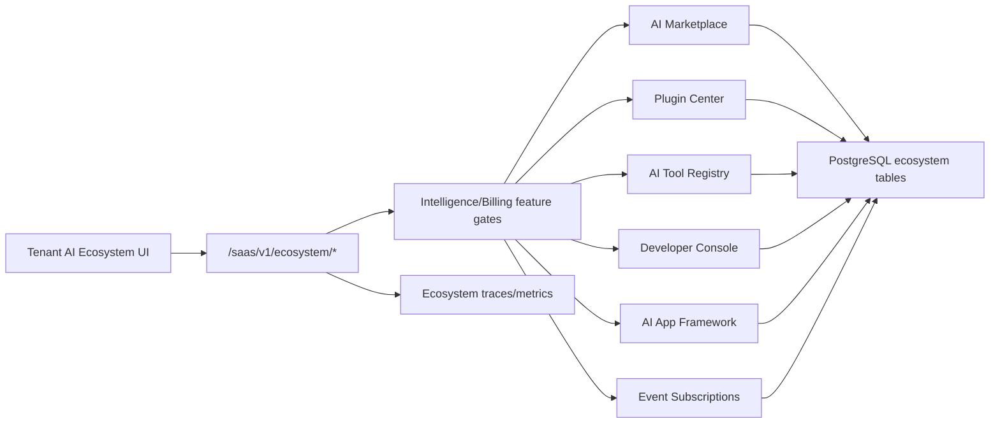
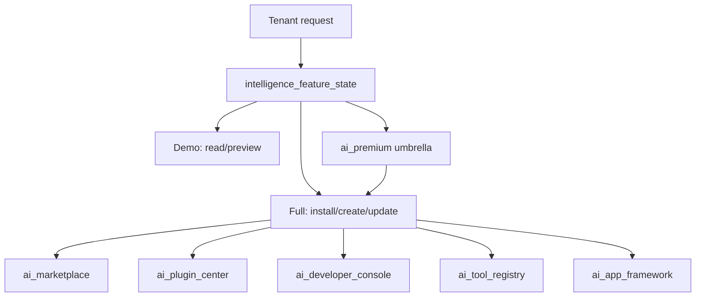

# AI Platform Ecosystem Architecture

Scope: SaaS only. Current implementation is Phase 11 AI Platform Ecosystem control-plane.

## Component Map

## Runtime Rules

- The ecosystem is a control-plane, not an untrusted code runtime.
- Plugin, tool, external integration and AI app manifests are stored as metadata.
- Mutations require full premium feature access. Demo mode can list/preview.
- Developer app API keys are hashed in DB and raw keys are returned once.
- Marketplace agent template installs can create agents only when explicitly requested and still use the existing `agents.service.create_from_template` path.

## Tables

- `saas_ai_marketplace_items`
- `saas_ai_marketplace_installations`
- `saas_ai_plugins`
- `saas_ai_tool_registry`
- `saas_ai_ecosystem_event_subscriptions`
- `saas_ai_developer_apps`
- `saas_ai_external_integrations`
- `saas_ai_apps`
- `saas_ai_ecosystem_traces`
- `saas_ai_ecosystem_metrics`

## Feature Gates

## Safety Boundary

- No direct Meta, WhatsApp, Instagram, CRM, billing or campaign side effects are executed by ecosystem plugin/app records.
- Tools with `medium` or `high` risk are metadata for approval-first execution through existing governed paths.
- Event subscriptions are persisted for future fanout/orchestration; they do not yet bypass Agent OS or worker approval logic.
