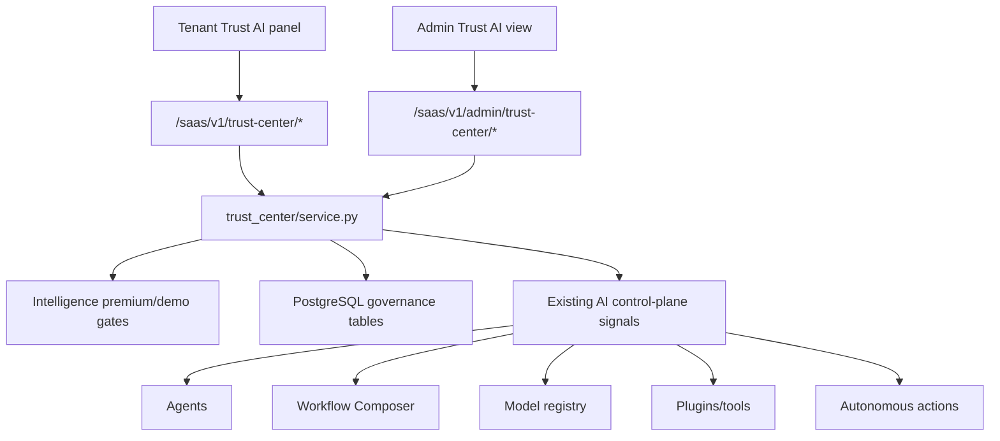
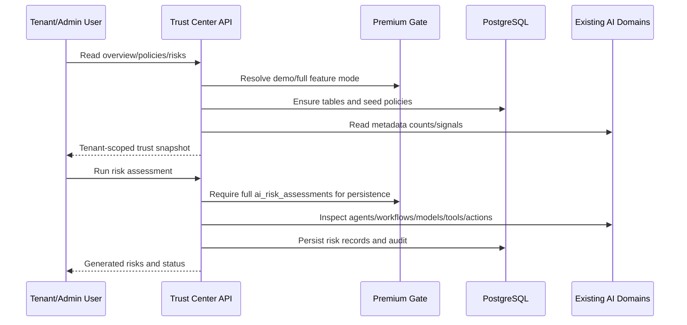

# AI Trust, Compliance & Governance

Scope: SaaS Phase 22. Code source is `saas-version/backend/app_saas/trust_center/` and migration `saas-version/migrations/058_saas_ai_trust_compliance_governance_phase22.sql`.

## Purpose

Phase 22 adds a tenant-scoped AI governance control-plane for policies, risk assessments, model cards, incidents, audit events and compliance report snapshots.

It is not an automatic enforcement runtime and not legal certification.

## Component Map

## Data Flow

## Tables

- `saas_ai_governance_policies`
- `saas_ai_governance_policy_attestations`
- `saas_ai_risk_assessments`
- `saas_ai_model_cards`
- `saas_ai_governance_incidents`
- `saas_ai_governance_reports`
- `saas_ai_governance_audits`

All records are tenant scoped through `tenant_id`.

## Feature Gates

- `ai_trust_center`: read/overview trust center.
- `ai_governance_policies`: policy creation/update/attestation.
- `ai_risk_assessments`: persisted risk scans and mitigation state.
- `ai_model_cards`: model card upsert/update.
- `ai_compliance_reports`: report snapshot generation.
- `ai_audit_exports`: audit listing/export capability.

Demo access can preview read-only surfaces. Full access is required for mutations.

## Safety Boundaries

- Risk scans do not pause or activate agents.
- Model cards do not promote or roll back models.
- Incidents do not trigger automatic self-healing.
- Reports do not certify legal compliance.
- Admin trust overview is read-only.
- No raw cross-tenant content is exported.

## Rollout Notes

1. Keep all flags disabled by default in plan limits.
2. Enable demo mode first for selected tenants.
3. Require full mode only after policy owner review.
4. Run risk assessment and generate a report before enabling higher autonomy or marketplace execution.
5. Treat legal/compliance statements as operational evidence, not formal certification.
