# API_FLOW

Scope: SaaS only.

## Request Flow

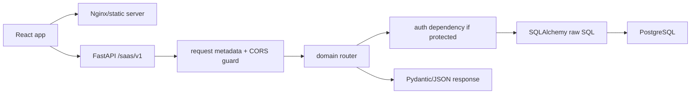

## Router Mounting

`app_saas.main` mounts domain routers with prefix `/saas/v1`.

Important router groups:

- auth/admin/tenants
- verticals
- CRM/campaigns/broadcasts/ads/social
- integrations/internal/webhooks/media
- billing
- api-credentials/ai-gateway/ai/agents/advisor/knowledge
- intelligence
- compliance
- diagnostics/health
- admin observability/dead-letter/operations

## Observability Flow

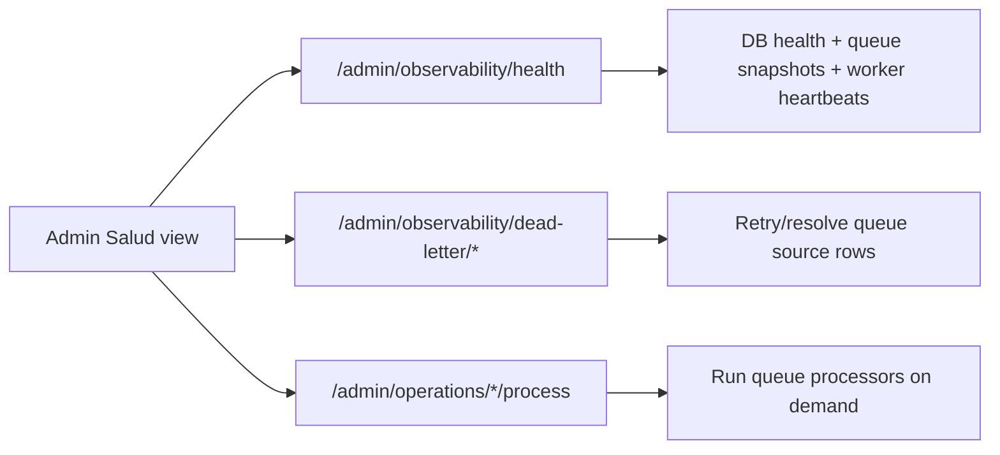

## Reliability Phase 12 API Flow

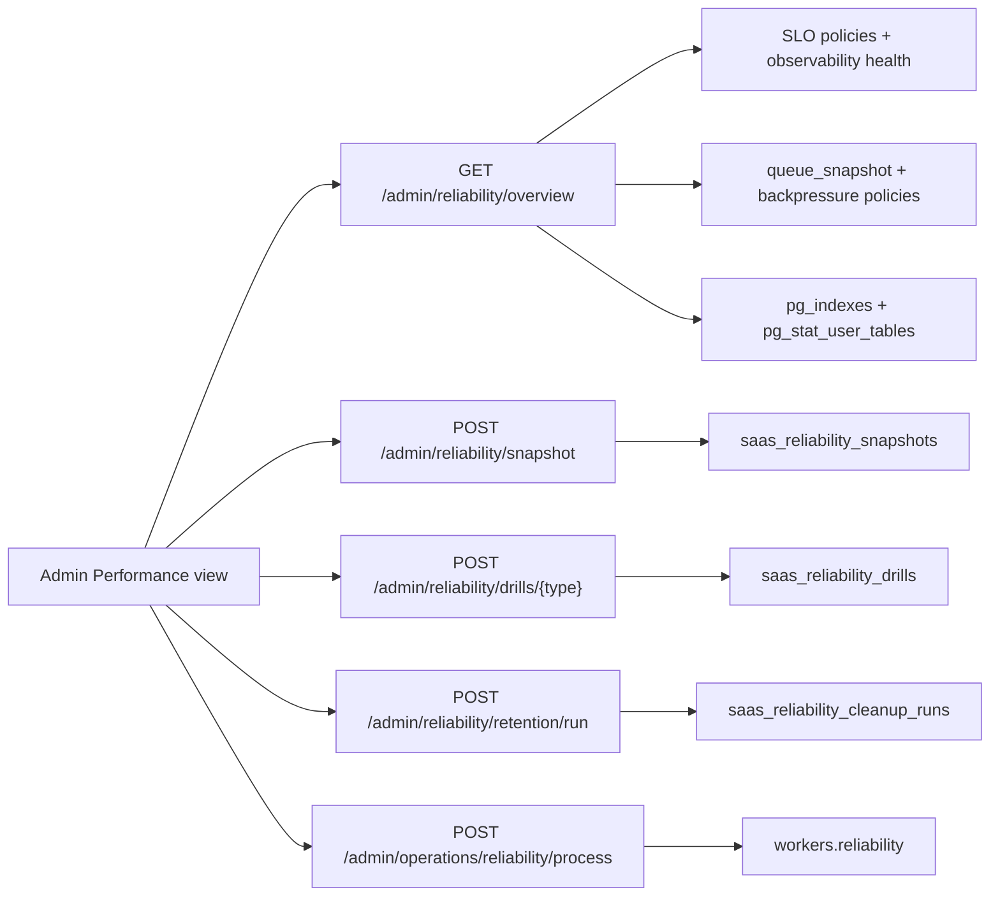

- Reliability APIs are platform-admin scoped and control-plane first.
- Retention defaults to dry-run; destructive cleanup is role-gated and allowlisted by backend service code.

## Security/Compliance Phase 13 API Flow

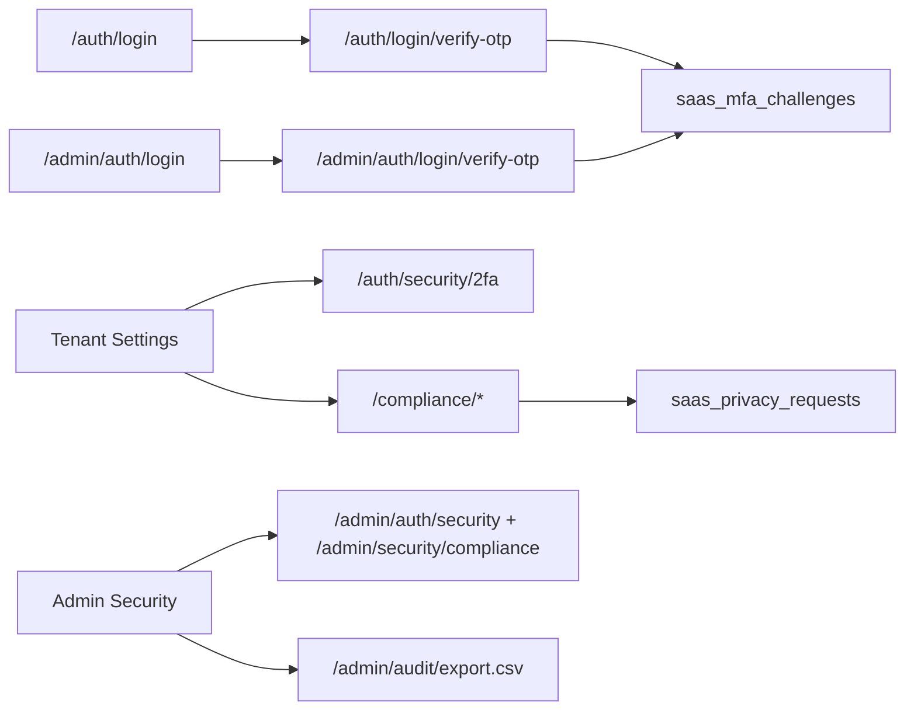

- MFA and compliance APIs are backend-authoritative and tenant/platform role scoped.
- Delete requests are workflow records; no automatic hard-delete API was added.

## Inbox API Flow

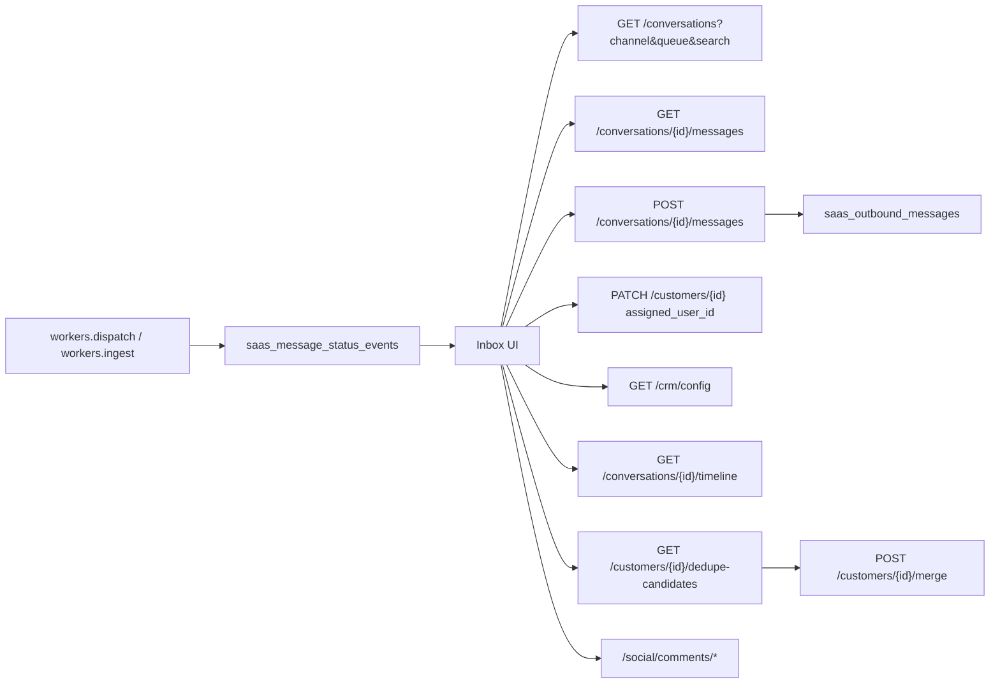

## Knowledge/RAG API Flow

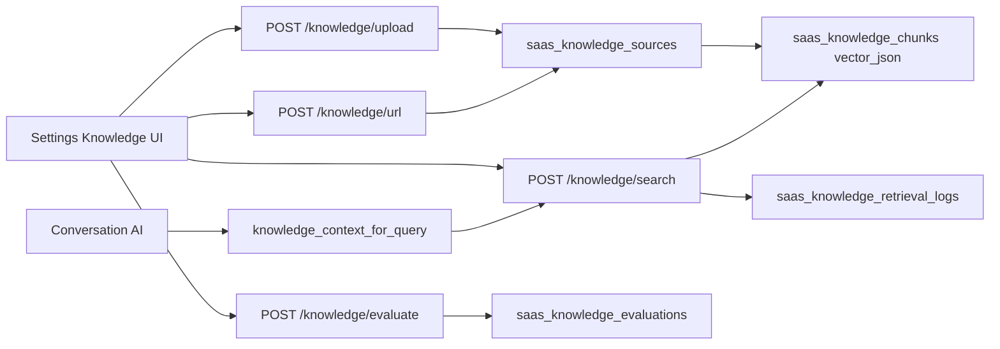

## Billing Phase 9 API Flow

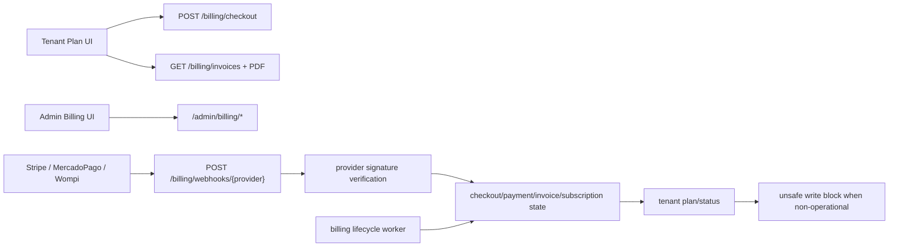

## Verticalization Phase 10 API Flow

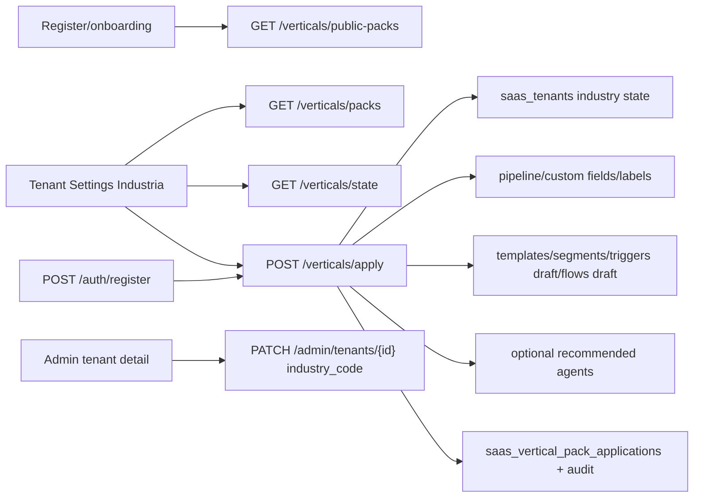

## Campaigns Phase 7 API Flow

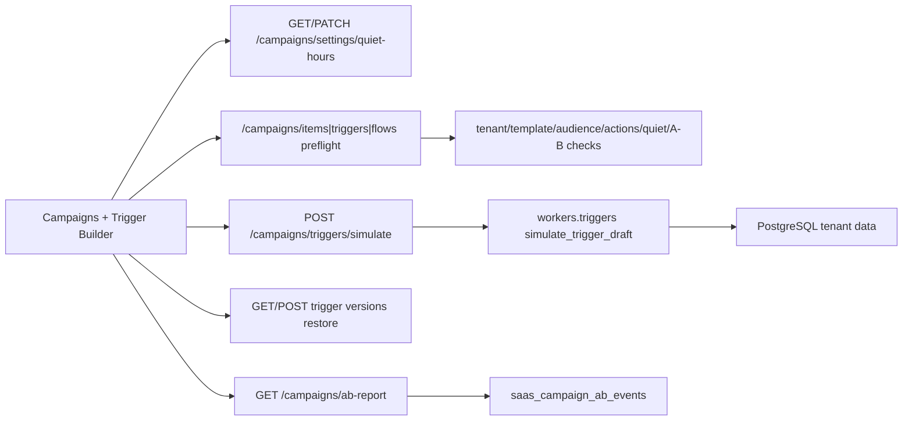

## AI Agents Phase 8 API Flow

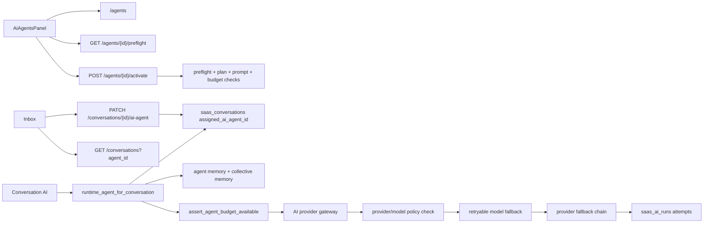

- Conversation AI, assigned/custom agents and Advisor use the same `generate_with_gateway` resilience path.
- Retryable model/provider failures can fall through to another allowed model/provider; provider policies, missing credentials and agent budget checks are still enforced before calls.

## Phase 24.1 Multimodal Gateway Flow

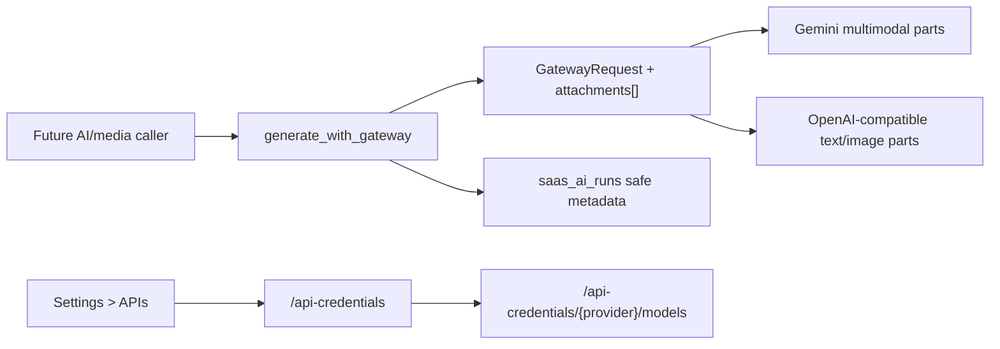

- Existing text-only gateway callers keep the same contract.
- Attachments are internal only in 24.1; no public media-analysis endpoint was added.
- Run logs never store raw base64 or media bytes.

## Phase 24.2 Voice Intelligence API Flow

```mermaid
flowchart LR
  Client["Inbox audio card"] --> Analyze["POST /media/messages/{message_id}/voice/analyze"]
  Analyze --> Role["tenant role gate"]
  Role --> Feature["voice feature gate + demo/full mode"]
  Feature --> Message["tenant audio message lookup"]
  Message --> Source["local media or WhatsApp media"]
  Source --> Gateway["generate_with_gateway attachments"]
  Gateway --> Gemini["Google/Gemini"]
  Gemini --> VoiceDb["saas_voice_intelligence_analyses"]
  VoiceDb --> MessagePayload["saas_messages.payload_json.voice_intelligence"]
  VoiceDb --> Event["message.audio.analyzed"]
```

- The endpoint analyzes existing tenant audio messages only.
- Cached completed analysis is reused unless `force=true`.
- Output is advisory and does not mutate CRM, campaigns, agents, workflows or outbound messaging.

## Phase 24.3 Vision Intelligence API Flow

```mermaid
flowchart LR
  Client["Inbox image/document card"] --> Analyze["POST /media/messages/{message_id}/vision/analyze"]
  Analyze --> Role["tenant role gate"]
  Role --> Feature["vision feature gate + demo/full mode"]
  Feature --> Message["tenant visual/document message lookup"]
  Message --> Source["local media or WhatsApp media"]
  Source --> Gateway["generate_with_gateway attachments"]
  Gateway --> Provider["Gemini image/document path<br/>OpenRouter/Kimi image path"]
  Provider --> VisionDb["saas_vision_intelligence_analyses"]
  VisionDb --> MessagePayload["saas_messages.payload_json.vision_intelligence"]
  VisionDb --> Event["message.visual.analyzed"]
```

- The endpoint analyzes existing tenant image/document/file messages only.
- Cached completed analysis is reused unless `force=true`.
- Output is advisory and does not search the web, send media, mutate CRM, campaigns, agents, workflows or outbound messaging.

## Phase 24.4 Web/Image Search Intelligence API Flow

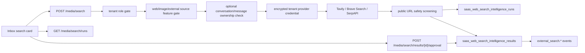

- The endpoint searches external providers only after an explicit user query.
- Results are persisted as pending/rejected/approved source records.
- Blocked/unsafe results cannot be approved.
- Output is advisory and does not crawl result pages, send links/images, mutate CRM, campaigns, agents, workflows or outbound messaging.

## Phase 24.5 Agent Multimodal Tools API Flow

```mermaid
flowchart LR
  AgentUI["AI Agents > Agent OS"] --> Execute["POST /agents/{agent_id}/multimodal-tools/execute"]
  Execute --> Role["tenant role gate"]
  Role --> Agent["tenant agent + tools_json check"]
  Agent --> Feature["agent multimodal feature gate"]
  Feature --> ToolRun["saas_ai_agent_tool_runs"]
  ToolRun --> Media["existing media/search endpoint"]
  Media --> Output["completed/failed compact output"]
  Output --> Prompt["assigned-agent prompt context"]
```

- Voice/vision tools require an existing tenant Inbox message id.
- Web/image search results still require per-source approval before agent prompt use.
- The endpoint records traces only; it does not send messages, mutate CRM, launch campaigns or execute workflows.

## Phase 24.6 Multimodal Memory API Flow

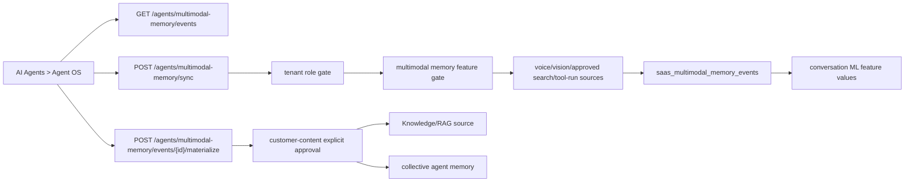

- Sync stores sanitized text/features only; no raw media/base64 is persisted.
- Training-ready flags require `multimodal_training_events`, `ml_predictions`, or `ai_premium`.
- Materialization can write to Knowledge/RAG and/or collective memory only after operator action.
- The API does not send customer messages, mutate CRM, launch campaigns, execute workflows, assign agents or train models automatically.

## Phase 24.8 Admin Premium Gating API Flow

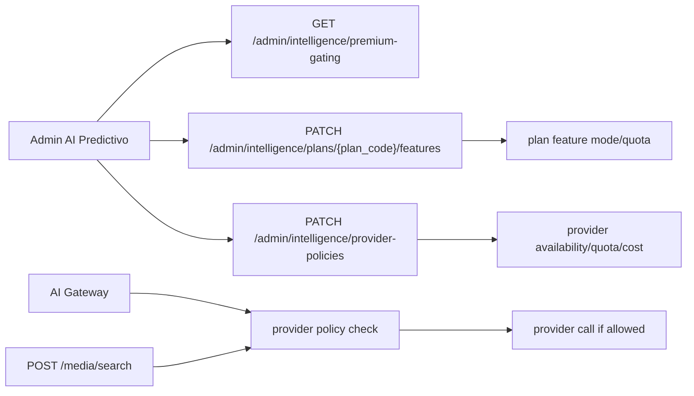

- Admin routes are platform-admin scoped; plan/provider mutations require platform/billing admin roles.
- Tenant grants remain more specific than plan limits.
- Provider policies can block provider/model usage or enforce positive monthly request/cost limits before external calls.
- The API returns credential readiness counts and estimated costs only; decrypted secrets are never returned.

## Phase 19/20 Revenue And Memory API Flow

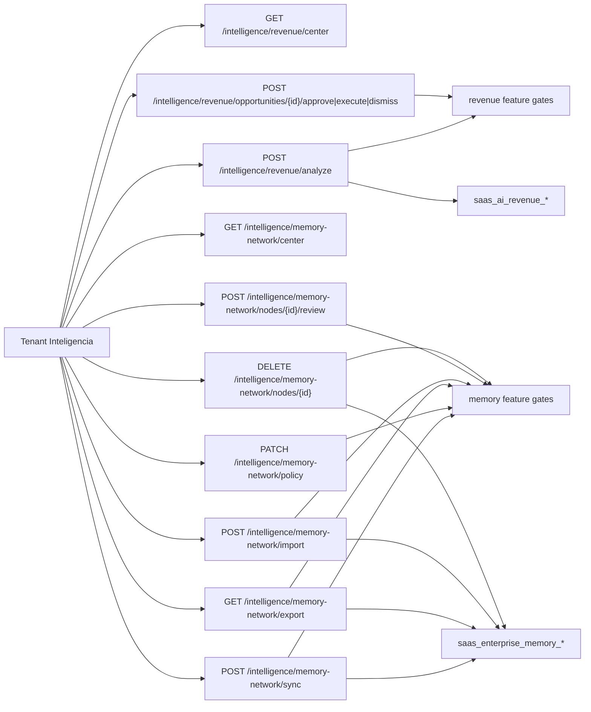

- Demo mode can preview center/dry-run data; full mode is required for persistence and status changes.
- Revenue actions are control-plane records only and do not send messages, charge customers or mutate CRM/campaign/workflow runtime.
- Memory review changes graph node status only; prompt/RAG consumers should read published tenant nodes after routing review.

## Phase 24.9-24.10 Multimodal Observability And Rollout API Flow

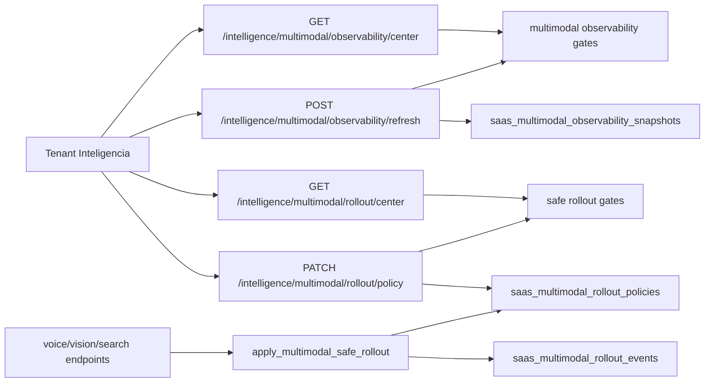

- Observability reads aggregate metrics and optional snapshots only.
- Rollout mutation is tenant-scoped and role-gated through the existing Intelligence router/auth path.
- Runtime enforcement is opt-in: no explicit enabled policy means compatibility behavior.

## Phase 17 Federated Learning API Flow

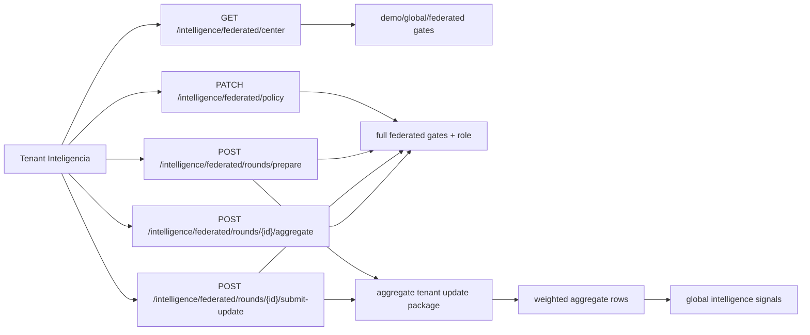

- Federated center can show safe previews in demo/read mode.
- Persisted policy/update/aggregation operations require owner/admin/supervisor and full premium feature access.
- API responses never include raw cross-tenant content, tenant names from other tenants, media/base64, prompts or decrypted secrets.

## Intelligence Phase 11 API Flow

```mermaid
flowchart LR
  Admin["Admin AI Predictivo"] --> AdminAPI["/admin/intelligence/*"]
  Admin --> Ops["/admin/operations/intelligence/process"]
  Tenant["Tenant Inteligencia UI/API"] --> TenantAPI["/intelligence/*"]
  CrmBilling["CRM send + Billing state changes"] --> Inline["record_inline_event"]
  Inline --> Events
  Worker["worker/intelligence.py"] --> Events
  Ops --> Worker
  AdminAPI --> Grants["saas_intelligence_feature_grants"]
  AdminAPI --> Registry["saas_intelligence_model_registry"]
  AdminAPI --> RolloutEvents["saas_intelligence_model_rollout_events"]
  TenantAPI --> Events["saas_intelligence_events"]
  TenantAPI --> Features["feature recompute/read"]
  Features --> Predictions["saas_intelligence_predictions"]
  Predictions --> Feedback["prediction feedback"]
  Feedback --> ModelMetrics["model metrics"]
  ModelMetrics --> Registry
  Registry --> Predictions
  AdminAPI --> ModelMetrics
  Predictions --> Recs["saas_intelligence_recommendations"]
  Recs --> Advisor["advisor_context"]
  Billing["plan flags + tenant flags"] --> Grants
  Billing --> TenantAPI
```

## AI Trust Phase 22 API Flow

```mermaid
flowchart LR
  TenantUI["Tenant Trust AI"] --> TenantAPI["/trust-center/*"]
  AdminUI["Admin Trust AI"] --> AdminAPI["/admin/trust-center/*"]
  TenantAPI --> Gates["premium/demo gates"]
  AdminAPI --> Snapshot["read-only platform snapshot"]
  Gates --> Policies["governance policies + attestations"]
  Gates --> Risks["risk assessments"]
  Gates --> Cards["model cards"]
  Gates --> Incidents["governance incidents"]
  Gates --> Reports["compliance reports"]
  Gates --> Audits["governance audits"]
  Risks --> Signals["agents/workflows/models/tools/plugins/actions metadata"]
  Reports --> Audits
  AdminAPI --> Audits
```

## Real-Time Intelligence Phase 16 API Flow

```mermaid
flowchart LR
  TenantUI["Tenant Inteligencia"] --> Center["GET /intelligence/realtime/center"]
  TenantUI --> Events["GET /intelligence/realtime/events"]
  TenantUI --> Session["POST /intelligence/realtime/sessions"]
  TenantUI --> Cursor["PATCH /intelligence/realtime/cursor"]
  TenantUI --> Stream["GET /intelligence/realtime/stream"]
  AdminUI["Admin AI Predictivo"] --> AdminRt["GET /admin/intelligence/realtime"]
  AdminUI --> Refresh["POST /admin/intelligence/realtime/metrics/refresh"]
  Center --> Gates["realtime_* feature gates"]
  Session --> Gates
  Cursor --> Gates
  Gates --> RtState["sessions + cursors"]
  Center --> Signals["events + predictions + recommendations + ops + trust"]
  Events --> Sanitizer["payload redaction"]
  Refresh --> Snapshots["saas_realtime_intelligence_metrics"]
  AdminRt --> Snapshots
```

- Tenant realtime APIs are tenant-scoped and premium/demo gated.
- Event payloads are sanitized before reaching the tenant UI.
- Admin metric refresh writes only snapshot rows; it does not process queues, send messages, repair Meta, mutate CRM, activate workflows or promote models.

## Compatibility Rule

Any endpoint documented for SaaS must exist under `saas-version/backend/app_saas` and be mounted in `main.py`.
