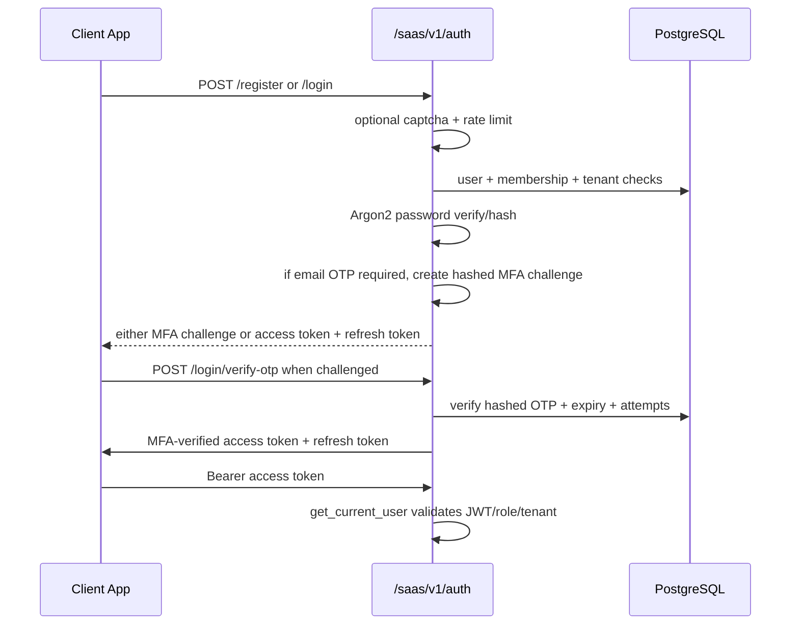
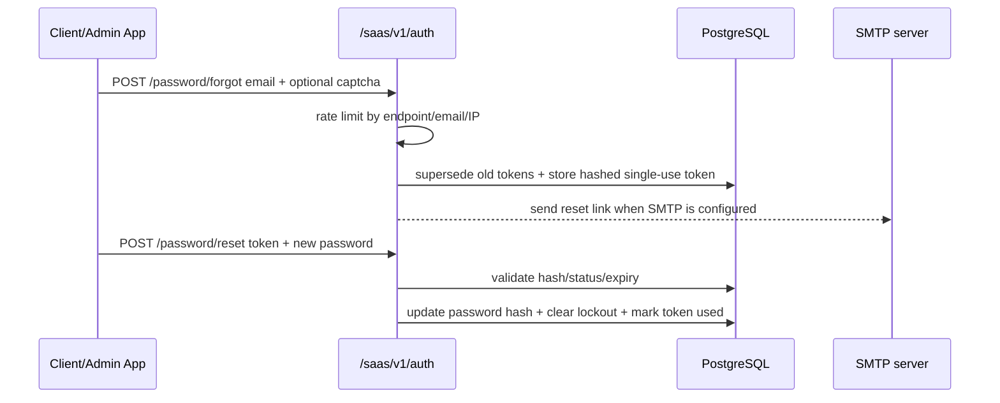
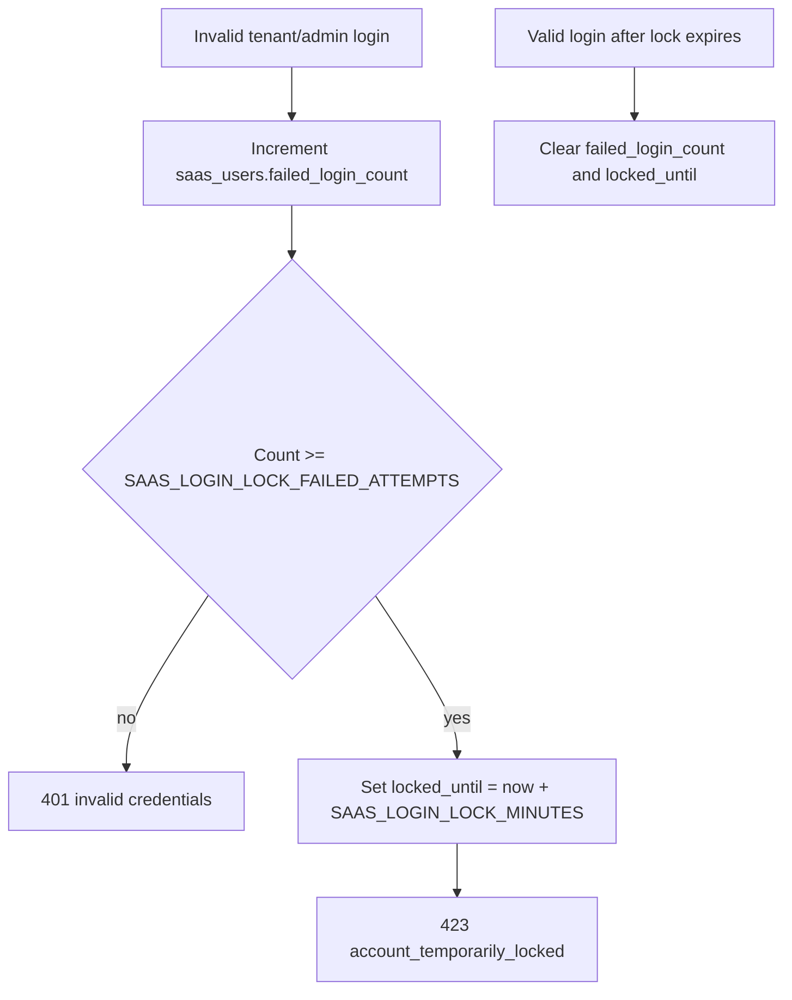
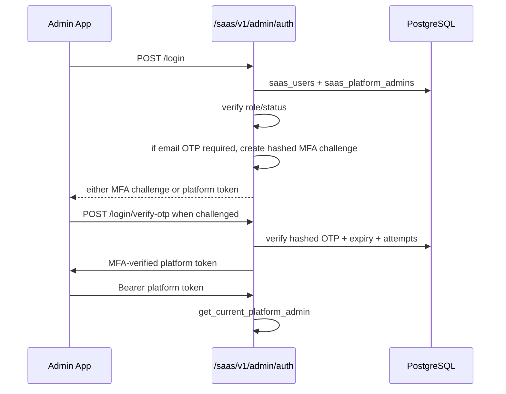
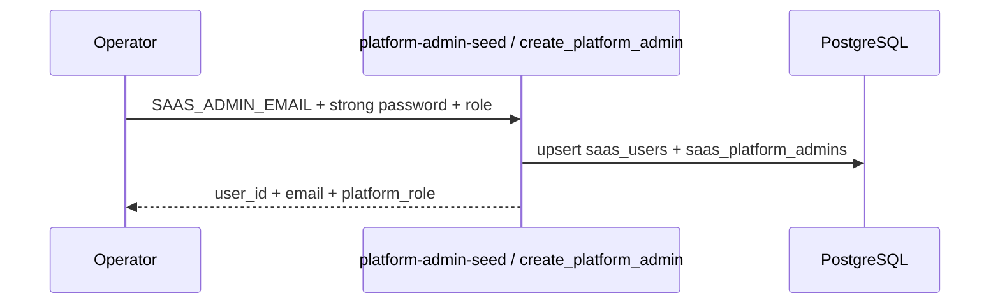

# AUTH_FLOW

Scope: SaaS only.

## Tenant User Auth

## Password Recovery

## Account Lockout

## Platform Admin Auth

## First Platform Admin Seed

## Rules

- Tenant roles and platform roles are separate.
- Tenant JWT must include tenant context.
- Platform admin privileges must not imply tenant membership unless impersonation flow explicitly handles it.
- Password hashing uses Argon2.
- JWT uses HS256 with configured issuer/secret.
- CAPTCHA is enforced server-side when enabled; frontend widgets are not trusted alone.
- Phase 13 supports email OTP MFA challenges for tenant/admin login. TOTP/authenticator apps are not implemented.
- HTTP admin bootstrap is local-only; production first-admin creation must use the seed tool/service.
