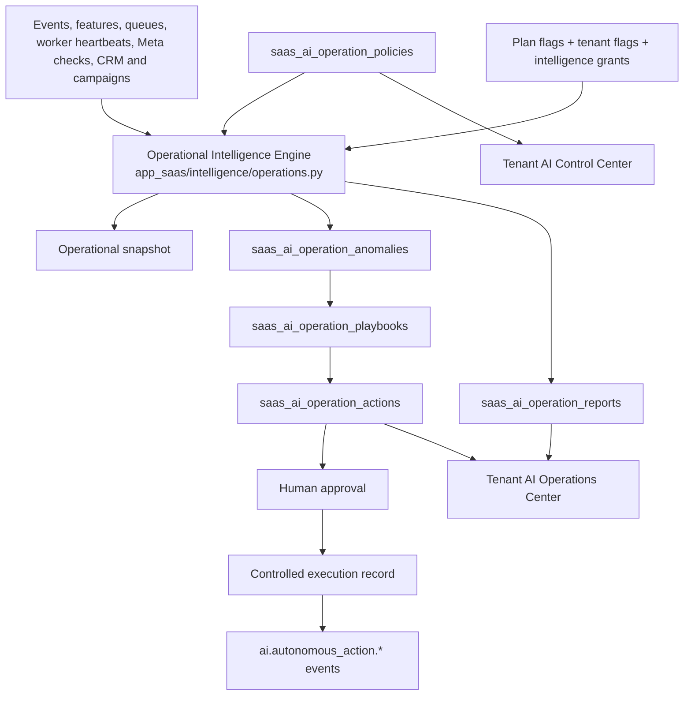
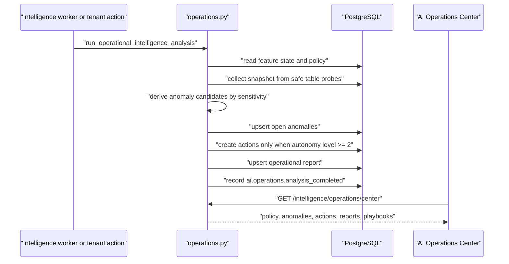

# Autonomous Operational Intelligence

Scope: SaaS only. Source of truth is `saas-version/`.

## Purpose

Phase 11 now includes a supervised autonomous operations layer. It detects operational risks, creates playbook-driven recommendations, prepares human-approved actions, and records controlled executions without bypassing existing Meta, CRM, billing, worker, or approval flows.

## System Map

## Autonomy Levels

- Level 0: insights only.
- Level 1: recommendations and playbook suggestions.
- Level 2: suggested actions requiring human approval.
- Level 3: semi-autonomous preparation with rollback metadata.
- Level 4: controlled low-risk/report-only execution when full mode and tenant policy allow it.

Critical and provider-impacting actions remain approval-first. Current execution records a controlled result and does not directly mutate Meta subscriptions, tokens, queues, campaigns, or CRM records.

## Detection Flow

## Self-Healing Safety

Implemented playbooks are control-plane records:

- webhook retry plan
- outbound queue triage
- Meta subscription review
- Meta token health review
- trigger timing optimization
- campaign send-time optimization
- churn recovery
- lead prioritization report
- queue degradation triage

Only report-only/low-risk actions can be marked executed automatically at Level 4, and only in full mode with `low_risk_auto_execute=true`. High/medium risk remediation remains approval-first.

## Premium Gating

Feature flags added in migration `052` and default billing limits:

- `autonomous_operations`
- `ai_self_healing`
- `ai_control_center`

Access modes:

- Disabled: center is read-limited and analysis is blocked.
- Demo: previews and analysis are allowed, but auto-remediation and auto-execute are forced off.
- Full: policy can enable higher autonomy within tenant limits.

`ai_premium` can act as umbrella full access according to the existing Intelligence feature-state resolver.

## API Flow

Tenant endpoints under `/saas/v1`:

- `GET /intelligence/operations/center`
- `PATCH /intelligence/operations/control`
- `POST /intelligence/operations/analyze`
- `GET /intelligence/operations/actions`
- `POST /intelligence/operations/actions/{action_id}/approve`
- `POST /intelligence/operations/actions/{action_id}/execute`
- `POST /intelligence/operations/actions/{action_id}/dismiss`

Read endpoints require tenant auth. Mutation/analyze/action endpoints require owner/admin/supervisor.

## Worker Flow

The Intelligence worker calls autonomous analysis after feature/prediction/Agent OS sync in a nested transaction. Failures are appended to the worker result and must not abort existing Intelligence, Meta, CRM, trigger, or webhook processing.

The worker totals now include:

- `autonomous_anomalies`
- `autonomous_actions`

## Tables

Migration: `saas-version/migrations/052_saas_autonomous_operational_intelligence_phase11.sql`.

- `saas_ai_operation_policies`
- `saas_ai_operation_playbooks`
- `saas_ai_operation_anomalies`
- `saas_ai_operation_actions`
- `saas_ai_operation_reports`

All tables are tenant-scoped. Actions and policies reference tenant users where approval or updates are user-driven.

## Frontend Surfaces

Tenant `Inteligencia` now includes:

- AI Operations Center
- AI Control Center
- Autonomous actions
- Operational reports

The UI can preview/analyze operations, update autonomy policy, approve/execute/dismiss action records, and inspect anomalies/playbooks/reports.

## Guardrails

- Do not add direct provider-side self-healing without an explicit ADR and staging acceptance.
- Do not bypass tenant feature gates, quotas, role checks, or approval states.
- Do not allow demo mode to persist auto-remediation or low-risk auto-execute.
- Keep every action auditable with evidence, confidence, rollback metadata and event records.
- Keep worker analysis idempotent and duplicate-safe.
