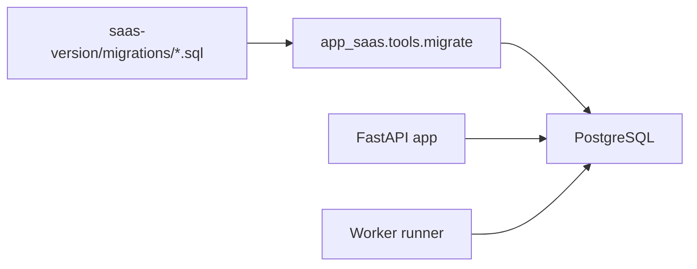
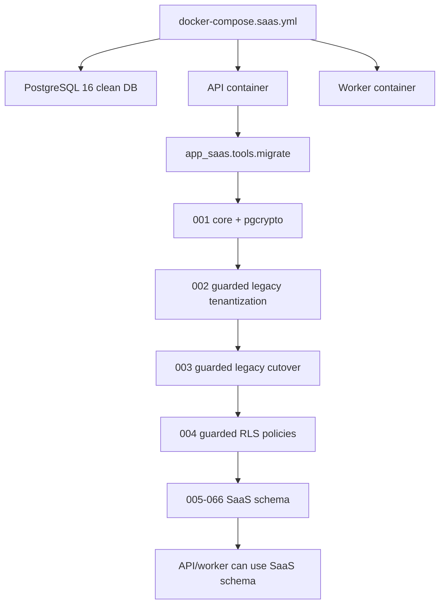
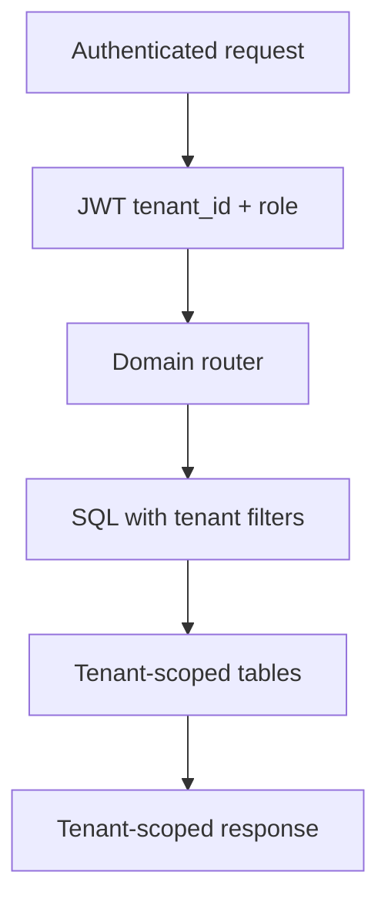
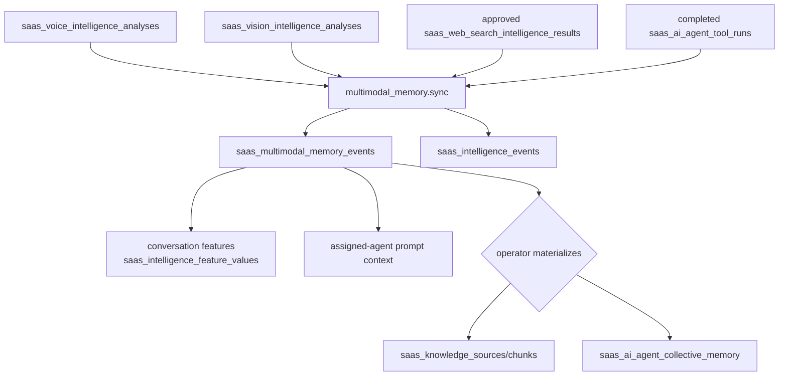
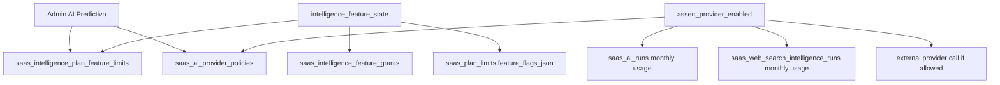
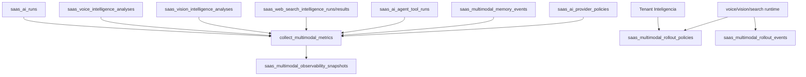
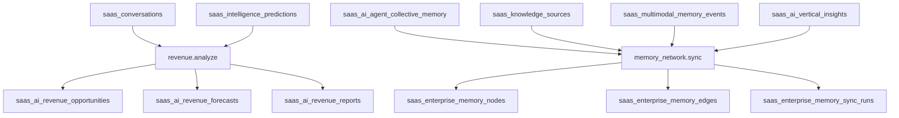
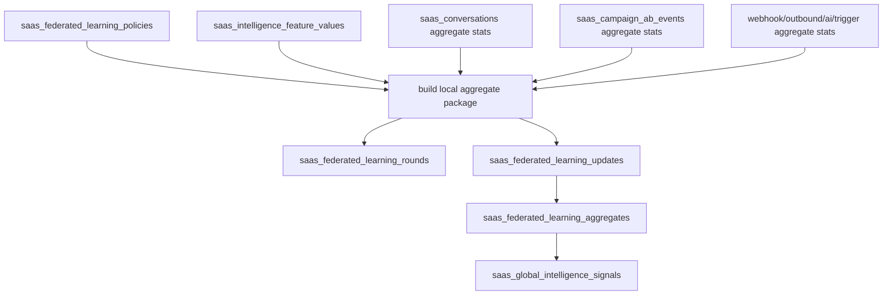

# DB_FLOW

Scope: SaaS only.

## Migration Flow

## Clean Bootstrap Flow

## Tenant Data Flow

## DB Rules

- Migrations are the first schema source.
- Runtime SQL can also create/check tables; inspect service code.
- Keep explicit tenant filters.
- Preserve `tenant_id` columns and indexes in tenant-scoped data.
- Treat non-prefixed social tables as collision risk in shared schemas.
- Clean bootstrap depends on guarded legacy migrations because root legacy tables are not present in a SaaS-only PostgreSQL schema.
- Phase 3 observability depends on `saas_worker_heartbeats` and correlation IDs across queue/dead-letter tables.
- Phase 5 commercial CRM depends on `saas_crm_custom_fields`, `saas_crm_pipelines`, `saas_crm_pipeline_stages`, `saas_crm_timeline_events`, and `saas_crm_merge_events`; values live on `saas_conversations.profile_json.custom_fields`.
- Phase 6 Knowledge/RAG depends on `saas_knowledge_sources`, `saas_knowledge_chunks.vector_json`, `saas_knowledge_retrieval_logs`, and `saas_knowledge_evaluations`.
- Phase 7 Campaigns depends on `saas_crm_triggers`, `saas_crm_trigger_versions`, `saas_campaign_preflight_runs`, `saas_remarketing_flows`, `saas_campaign_quiet_hours`, and `saas_campaign_ab_events`.
- Phase 8 AI Agents depends on `saas_ai_agents`, `saas_ai_agent_evals`, `saas_ai_agent_collective_memory`, `saas_ai_agent_memory_archives`, and `saas_conversations.assigned_ai_agent_id`/`ai_owner_mode`.
- Phase 9 Billing depends on `saas_billing_subscriptions`, `saas_billing_invoices`, `saas_billing_checkout_sessions`, `saas_billing_provider_events`, `saas_billing_payments`, and lifecycle notice/PDF fields from migration `044`.
- Phase 10 Verticalization depends on `saas_tenants.industry_code`, `vertical_pack_*` tenant fields, and `saas_vertical_pack_applications`; pack application also writes existing CRM/campaign/agent tables.
- Phase 11 Intelligence depends on `saas_intelligence_events`, `saas_intelligence_event_contracts`, `saas_intelligence_event_replay_cursors`, `saas_intelligence_feature_values`, `saas_intelligence_predictions`, `saas_intelligence_prediction_feedback`, `saas_intelligence_model_metrics`, `saas_intelligence_model_rollout_events`, `saas_intelligence_recommendations`, `saas_intelligence_feature_grants`, `saas_intelligence_model_registry`, `saas_intelligence_usage`, `saas_ml_training_jobs`, `saas_ml_model_artifacts`, `saas_ml_inference_runs`, `saas_ml_drift_snapshots`, `saas_ml_auto_labels`, `saas_ml_feature_sets`, `saas_ml_feature_pipeline_runs`, `saas_ml_training_datasets`, `saas_ml_model_evaluations`, `saas_ai_operation_policies`, `saas_ai_operation_playbooks`, `saas_ai_operation_anomalies`, `saas_ai_operation_actions`, `saas_ai_operation_reports`, `saas_ai_marketplace_items`, `saas_ai_marketplace_installations`, `saas_ai_plugins`, `saas_ai_tool_registry`, `saas_ai_ecosystem_event_subscriptions`, `saas_ai_developer_apps`, `saas_ai_external_integrations`, `saas_ai_apps`, `saas_ai_ecosystem_traces`, `saas_ai_ecosystem_metrics`, `saas_ai_vertical_industry_models`, `saas_ai_vertical_benchmarks`, `saas_ai_vertical_tenant_benchmarks`, `saas_ai_vertical_insights`, `saas_ai_vertical_playbooks`, `saas_ai_knowledge_network`, and `saas_ai_network_metrics`.
- Phase 12 Reliability depends on `saas_reliability_slo_policies`, `saas_reliability_backpressure_policies`, `saas_reliability_retention_policies`, `saas_reliability_cleanup_runs`, `saas_reliability_snapshots`, `saas_reliability_drills`, plus expected indexes on webhook/outbound/trigger/AI/remarketing/agent/conversation/message/intelligence/audit tables.
- Phase 13 Security/Compliance depends on `saas_mfa_challenges`, `saas_privacy_requests`, `saas_users.two_factor_*`, `saas_security_events`, and `saas_audit_events`.
- Phase 18 Workflow Composer depends on `saas_ai_workflow_templates`, `saas_ai_workflows`, `saas_ai_workflow_versions`, `saas_ai_workflow_simulations`, `saas_ai_workflow_approvals`, and `saas_ai_workflow_materializations`.
- Phase 22 Trust AI depends on `saas_ai_governance_policies`, `saas_ai_governance_policy_attestations`, `saas_ai_risk_assessments`, `saas_ai_model_cards`, `saas_ai_governance_incidents`, `saas_ai_governance_reports`, and `saas_ai_governance_audits`.
- Phase 16 Real-Time Intelligence depends on `saas_realtime_intelligence_sessions`, `saas_realtime_intelligence_cursors`, `saas_realtime_intelligence_metrics`, and existing Phase 11/22 signal tables such as `saas_intelligence_events`, `saas_intelligence_predictions`, `saas_intelligence_recommendations`, `saas_ai_operation_anomalies`, `saas_ai_operation_actions`, `saas_ai_governance_incidents`, and `saas_ai_risk_assessments`.
- Phase 24.2 Voice Intelligence depends on `saas_voice_intelligence_analyses`, `saas_messages.payload_json`, `saas_media_assets` for local audio, existing Meta integration media helpers for WhatsApp audio, AI Gateway run tables and Intelligence feature/usage gates.
- Phase 24.3 Vision Intelligence depends on `saas_vision_intelligence_analyses`, `saas_messages.payload_json`, `saas_media_assets` for local images/documents, existing Meta integration media helpers for WhatsApp media, AI Gateway run tables and Intelligence feature/usage gates.
- Phase 24.4 Web/Image Search Intelligence depends on `saas_web_search_intelligence_runs`, `saas_web_search_intelligence_results`, encrypted `saas_api_credentials` for tenant search providers, existing conversation/message ownership tables, and Intelligence feature/usage gates.
- Phase 24.5 Agent Multimodal Tools depends on existing `saas_ai_agent_tool_runs`, `saas_ai_agents.tools_json`, Phase 24 media/search analysis tables, encrypted provider/search credentials, and Intelligence feature/usage gates.
- Phase 24.6 Multimodal Memory & Training Events depends on `saas_multimodal_memory_events`, Phase 24 voice/vision/search tables, Agent OS tool-run traces, `saas_intelligence_events`, `saas_intelligence_feature_values`, Knowledge sources, collective agent memory and Intelligence feature/usage gates.
- Phase 24.8 Admin/Premium Gating depends on `saas_intelligence_plan_feature_limits`, `saas_ai_provider_policies`, `saas_plan_limits`, `saas_intelligence_feature_grants`, `saas_ai_runs`, `saas_web_search_intelligence_runs` and encrypted `saas_api_credentials` summaries.
- Phase 24.9/24.10 Observability/Safe Rollout depends on `saas_multimodal_observability_snapshots`, `saas_multimodal_rollout_policies`, `saas_multimodal_rollout_events`, Phase 24 voice/vision/search/memory/tool tables, `saas_ai_runs`, `saas_ai_provider_policies` and Intelligence feature/usage gates.
- Phase 19 Autonomous Revenue Engine depends on `saas_ai_revenue_policies`, `saas_ai_revenue_opportunities`, `saas_ai_revenue_forecasts`, `saas_ai_revenue_experiments`, `saas_ai_revenue_reports`, `saas_conversations`, `saas_intelligence_predictions`, `saas_intelligence_events`, `saas_intelligence_usage` and Intelligence feature/usage gates.
- Phase 20 AI Enterprise Memory Network depends on `saas_enterprise_memory_policies`, `saas_enterprise_memory_nodes`, `saas_enterprise_memory_edges`, `saas_enterprise_memory_sync_runs`, `saas_enterprise_memory_access_logs`, collective agent memory, Knowledge/RAG sources, multimodal memory events, vertical insights and Intelligence feature/usage gates. Policy changes now enforce allowed scopes, retention and customer-content review against existing active nodes; import/export/delete reuse the same tables and access logs without adding new schema.

## Phase 24.6 Multimodal Memory DB Flow

Notes:

- `replay_key` deduplicates captured memory events by source kind/source id.
- `eligible_for_training` is false unless `multimodal_training_events`, `ml_predictions`, or `ai_premium` is enabled.
- Customer-content materialization to Knowledge/RAG or collective memory requires explicit approval from the operator payload.
- Local Compose validation should use one SaaS project per external `coolify` network to avoid service alias collisions.

## Phase 24.8 Admin/Premium Gating DB Flow

Notes:

- Tenant grants have highest priority over plan feature limits.
- Provider policy scope resolves tenant, plan, global, then compatibility default allow.
- Monthly request/cost limits are enforced only when Admin configures a positive limit.

## Phase 24.9-24.10 Multimodal Observability And Rollout DB Flow

Notes:

- Snapshot rows store aggregate metrics/metadata only.
- Rollout policy rows are tenant-scoped and disabled until explicitly enabled.
- Rollout events store decision metadata and do not trigger side effects.

## Phase 19/20 Revenue And Memory DB Flow

Notes:

- Revenue opportunity execution is a status/audit update only.
- Memory graph nodes remain tenant-scoped and reviewable before prompt/RAG consumption.

## Phase 17 Federated Learning DB Flow

Notes:

- Update rows contain aggregate metrics, feature summaries, quality score, privacy metadata and hashes only.
- Aggregates require minimum participant/sample thresholds before active global signals.
- Model promotion is not automatic and remains outside the DB flow.
