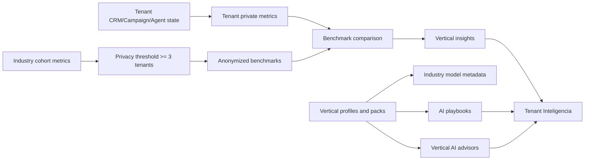
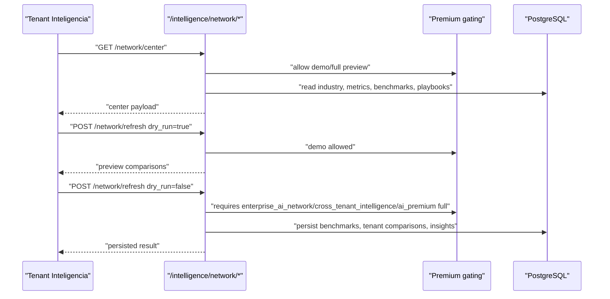

# Enterprise AI Network Architecture

Scope: SaaS only. Implemented in Phase 11 closeout.

## Purpose

Scentra Enterprise AI Network adds privacy-safe vertical intelligence over the existing Intelligence Engine. It provides:

- industry-specific AI models metadata and routing hints
- anonymized industry benchmarks
- tenant benchmark comparisons
- vertical AI advisors
- AI playbook library
- AI knowledge network
- recommendation network based on industry + tenant behavior

It does not share raw messages, full conversations, tenant names, private content, or sensitive data across tenants.

## Data Flow

## Storage

Migration: `saas-version/migrations/054_saas_enterprise_ai_network_phase11.sql`.

- `saas_ai_vertical_industry_models`: model metadata and routing policy per industry/task.
- `saas_ai_vertical_benchmarks`: privacy-safe aggregate industry metrics.
- `saas_ai_vertical_tenant_benchmarks`: tenant-vs-industry comparisons.
- `saas_ai_vertical_insights`: tenant-scoped vertical insights.
- `saas_ai_vertical_playbooks`: published sector playbooks/templates.
- `saas_ai_knowledge_network`: aggregate-only best-practice nodes.
- `saas_ai_network_metrics`: tenant-private metric snapshots for audit/observability.

## API Flow

## Privacy Rules

- Minimum benchmark sample count: `3`.
- Aggregates are per industry/metric, not per peer tenant.
- Tenant-specific network metrics use `privacy_level = tenant_private`.
- Playbooks are recommendations only; they do not activate triggers or flows.
- Industry model records are metadata/routing hints; they do not train LLMs or execute GPU-heavy systems.

## Feature Gates

Defaults are disabled in `billing/limits.py` and `saas_plan_limits.feature_flags_json`:

- `enterprise_ai_network`
- `vertical_ai_intelligence`
- `industry_ai_models`
- `benchmark_intelligence`
- `cross_tenant_intelligence`
- `vertical_ai_advisors`
- `ai_playbook_library`

Demo/read preview can also flow through `intelligence_demo`. Persisted refresh requires full mode.

## Worker Integration

`app_saas/workers/intelligence.py` tries an enterprise network refresh inside a nested transaction. Tenants without full feature access are skipped, not treated as errors. Existing Intelligence, Meta, CRM, trigger and webhook processing continue if this layer is disabled.

## UI

Tenant `Inteligencia` now includes:

- Industry Intelligence Center
- Benchmark Dashboard
- Industry Insights Panel
- AI Playbook Marketplace
- Industry AI Models
- AI Knowledge Network

Admin plan defaults now expose the new feature flags for plan creation/editing.

## Safety Boundary

This layer is decision support and control-plane intelligence. It does not:

- execute third-party plugin code
- mutate Meta subscriptions
- activate campaigns/triggers/flows
- share private tenant data
- replace the existing per-tenant prediction/billing gates
