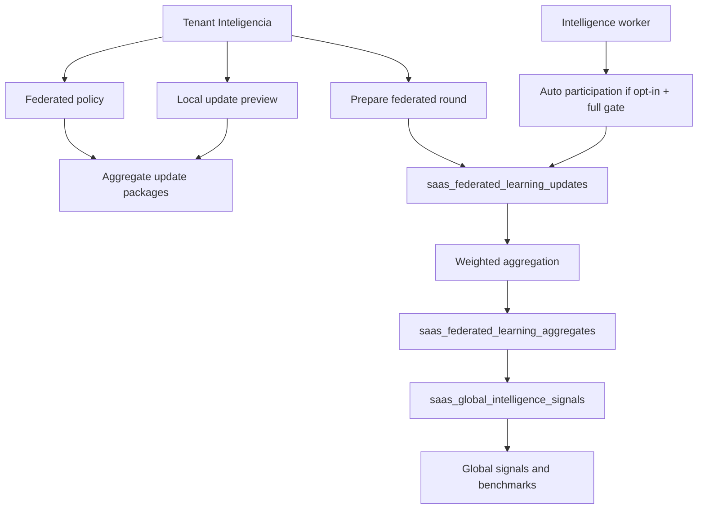
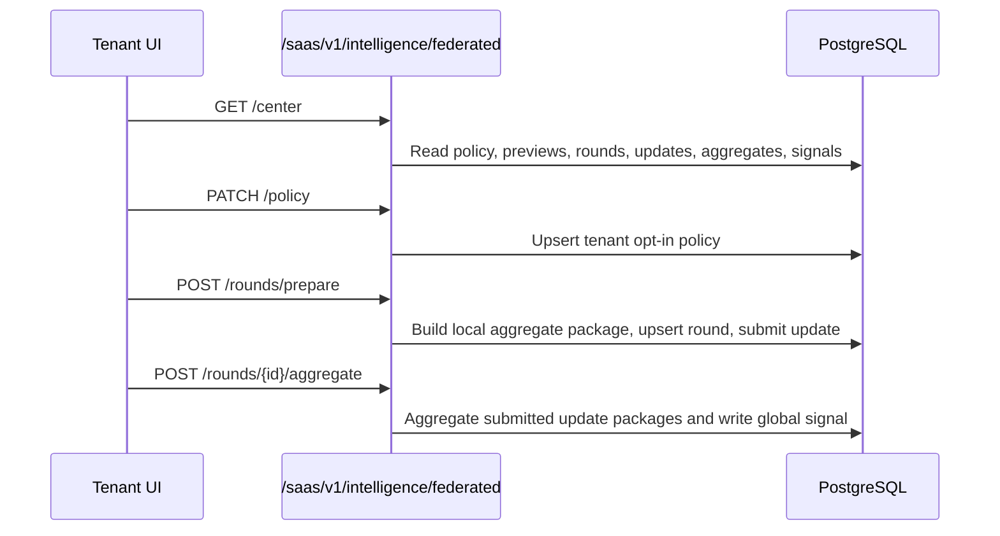

# Federated Learning And Global Intelligence

Scope: SaaS Phase 17. Code path: `saas-version/backend/app_saas/intelligence/federated.py`.

## Purpose

Phase 17 adds a privacy-safe federated learning control-plane for Scentra. Tenants can opt in to share aggregate/statistical model-update packages for lead scoring, churn prediction, smart remarketing and operational anomaly tasks.

This phase does not share raw tenant data and does not automatically promote models.

## Architecture

## Privacy Boundary

- Raw messages are never stored in federated tables.
- Raw conversations are never shared across tenants.
- Raw media, base64, provider payloads and decrypted secrets are not included.
- Tenant names are not stored in aggregate rows or global signals.
- Update packages include only counts, rates, feature summaries, quality score, feature-importance metadata and privacy metadata.
- Aggregation enforces minimum cohort tenants and total samples before marking a signal active.

## API Flow

## Worker Flow

`workers/intelligence.py` calls `process_federated_learning` inside a nested transaction. The worker skips the phase unless the tenant has full feature access, `opt_in_enabled=true` and `auto_participation_enabled=true`.

## Safety Rules

- Full mutation requires `federated_learning`, `federated_model_updates`, `privacy_safe_model_aggregation` or `ai_premium`.
- Demo/read access can preview with `intelligence_demo`, `global_intelligence`, `federated_benchmarking`, `cross_tenant_intelligence` or full features.
- No model registry promotion is automatic.
- No CRM, campaign, workflow, billing, Meta, provider or agent runtime side effects occur.
- Future real model promotion must use a separate ModelOps review, registry decision and ADR.
