# FRONTEND_BACKEND_FLOW

Scope: SaaS only.

## Client App Flow

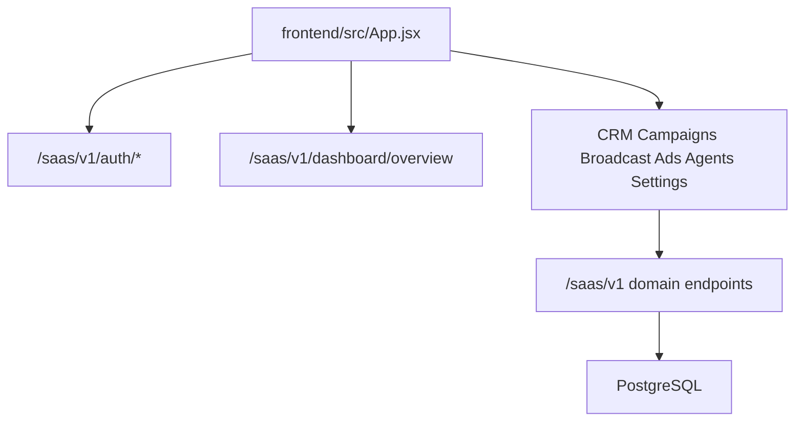

## Phase 4 Inbox Flow

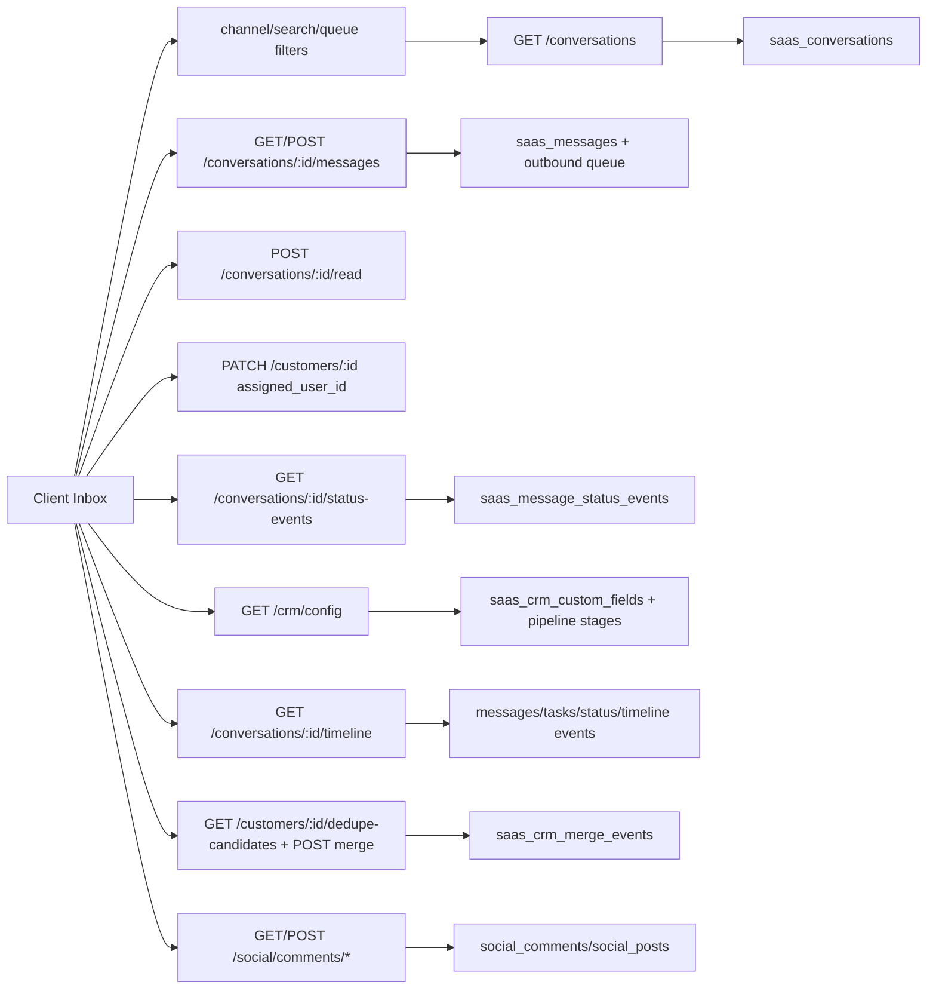

## Admin App Flow

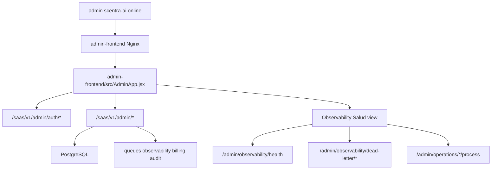

## Phase 6 Knowledge UI Flow

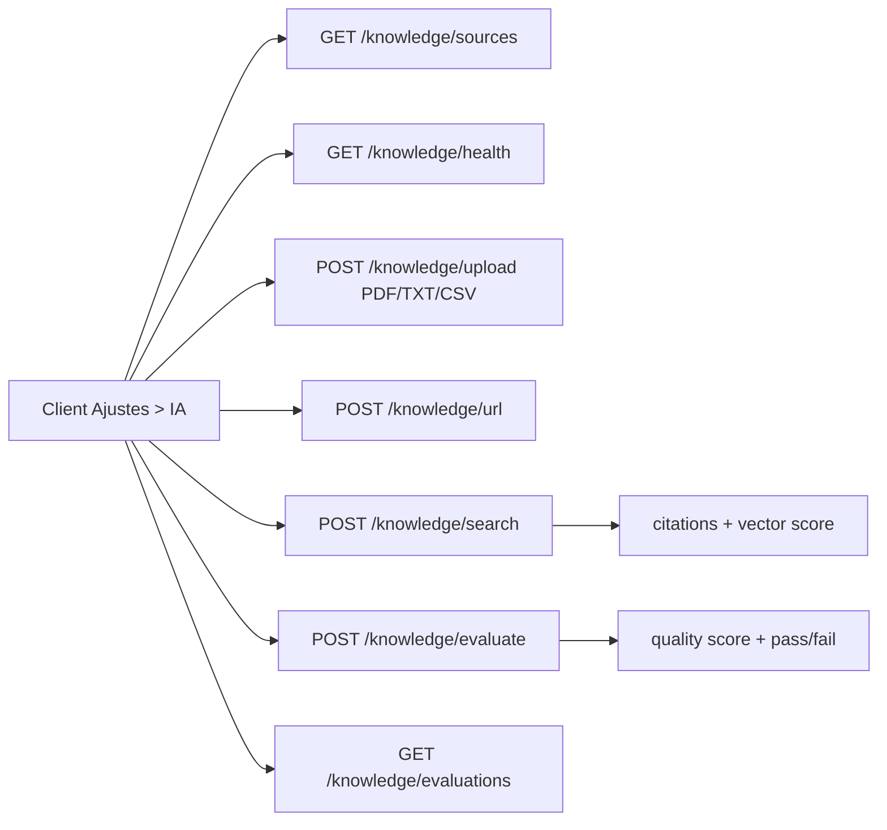

## Phase 7 Campaigns UI Flow

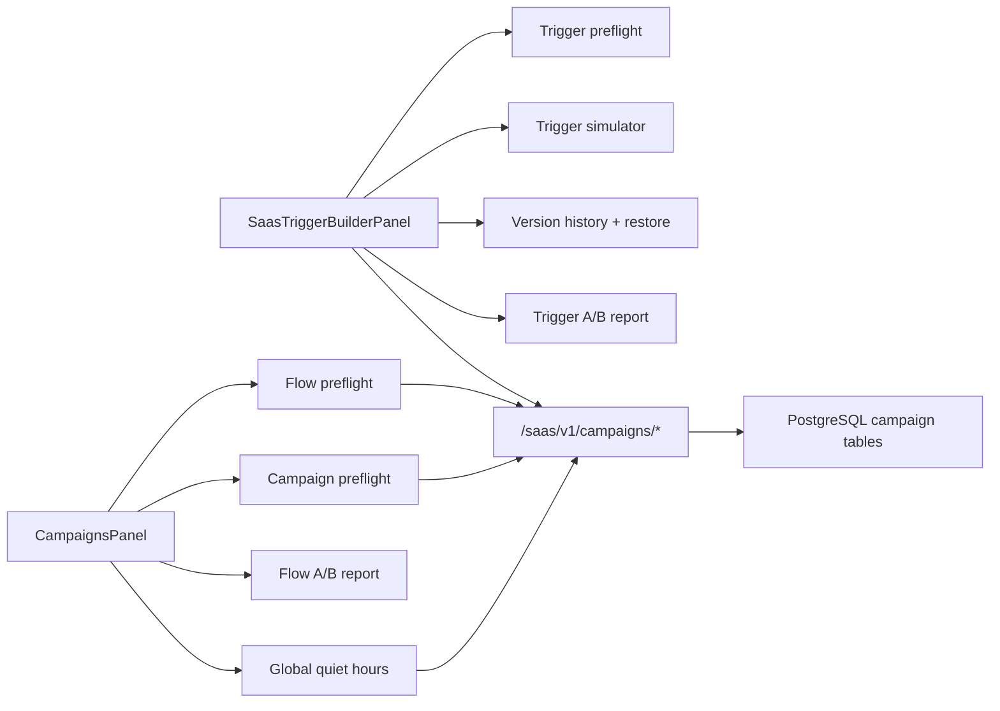

## Phase 8 Agents UI Flow

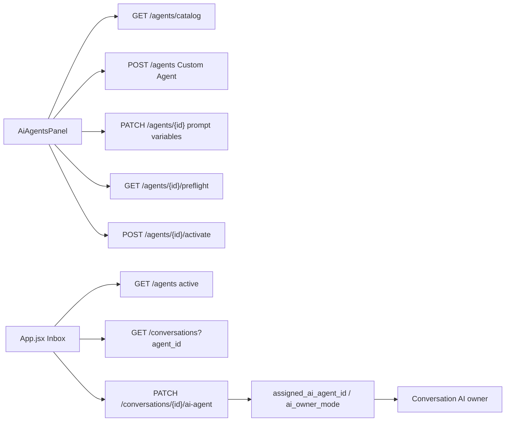

## Phase 9 Billing UI Flow

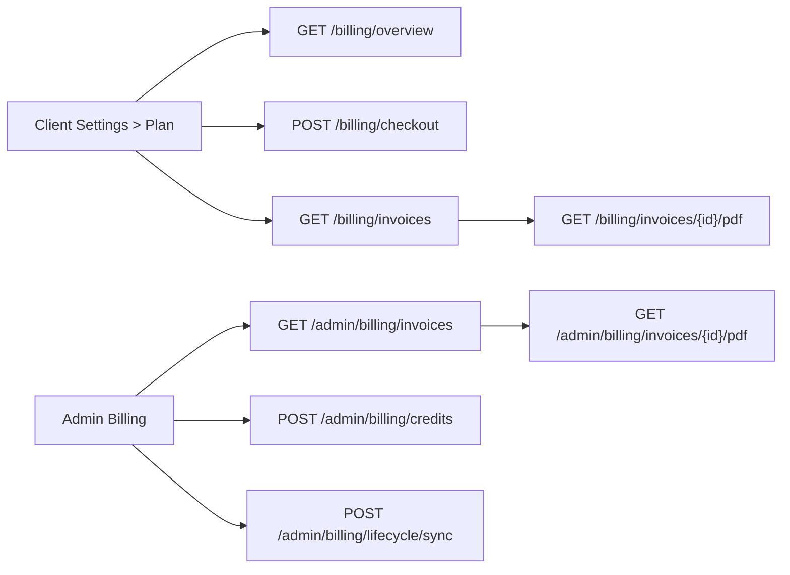

## Phase 10 Verticalization UI Flow

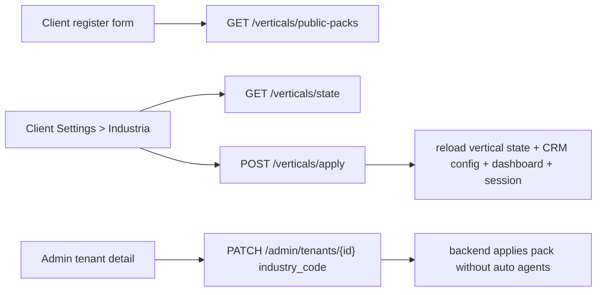

## Phase 11 Intelligence Admin Flow

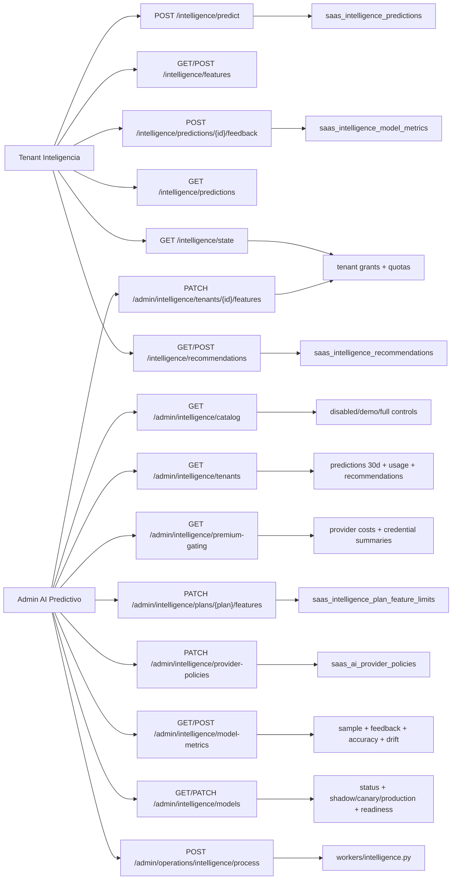

## Phase 16 Real-Time Intelligence UI Flow

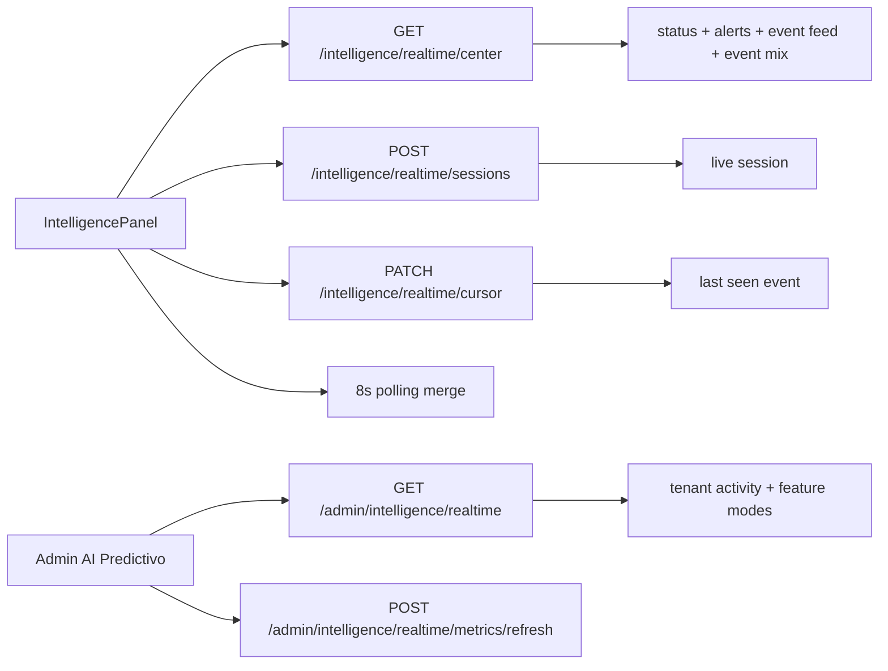

- Tenant UI reads sanitized live signals only.
- Admin UI reads aggregate per-tenant live activity and writes metric snapshots only.
- Neither UI can execute realtime alerts or mutate provider/customer runtime from Phase 16.

## Phase 24.1 API Settings Flow

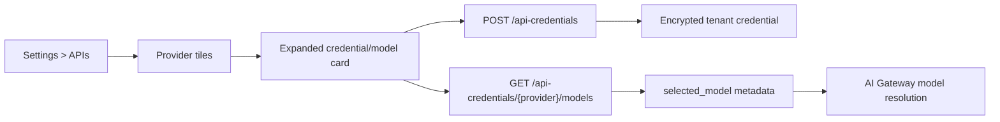

- Unsaved providers stay collapsed until the tenant clicks "Anadir".
- Saved credentials or selected models remain visible automatically.
- Model loading still uses the existing credential/model endpoints.

## Phase 24.2 Voice Intelligence UI Flow

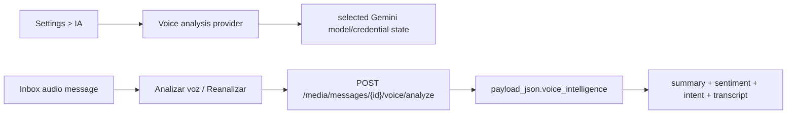

- Voice analysis updates the local message payload after the API returns.
- The UI does not create CRM tasks, send replies or trigger automations from the voice card.

## Phase 24.3 Vision Intelligence UI Flow

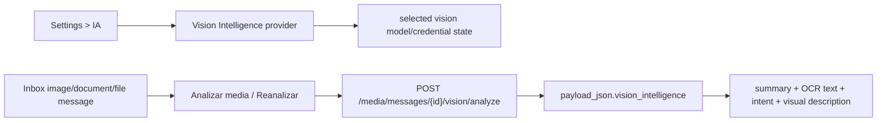

- Vision analysis updates the local message payload after the API returns.
- The UI does not search the web, send images/documents, create CRM tasks, trigger automations or hand off agents from the vision card.

## Phase 24.4 Web/Image Search Intelligence UI Flow

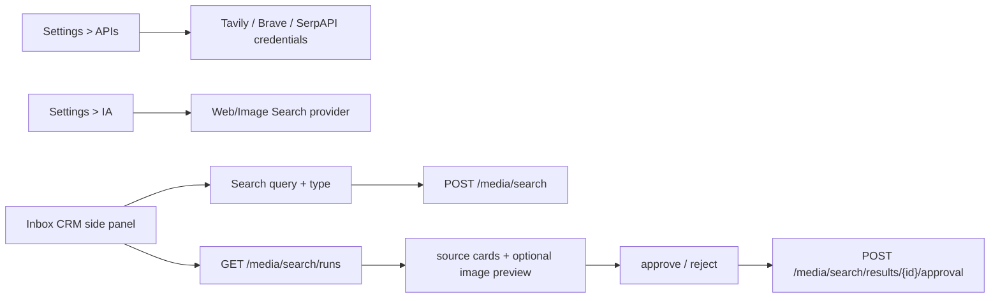

- Search runs are scoped to the active tenant and optional selected conversation.
- Result cards are advisory source references and require human review.
- The UI does not auto-send links/images, mutate CRM, launch campaigns, execute workflows or hand off agents from search results.

## Phase 24.5 Agent Multimodal Tools UI Flow

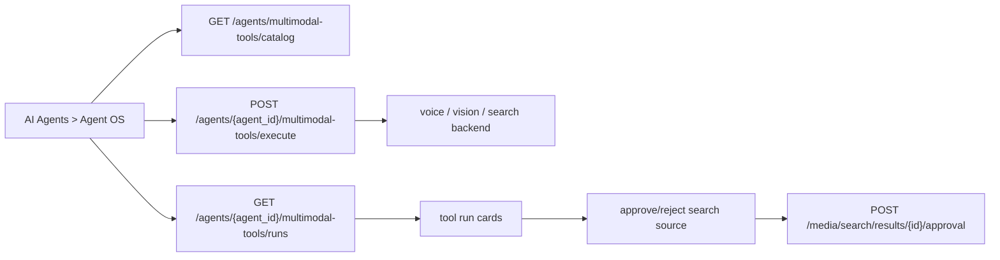

- The UI requires real Inbox ids for voice/vision tools and a query for web/image search.
- Agent tool output is shown as run history; it does not auto-send customer messages or mutate CRM.
- Search source approval remains human-in-the-loop before any agent prompt can use external source context.

## Phase 24.6 Multimodal Memory UI Flow

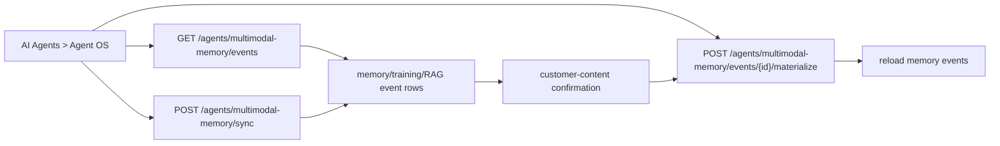

- The UI shows counts for memory events, training-ready rows, RAG candidates and materialized rows.
- Operators explicitly choose whether to send a row to Knowledge/RAG or collective memory.
- The UI does not auto-send references, mutate CRM, launch campaigns, execute workflows or start model training.

## Phase 24.8-24.10 Admin Premium Gating UI Flow

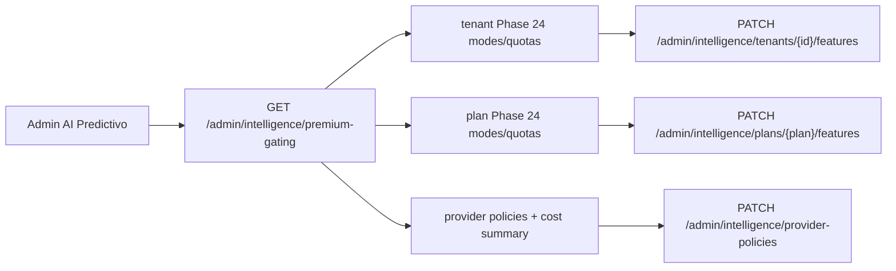

- Admin sees tenant grants, plan limits, provider policies, credential readiness and estimated monthly AI/search cost in one view.
- The UI never displays decrypted provider secrets.
- Cost controls are metadata-driven and require reviewed provider pricing before commercial reporting.

## Phase 24.9-24.10 Tenant Observability And Rollout UI Flow

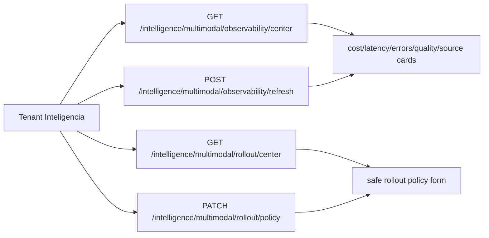

- Observability panels read aggregate/safe metadata only.
- Rollout controls remain backend-authoritative and require feature access plus explicit policy enablement.

## Session Storage

- Client access token: `scentra_ai_access_token`
- Client refresh token: `scentra_ai_refresh_token`
- Admin access token: `scentra_admin_access_token`

## Env Boundary

- Both frontends require `VITE_API_BASE`.
- Admin can use `VITE_CLIENT_APP_BASE`.
- Captcha UI uses `VITE_CAPTCHA_ENABLED` and `VITE_TURNSTILE_SITE_KEY`.
- Admin local bootstrap UI uses `VITE_ADMIN_BOOTSTRAP_ENABLED` or localhost runtime detection; production uses the seed command/service instead.
