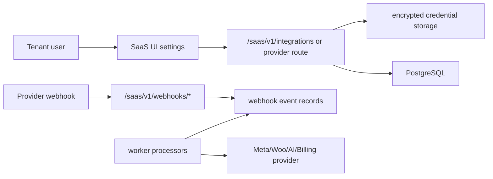

# INTEGRATIONS_FLOW

Scope: SaaS only.

## Provider Flow

## Integration Families

- WhatsApp Cloud through Meta.
- Instagram Business through Meta Graph/OAuth.
- WooCommerce products/integration records.
- AI/TTS provider credentials through API credentials and AI gateway.
- Billing providers through billing webhooks/checkout.
- Turnstile captcha for auth forms when enabled.

## Rules

- Verify signature/token behavior before editing webhooks.
- Keep encrypted credential handling centralized.
- Preserve token health/refresh diagnostics.
- Do not hardcode provider secrets.

