# Intelligence Engine Architecture

Scope: SaaS only. Current implementation is Phase 11 foundation plus optional ML profile.

## System Map

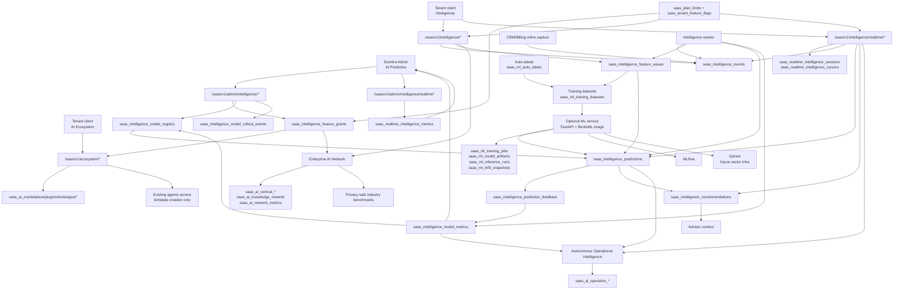

## Event Flow

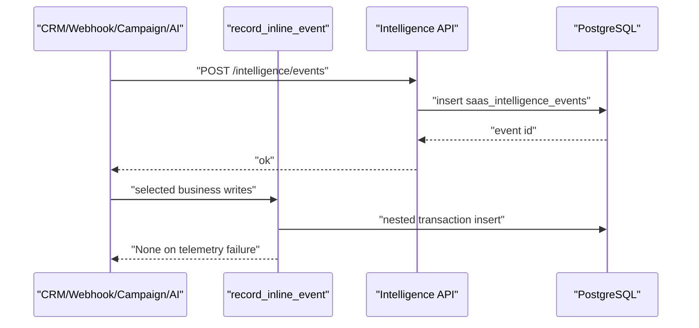

Current event transport is PostgreSQL. Future event streaming should add NATS JetStream first for replay/fanout, then Kafka/Redpanda if high-volume analytics requires it.

Current inline sources are intentionally limited to CRM outbound `message.sent` and billing `billing.subscription.changed`. Runtime smoke validated this first pattern; broader producer coverage should still be added incrementally, preserving deterministic `replay_key` values.

## Real-Time Intelligence Flow

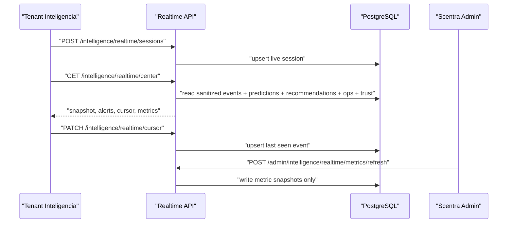

Phase 16 uses polling as the default product transport and exposes bounded SSE for future clients. It does not add Kafka, NATS, Redis Streams, WebSocket infrastructure or new dependencies. Realtime alerts are advisory and do not execute CRM, campaign, Meta, billing, workflow, agent, Trust or model-rollout side effects.

## Worker Automation Flow

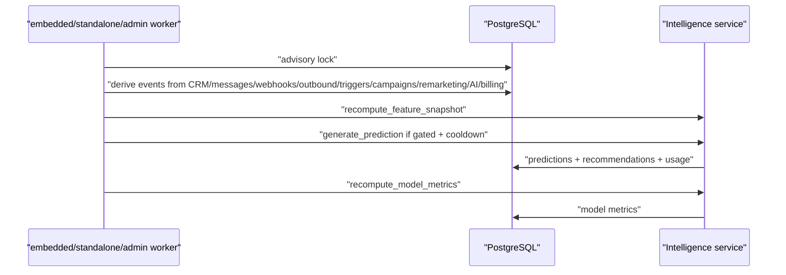

- Derived events use deterministic `replay_key` values for idempotency.
- The worker avoids invasive producer rewrites while Phase 11 matures.
- Inline capture uses the same replay-key families as the worker so API writes and derived passes do not duplicate events.
- Full event streaming can later move to NATS/Kafka without changing the persisted event schema.

## Prediction Flow

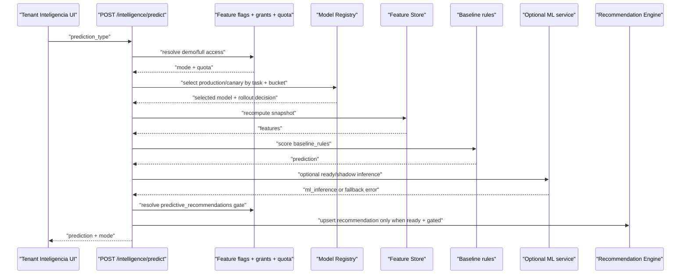

Disabled/paused registry states block prediction generation. Canary routing is deterministic by tenant/prediction/subject/window and traffic percent. Shadow/unapproved canary predictions are stored with `status = 'shadow'` and do not create recommendations automatically.

Prediction generation and recommendation persistence are separate gates. Demo prediction access can return a baseline preview, but writing `saas_intelligence_recommendations` requires enabled `predictive_recommendations` access and quota. Blocked recommendation persistence is reflected in prediction `output_json.recommendation_gate`.

Default canary selection changes the registry model key/version and emits `scoring_engine = baseline_rules`. When `SAAS_ML_ENABLED=true` and a registry artifact is loadable by `ml-service`, prediction runtime can call trained inference. Shadow inference is recorded under `output_json.ml_inference` and does not change baseline business output.

## Feedback And ModelOps Flow

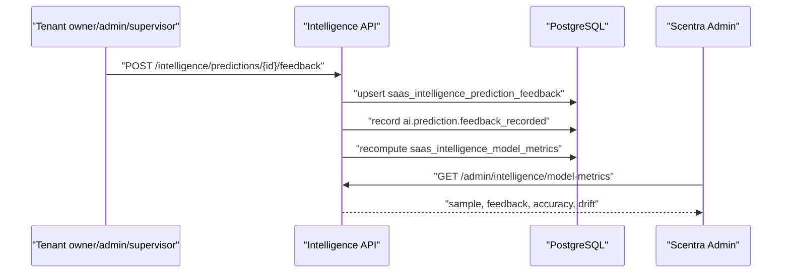

- Metrics are tenant-scoped and model-scoped.
- Current metrics are governance baselines for rule predictions.
- Trained model quality still requires labeled datasets, eval thresholds, drift monitoring and staged rollout acceptance.

## Model Rollout Governance Flow

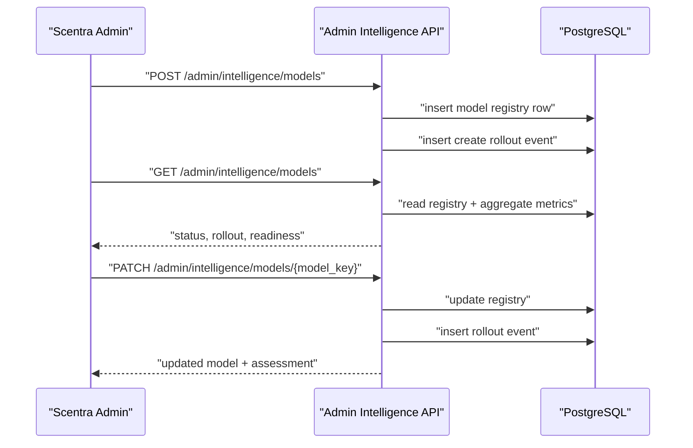

- Current controls cover `disabled`, `shadow`, `canary`, and `production`.
- Canary traffic percent is applied by the prediction runtime against registry rows.
- Real inference routing is now available only through the optional ML profile and stays disabled by default. Baseline fallback remains mandatory for compatibility and rollout safety.

## Premium Gating

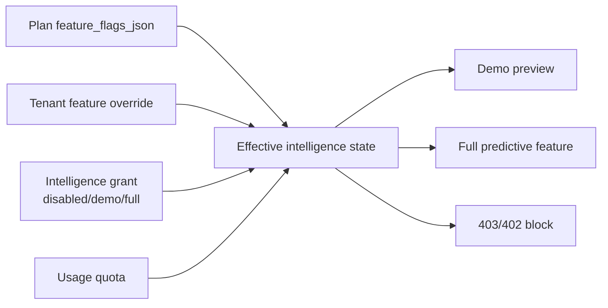

Rules:

- Demo mode is limited and visible through `intelligence_demo`.
- Full mode requires specific feature enablement, `ai_premium`, or an explicit full grant.
- Recommendation persistence requires the separate `predictive_recommendations` feature; do not infer it from the base prediction feature.
- Usage is recorded in `saas_intelligence_usage`.
- Admin changes are audited in `saas_audit_events`.

## Advisor Integration

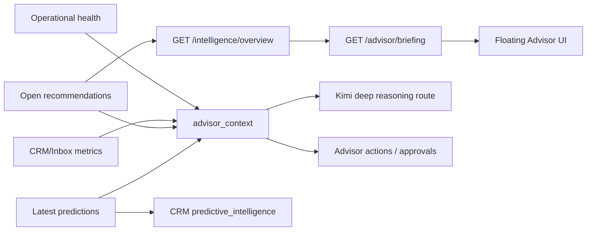

Advisor does not auto-execute predictive recommendations. It receives context and briefing summaries, then proposes actions under existing approval patterns. CRM/inbox can request conversation-level predictions, but generated recommendations remain gated by `predictive_recommendations`.

## ML Roadmap Deployment Shape

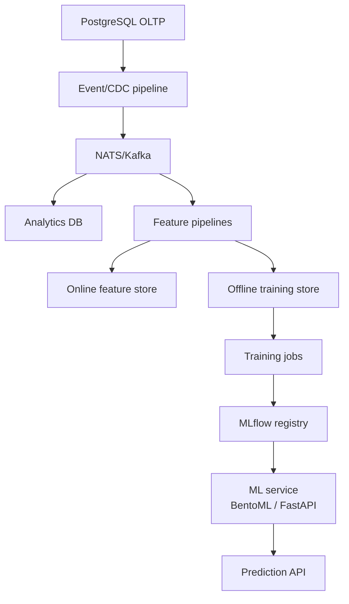

The default API/worker images intentionally remain dependency-light. The optional ML topology is enabled only through Compose profile `ml` and explicit ML flags after staging acceptance.

## Autonomous Operational Intelligence Flow

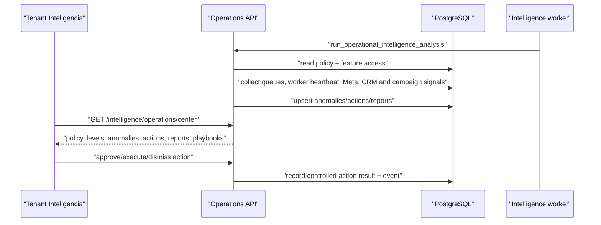

Autonomous Operations is human-supervised. Current execution does not directly mutate Meta, queues, campaigns, CRM or billing. Demo mode can preview analysis but cannot persist auto-remediation or low-risk auto-execute settings.

## Training Data Intelligence Flow

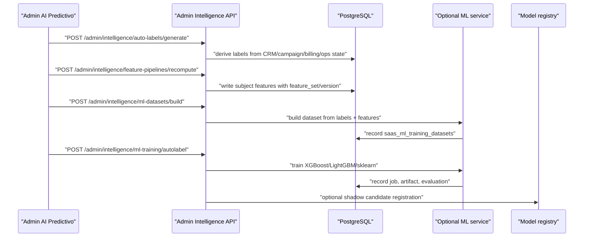

Auto-labeling is heuristic and auditable. It uses existing SaaS events/state and evidence JSON, not manual labels or external private datasets. Promotion from shadow to canary/production still depends on registry gates, label-quality review, drift checks and staged rollout.

## Enterprise AI Network Flow

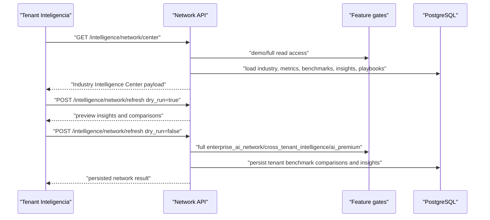

Privacy model:

- Cross-tenant output is aggregate only.
- Benchmark rows require sample count >= 3.
- Tenant-private metric snapshots are not exposed as peer data.
- Playbooks and vertical model rows are metadata/recommendations, not active automation or heavy model training.

## Federated Learning Flow

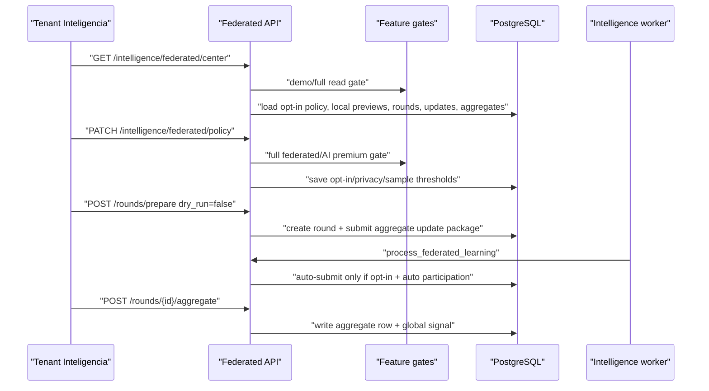

Phase 17 uses aggregate/statistical update packages only. It does not share raw tenant content, tenant names, prompts, media, provider payloads or secrets. Aggregates are candidate/global signals and do not promote production models automatically.
