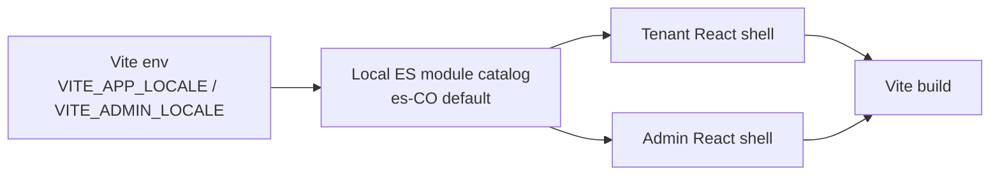
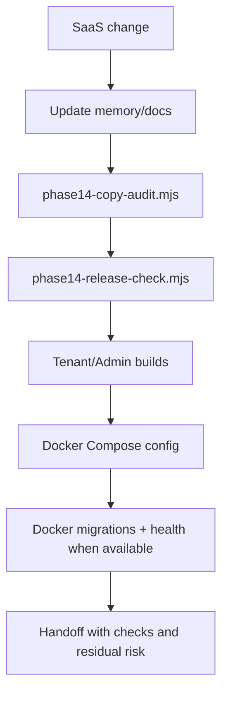

# LOCALIZATION_PRODUCT_OPS

Scope: SaaS only.

## Text Flow



## Product Ops Gate



## Safety Boundaries

- No runtime translation service.
- No DB-backed locale table.
- No new dependency.
- No API contract change.
- No provider enum/value translation.
- No generated runtime mutation.

## External Agent Repository Intake

For Phase 15 research, keep external repositories outside `saas-version/` until an ADR approves integration.

Recommended workspace path:

```text
external-repos/agents-research/
```

Required intake metadata:

- Source URL or zip origin.
- Branch/tag/commit.
- License and reuse permission.
- Install/runtime notes.
- Which parts the user wants evaluated: planner, tools, memory, evals, observability, prompts, SDK, or orchestration.
- Confirmation that secrets and private customer data were removed.

Analysis order:

1. Read-only architecture review.
2. Map concepts to Scentra domains.
3. Record ADR and risks.
4. Prototype behind feature flags only after approval.
