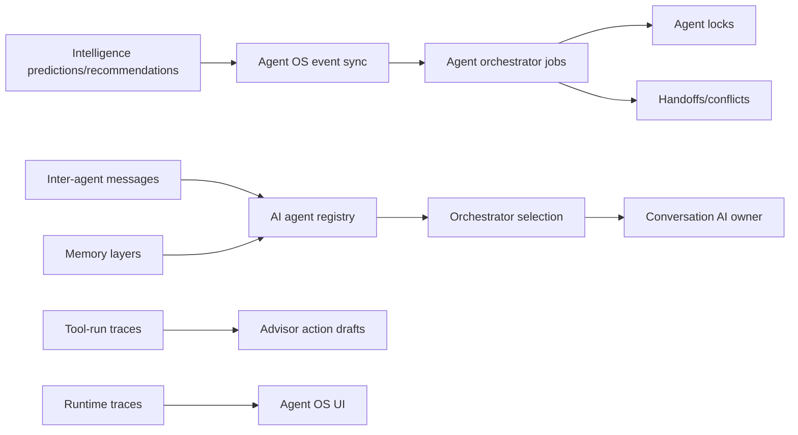

# Multi-Agent Operating System

Scope: SaaS only. Source of truth is `saas-version/`.

## Components

## Runtime Flow

1. Intelligence worker derives events, features, predictions and recommendations.
2. `agents/operating_system.py` scans recent predictive signals.
3. If Agent OS is in demo mode, candidates are returned without enqueueing jobs.
4. If full premium mode is enabled, candidates become `saas_ai_agent_orchestration_jobs` with source `agent_os`.
5. Existing `agents/orchestrator.py` selects one active agent, creates locks/handoffs/conflicts, and preserves single AI ownership.
6. Tool requests are recorded as `saas_ai_agent_tool_runs` and create approval-required Advisor action drafts by default.

## Memory Layers

- Short-term: `saas_conversation_memory`.
- Long-term: `saas_ai_agent_memory_archives`.
- Semantic: `saas_knowledge_chunks` with current Postgres sparse-vector/lexical retrieval.
- Episodic: `saas_ai_agent_events`, orchestration jobs and tool-run traces.
- Collective: `saas_ai_agent_collective_memory`.

## Safety

- No direct side-effect tool execution from Agent OS.
- Full event-driven enqueue requires `multi_agent_os`, `event_driven_agents`, or `ai_premium`.
- Demo mode is read/preview oriented.
- Worker sync uses nested transactions so Agent OS failures do not break CRM, Meta, Intelligence or automation runtime.
- Conversation AI ownership remains one agent or general AI, never both.
