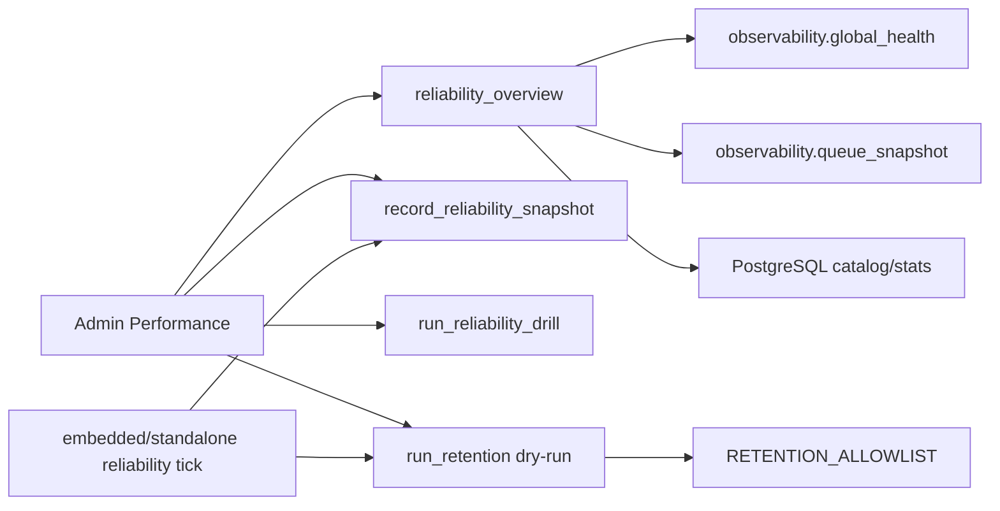

# PERFORMANCE_RELIABILITY_SCALE

Scope: SaaS Phase 12 only.

## Goal

Make production readiness measurable without changing WhatsApp, Instagram, CRM, billing, campaign or AI runtime behavior.

## Components

- Migration: `saas-version/migrations/055_saas_performance_reliability_phase12.sql`.
- Backend service: `saas-version/backend/app_saas/reliability/service.py`.
- Worker wrapper: `saas-version/backend/app_saas/workers/reliability.py`.
- Admin APIs: `/saas/v1/admin/reliability/*` and `/saas/v1/admin/operations/reliability/process`.
- Admin UI: `saas-version/admin-frontend/src/AdminApp.jsx` view `Performance`.

## Data Model

- `saas_reliability_slo_policies`: metric thresholds for DB latency, queue backlog, queue errors, worker freshness, AI failure rate and Meta errors.
- `saas_reliability_backpressure_policies`: warning/critical queue backlog thresholds and batch-size guidance.
- `saas_reliability_retention_policies`: allowlisted retention policies, disabled and dry-run by default.
- `saas_reliability_cleanup_runs`: dry-run/destructive cleanup audit results.
- `saas_reliability_snapshots`: periodic and manual SLO/backpressure snapshots.
- `saas_reliability_drills`: load smoke, backup readiness, retention dry-run and SLO snapshot drill history.

## Flow

## Safety Rules

- Default retention is disabled and dry-run.
- Destructive retention requires explicit `dry_run=false` plus `superadmin` or `platform_admin`.
- Retention SQL uses backend allowlisted table names, timestamp columns and conditions only.
- Backup readiness is metadata-only. Real backup and restore execution belongs to infrastructure tooling.
- Backpressure output is advisory. No automatic throttling, queue mutation, provider pausing or campaign pausing is performed.

## Operational Acceptance

- Clean migration through `055`.
- API health and Swagger available.
- Admin authenticated reliability overview returns 200.
- Snapshot, load smoke, backup readiness, retention dry-run and reliability process return 200.
- API/worker logs have no recent tracebacks after worker tick.
- SLO/backpressure thresholds must be tuned with real staging/production traffic before they become contractual SLOs.
