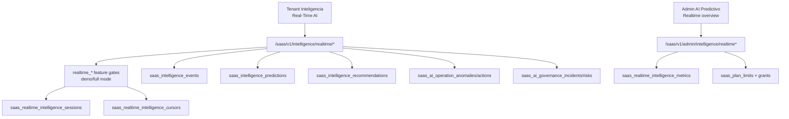
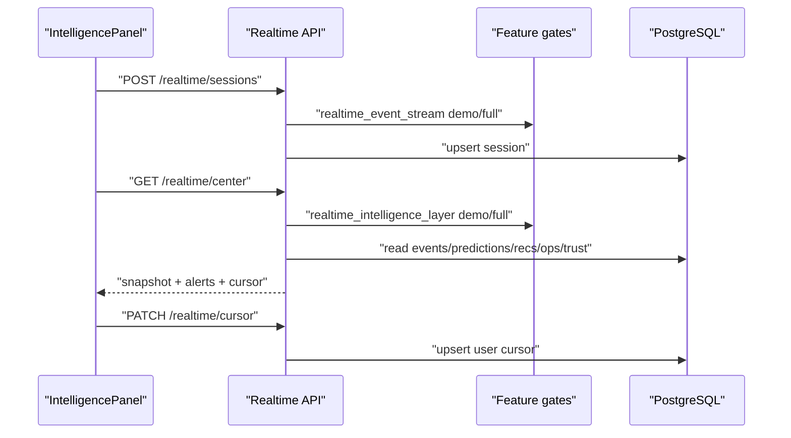

# Real-Time Intelligence Layer

Scope: SaaS only. Phase 16.

## Intent

Phase 16 adds a live intelligence control-plane over the existing Phase 11/18/22 data:

- Intelligence events
- feature snapshots
- predictions
- recommendations
- Autonomous Operations anomalies/actions
- Trust AI incidents/risks
- ModelOps metrics

It is PostgreSQL-first and dependency-free. Kafka, NATS, Redis Streams or WebSocket brokers were not added.

## Architecture

## Tenant Flow

## Streaming Shape

- Primary tenant UI uses safe polling every 8 seconds.
- Backend also exposes bounded SSE through `GET /intelligence/realtime/stream`.
- SSE connections are capped by `max_seconds` and reopen client-side if needed.
- The stream opens a fresh DB session per snapshot and does not keep a transaction open.

## Data Privacy

- Event payloads are sanitized before returning to UI.
- Keys containing `text`, `message`, `content`, `body`, `email`, `phone`, `token`, `secret`, or `password` are redacted.
- Cross-tenant data is not exposed to tenant endpoints.
- Admin overview aggregates tenant activity but does not return raw event payloads.

## Premium Gating

Feature keys:

- `realtime_intelligence_layer`
- `realtime_event_stream`
- `realtime_ai_alerts`
- `realtime_intelligence_dashboard`

Rules:

- Demo mode can read live previews.
- Full mode is controlled by plan flags, tenant overrides, or explicit Intelligence grants.
- Session creation records usage under `realtime_sessions`.
- Center polling does not consume prediction quota to avoid noisy billing from passive dashboards.

## Safety Boundaries

- No Meta, webhook, CRM, campaign, billing, workflow, agent, model promotion, or Trust enforcement side effects.
- Alerts are advisory and derived from existing records.
- Admin metric refresh writes only `saas_realtime_intelligence_metrics` snapshots.
- Broker-based streaming remains a future scale decision.
