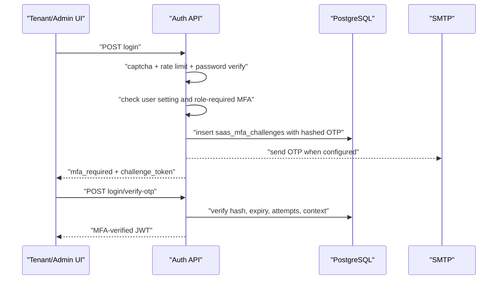
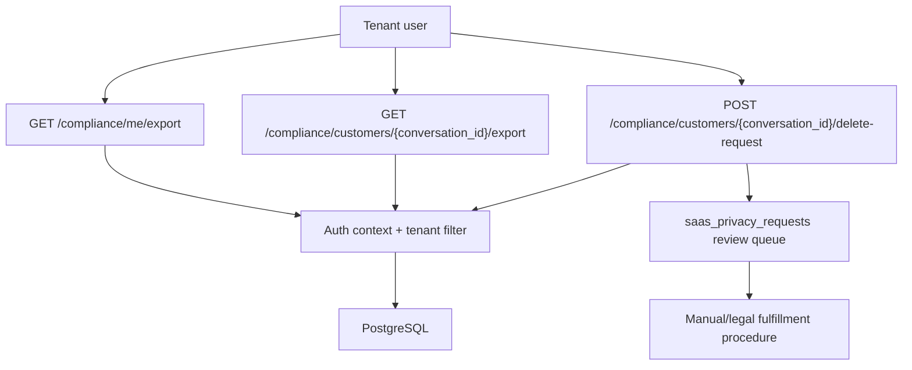
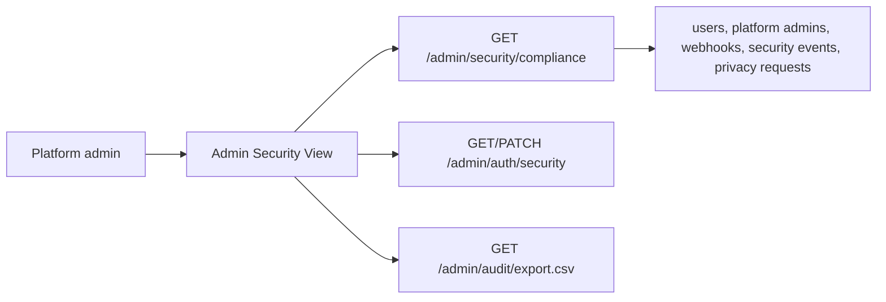

# SECURITY_COMPLIANCE

Scope: SaaS security/compliance surfaces, including Phase 13 MFA/privacy and Phase 22 AI Trust.

## Purpose

Phase 13 adds enforceable email OTP MFA and tenant-scoped compliance workflows without changing Meta, CRM, billing, worker or AI runtime behavior.

## MFA Flow

## Compliance Flow

## Admin Security Center

## Safety Boundaries

- Email OTP is the only implemented MFA method.
- OTPs and reset tokens are stored as hashes, not raw secrets.
- Production MFA requires SMTP; dev OTP exposure is local-only.
- Compliance delete requests are non-destructive records.
- Customer exports are tied to tenant-scoped conversation IDs.
- Admin audit CSV is a review export, not immutable external archival.
- Secret rotation and TOTP are future scoped work, not hidden behavior in Phase 13.

## Phase 22 AI Trust Boundary

Phase 22 adds AI governance records under `/trust-center` and `/admin/trust-center`.

- Policies, attestations, risk assessments, model cards, incidents, reports and audits are tenant-scoped.
- Risk scans inspect AI metadata but do not enforce runtime changes.
- Compliance reports are evidence snapshots, not legal certification.
- Admin Trust AI overview is read-only and must not expose raw tenant content across tenants.
