# SYSTEM_DIAGRAMS

Scope: SaaS only. Source root: `saas-version/`.

## High-Level Map

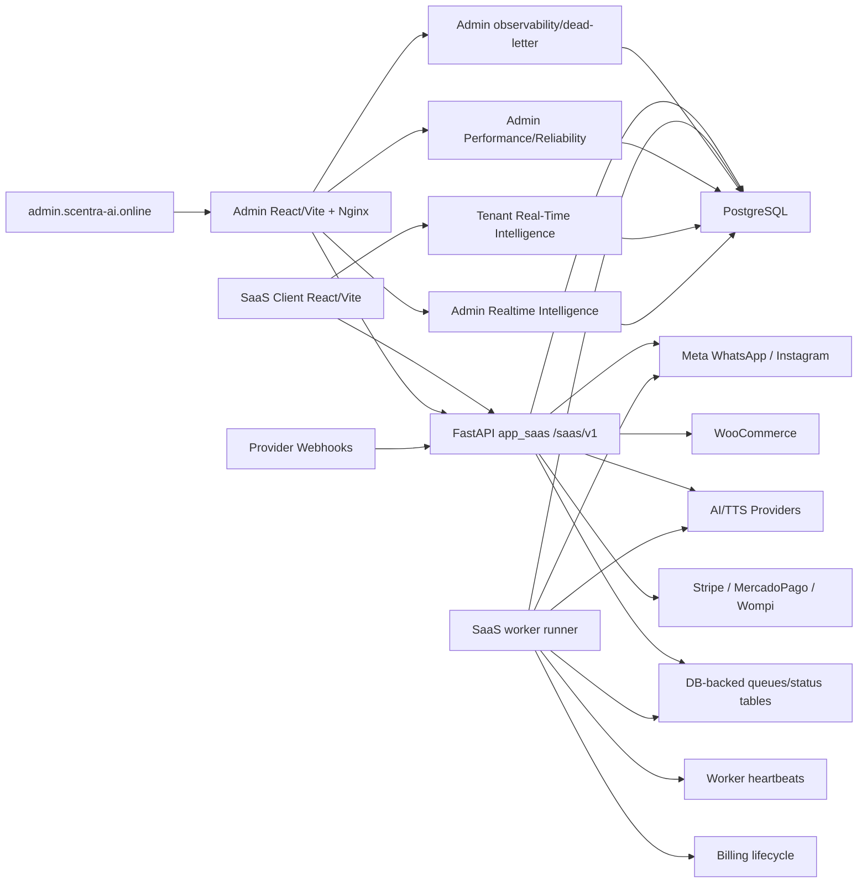

## Code Map

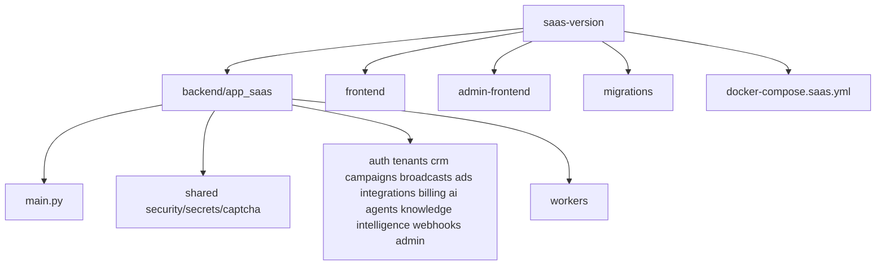

## Boundaries

- SaaS API boundary: `/saas/v1`.
- SaaS DB boundary: migrations in `saas-version/migrations`.
- SaaS frontend boundary: `saas-version/frontend` and `saas-version/admin-frontend`.
- Non-SaaS root apps are out of scope.

## Phase 4 Inbox Map

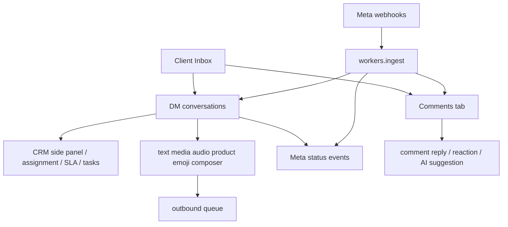

## Phase 5 CRM Map

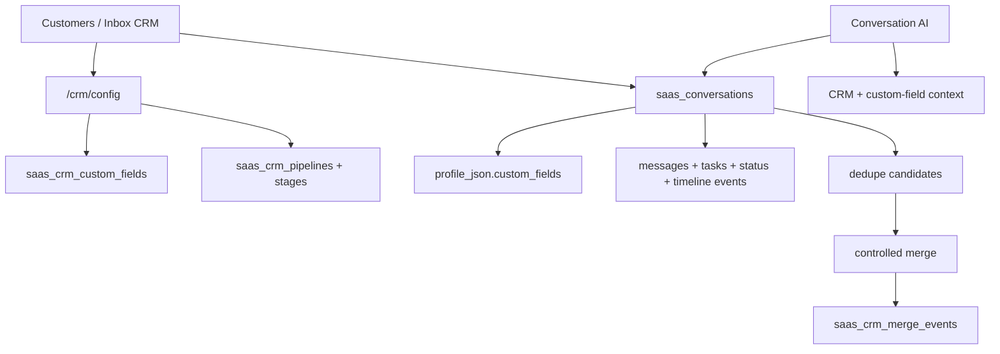

## Phase 6 Knowledge/RAG Map

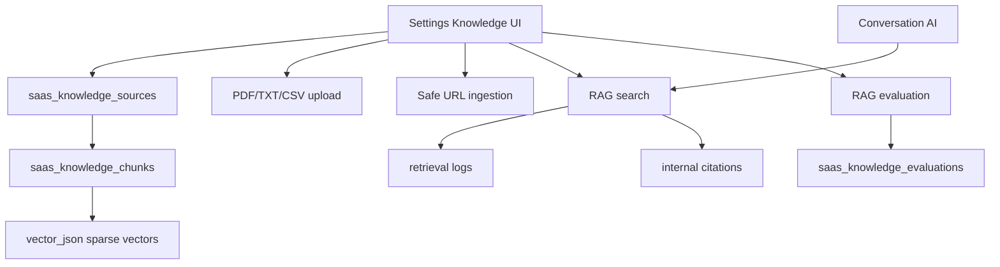

## Phase 8 AI Agents Map

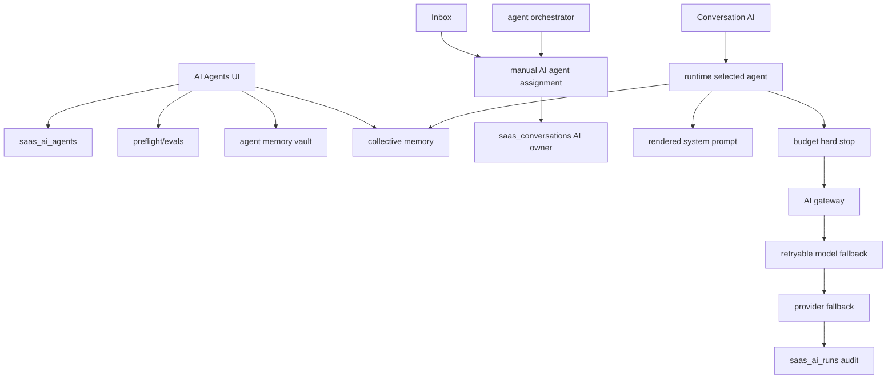

- The orchestrator selects ownership only; generated replies still pass through Conversation AI and the shared AI Gateway failover path.
- Provider/model failover never changes the assigned AI owner and does not fall back to general AI when an assigned agent is unavailable.

## Phase 24.1 Multimodal Gateway Map

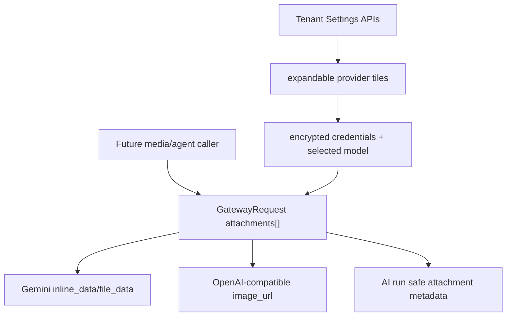

- This started as a gateway foundation only; Phase 24.2/24.3 now use it for explicit Inbox audio/image/document analysis, Phase 24.4 adds approval-first web/image search, Phase 24.5 adds read-only agent multimodal tools, Phase 24.6 stores sanitized multimodal memory/training/RAG signals, Phase 24.7 adds human-operated approved-reference UX, Phase 24.8 adds Admin provider/plan gating, and Phase 24.9/24.10 add observability plus safe rollout. Automatic AI/agent customer media sends remain out of scope until a separate approved design.

## Phase 9 Billing Map

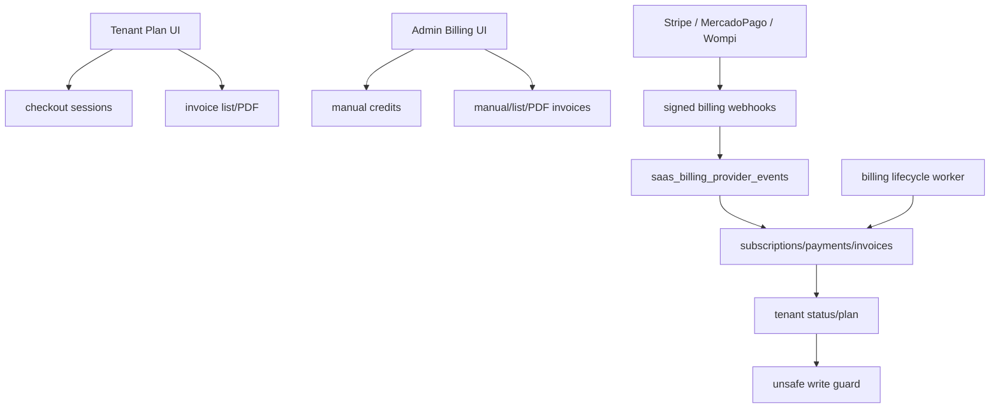

## Phase 10 Verticalization Map

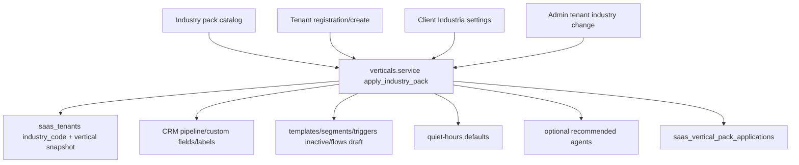

## Phase 11 Intelligence Map

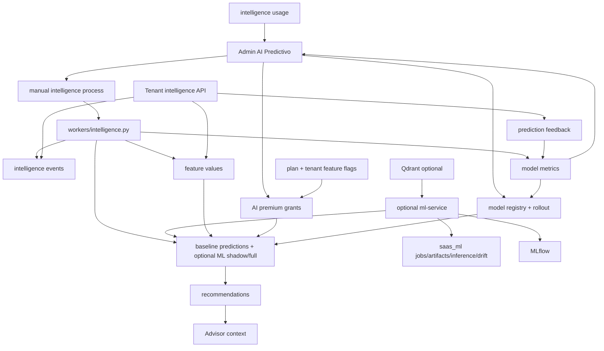

## Phase 12 Performance And Reliability Map

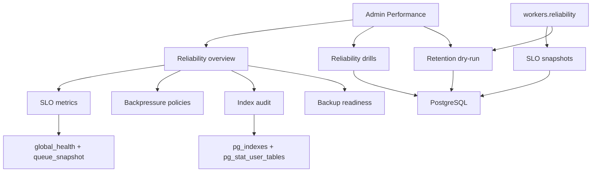

- Phase 12 is an admin control-plane, not autonomous self-healing.
- Provider throttling, campaign pausing, real backup/restore and destructive cleanup are intentionally outside automatic execution.

## Phase 13 Security And Compliance Map

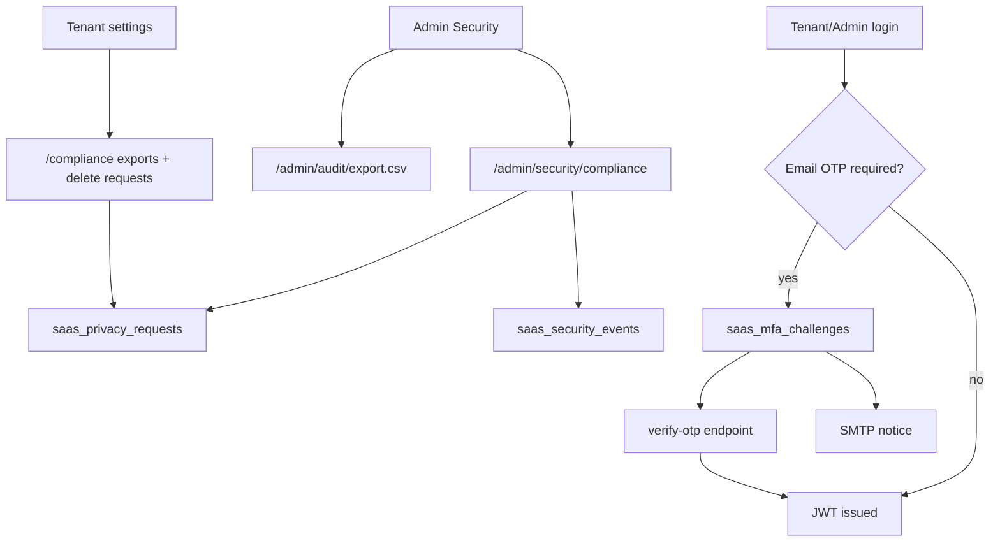

- Phase 13 email OTP is enforced by backend auth, not by frontend state.
- Privacy delete requests are non-destructive review records.

## Phase 22 AI Trust Map

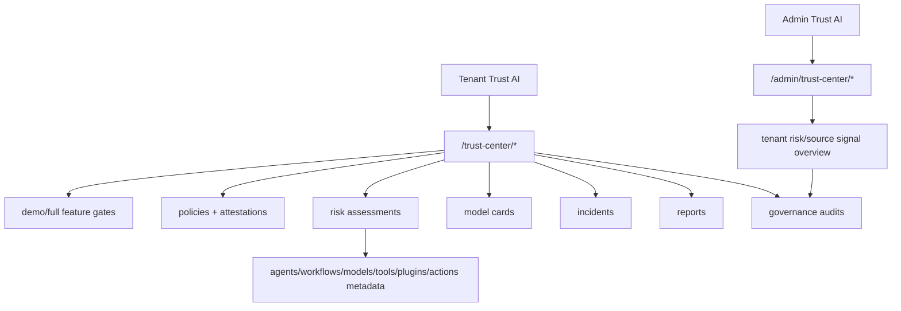

- Phase 22 is a governance control-plane.
- Risk scans and reports do not execute runtime remediation or legal certification.

## Phase 16 Real-Time Intelligence Map

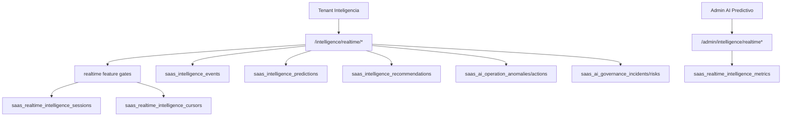

- Phase 16 is a live intelligence control-plane over existing events/signals.
- Default transport is polling; bounded SSE is available for future clients.
- Alerts are advisory and no realtime endpoint mutates Meta, CRM, campaigns, billing, workflows, agents or model rollout state.

## Phase 24.2 Voice Intelligence Map

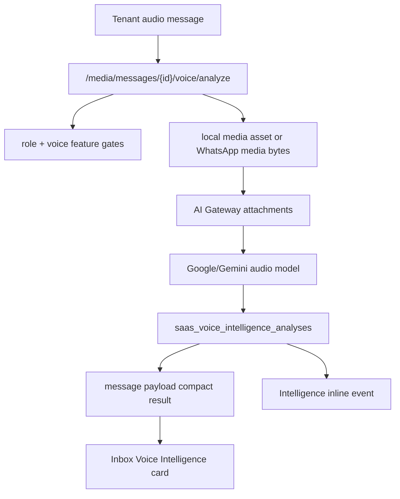

- Phase 24.2 analyzes audio only when a user explicitly requests it from an existing tenant message.
- It does not send responses, mutate CRM, launch campaigns, execute agents, run OCR or search the web.

## Phase 24.3 Vision Intelligence Map

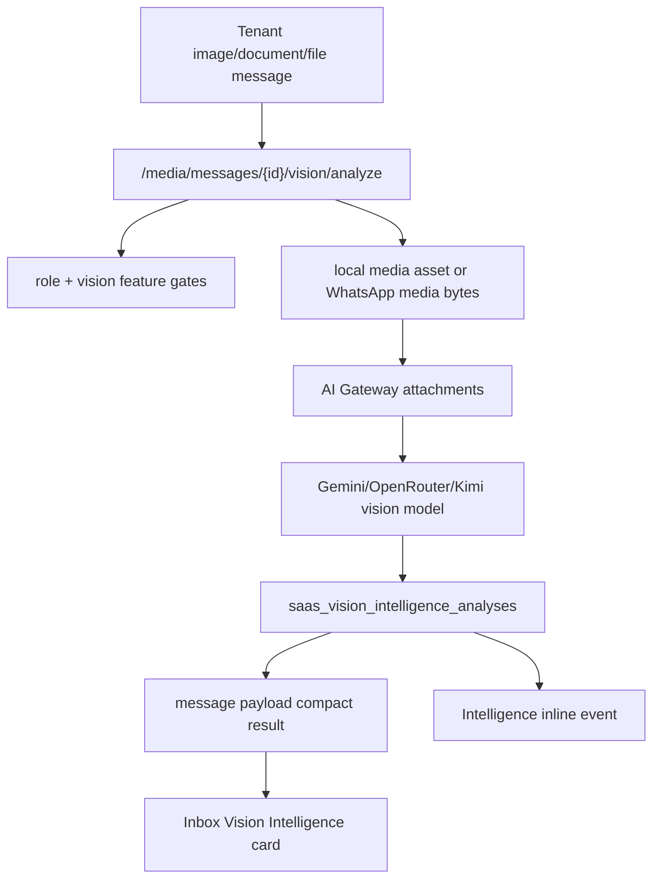

- Phase 24.3 analyzes image/document media only when a user explicitly requests it from an existing tenant message.
- It does not search the web, send references, mutate CRM, launch campaigns, execute agents or train models.

## Phase 24.4 Web/Image Search Intelligence Map

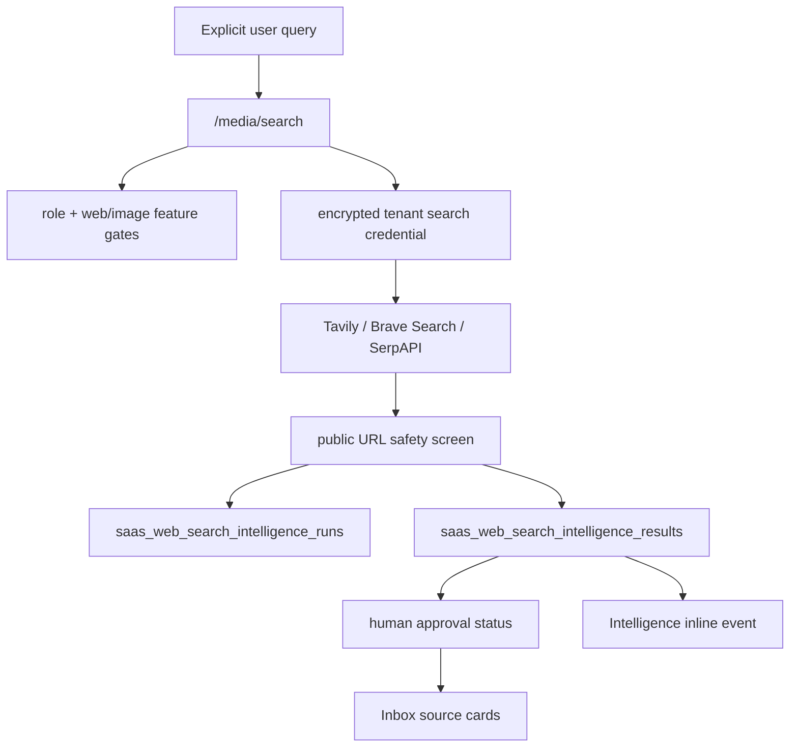

- Phase 24.4 searches external providers only when a user explicitly requests it.
- Results are source references with approval state; they are not sent to customers automatically.
- It does not crawl result URLs, mutate CRM, launch campaigns or train models.

## Phase 24.5 Agent Multimodal Tools Map

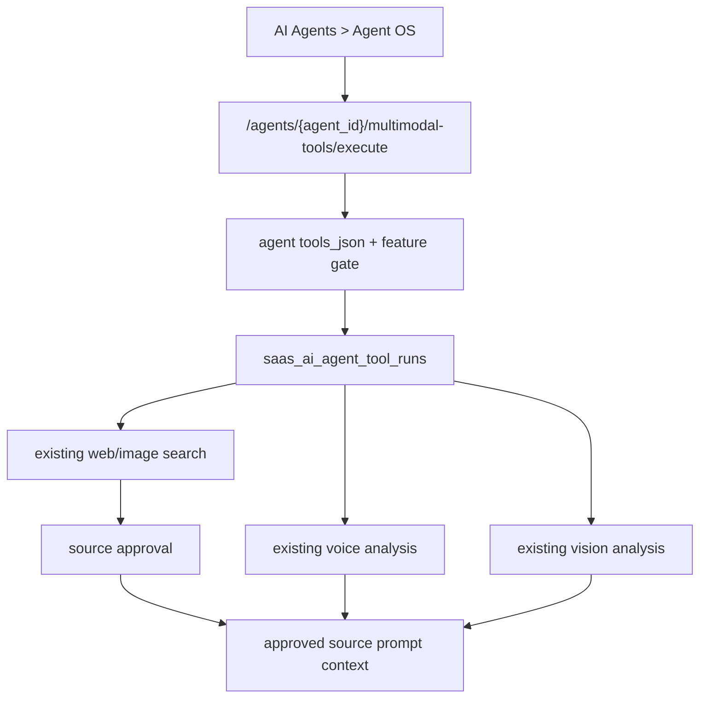

- Phase 24.5 tools are agent-scoped and contextual.
- External sources reach prompts only after approval and only when not blocked.
- It does not send messages, mutate CRM, launch campaigns, execute workflows, assign agents or train models.

## Phase 24.6 Multimodal Memory Map

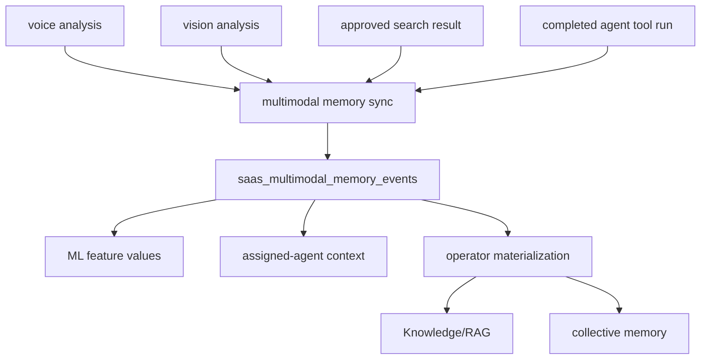

- Phase 24.6 captures sanitized text/features/labels only.
- Training-ready events require a specific ML/training premium gate.
- Customer content needs explicit approval before Knowledge/RAG or collective-memory materialization.
- It does not store raw media/base64, auto-train models, send messages or mutate operational domains.

## Phase 24.8 Admin Premium Gating Map

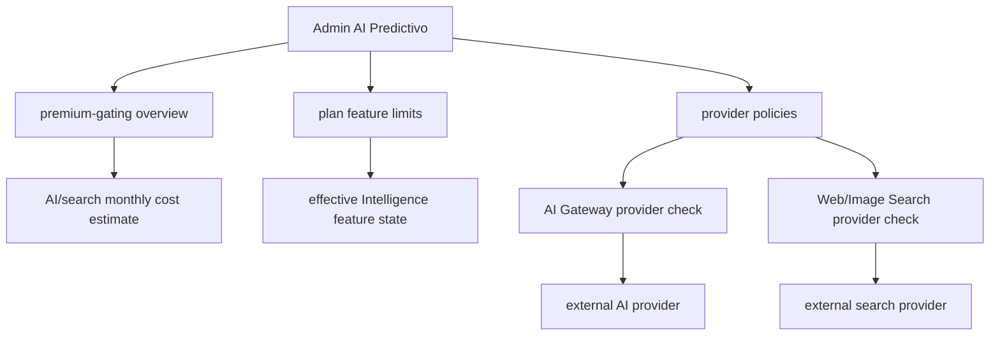

- Phase 24.8 is an Admin control-plane over existing gates and provider calls.
- Provider disablement, request quota and cost limit enforcement happens before external calls.
- It does not expose decrypted secrets, auto-charge billing, train models or alter Meta/CRM/campaign/workflow runtime.

## Phase 24.9-24.10 Multimodal Observability And Rollout Map

```mermaid
flowchart TB
  Runtime["Voice/Vision/Search runtime"] --> Rollout["Safe rollout helper"]
  Rollout --> Policies["rollout policies"]
  Rollout --> Decisions["rollout events"]
  Runtime --> Observability["observability collector"]
  Tools["Agent multimodal tools"] --> Observability
  Memory["Multimodal memory"] --> Observability
  Observability --> Snapshots["observability snapshots"]
  Pricing["provider policy pricing"] --> Observability
  UI["Tenant Inteligencia"] --> Observability
  UI --> Policies
```

- Phase 24.9 tracks cost, latency, errors, quality and sources used from existing multimodal tables.
- Phase 24.10 keeps rollout disabled unless a tenant has rollout access and an explicit enabled policy.
- Rollout decisions can block, downgrade to demo, canary-select or allow full execution without mutating CRM, campaigns, billing, Meta or agent ownership.

## Phase 19/20 Revenue And Memory Map

```mermaid
flowchart TB
  CRM["CRM/conversations"] --> Revenue["Autonomous Revenue Engine"]
  Predictions["Intelligence predictions"] --> Revenue
  Revenue --> Opportunities["Revenue opportunities"]
  Revenue --> Forecasts["Revenue forecasts/reports"]
  Collective["Collective memory"] --> Memory["Enterprise Memory Network"]
  Knowledge["Knowledge/RAG"] --> Memory
  Multimodal["Multimodal memory"] --> Memory
  Vertical["Vertical insights"] --> Memory
  Memory --> Graph["Tenant memory graph nodes/edges"]
  Graph --> Policy["scope/privacy/retention policy"]
  Graph --> Review["human review: publish/archive/reject/delete"]
  Graph --> Portability["audited export/import"]
```

- Revenue is supervised and records control-plane opportunities only.
- Enterprise Memory Network is tenant-scoped and stores bounded summaries/metadata/hashes.
- Enterprise Memory Network import creates candidate nodes only; export/import/delete are tenant-scoped and access-logged.
- Neither system sends messages, mutates CRM/campaign/workflow runtime, charges payments or shares raw tenant content.

## Phase 17 Federated Learning Map

```mermaid
flowchart TB
  Tenant["Tenant opt-in policy"] --> Local["Local aggregate update package"]
  Worker["Intelligence worker"] --> Local
  Local --> Round["Federated round"]
  Round --> Update["Tenant update"]
  Update --> Aggregate["Privacy-safe aggregate"]
  Aggregate --> Signal["Global signal / benchmark"]
  Signal --> ModelOps["Manual ModelOps review only"]
```

- Phase 17 is opt-in and premium-gated.
- Local packages are aggregate/statistical and tenant-owned.
- Aggregates do not promote models, send messages, mutate CRM, activate campaigns/workflows or alter Meta/billing/provider runtime.
