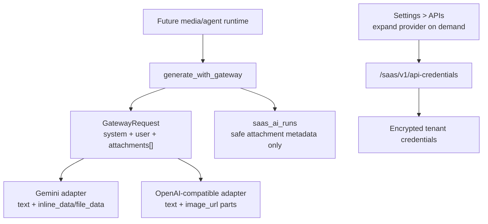
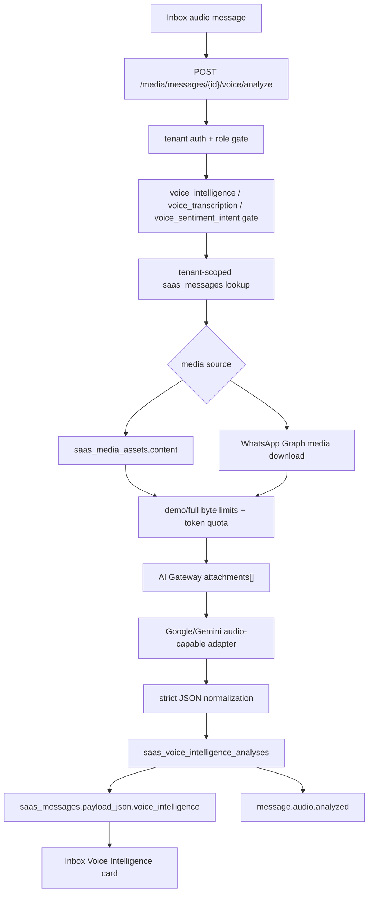
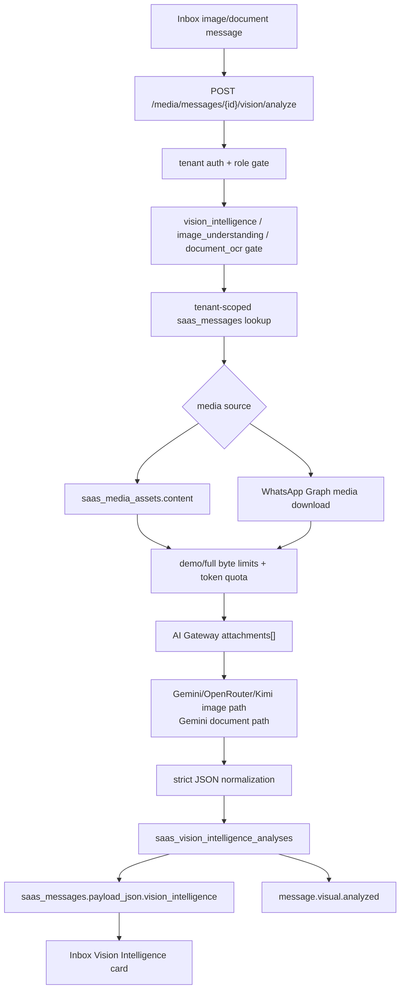
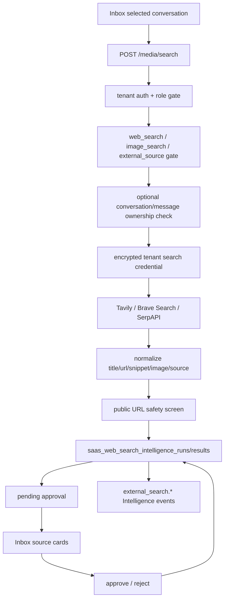
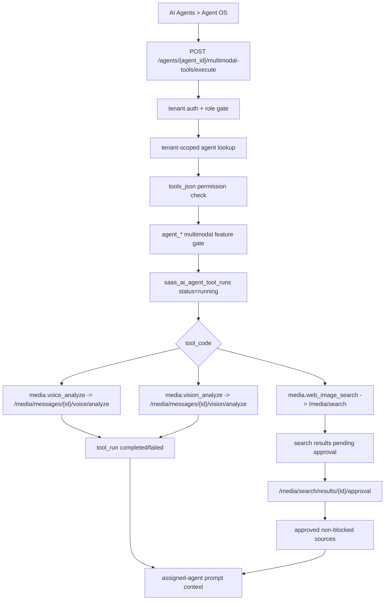
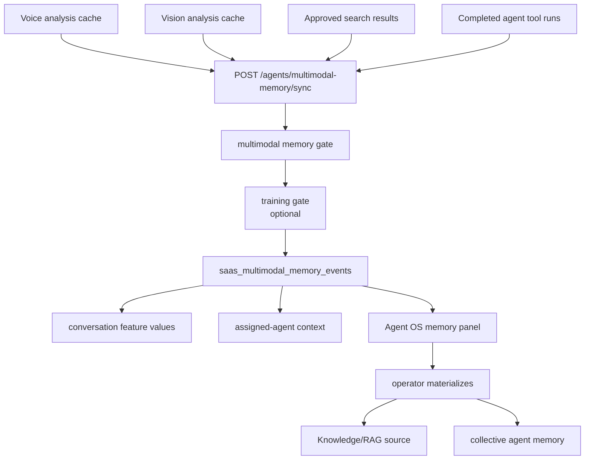
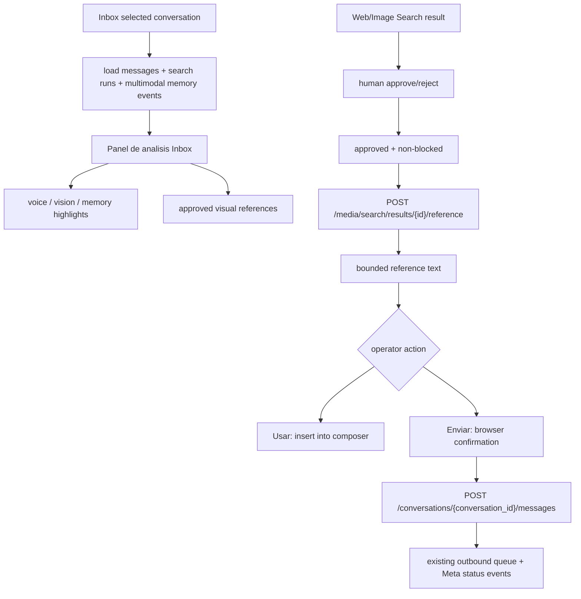
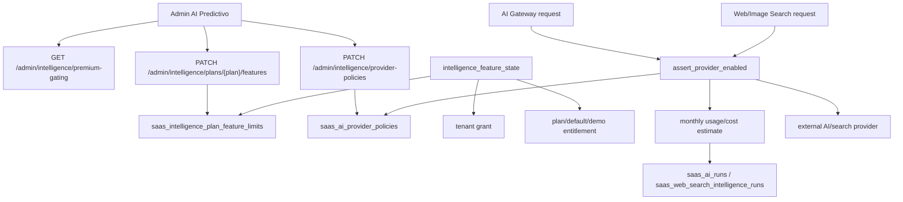
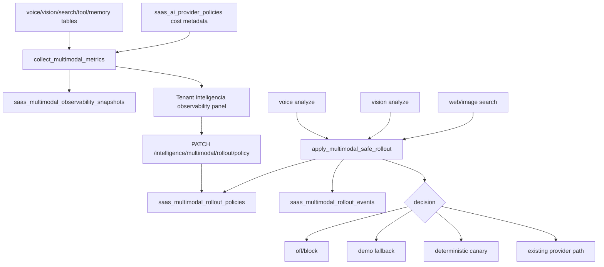

# Voice & Multimodal Intelligence

Scope: SaaS only. Phase 24.

## Intent

Phase 24 extends the existing AI Gateway so future voice, image, video and document intelligence can reuse the same provider routing, run logs, tenant credentials and fallback behavior.

24.1 was intentionally narrow:

- Add a structured attachment contract to internal gateway calls.
- Allow Gemini and OpenAI-compatible adapters to receive multimodal parts when callers provide them.
- Record only safe attachment metadata in `saas_ai_runs`.
- Keep existing text-only calls compatible.
- Improve tenant Settings > APIs so providers are added on demand instead of rendering every credential form at once.

24.2 adds the first runtime multimodal product capability:

- Analyze existing tenant audio messages from Inbox.
- Transcribe audio.
- Summarize the customer message.
- Classify sentiment and intent.
- Estimate urgency, language and confidence.
- Cache the analysis by message.
- Keep the result advisory and non-mutating.

24.3 adds the first runtime vision/document capability:

- Analyze existing tenant image, document and file messages from Inbox.
- Describe images.
- Extract text from supported documents.
- Summarize visual/document content.
- Classify document type, sentiment, intent, urgency, language and confidence.
- Cache the analysis by message.
- Keep the result advisory and non-mutating.

24.4 adds external source assistance:

- Search web and image providers from a selected conversation.
- Persist source/result metadata with safety status.
- Require human approval or rejection before any result can be used downstream.
- Keep search advisory and non-mutating.

24.5 adds agent-scoped multimodal tools:

- Let a selected agent run audio, vision/document or web/image search tools from Agent OS.
- Reuse existing media/search endpoints and Agent OS tool-run traces.
- Require the agent tool to be declared in `tools_json`.
- Inject only compact completed analysis and approved external sources into assigned-agent prompts.
- Keep execution contextual/read-only and non-mutating.

24.6 adds multimodal memory and training events:

- Capture useful voice, vision, approved source and agent-tool outputs as tenant-scoped memory events.
- Store sanitized text, compact features, labels and safety metadata only.
- Refresh conversation-level ML feature values from multimodal signals.
- Let operators materialize reviewed events into Knowledge/RAG and/or collective agent memory.
- Keep training eligibility separately gated and avoid automatic model training.

24.8 adds Admin and premium gating control:

- Control Phase 24 feature mode/quota by tenant and by plan.
- Control AI/search/TTS provider availability by global, plan or tenant scope.
- Configure request quotas and cost metadata for provider/model usage.
- Enforce explicit provider policy before AI Gateway and Web/Image Search calls.
- Keep compatibility default allow unless Admin configures a blocking policy.

24.9 adds multimodal observability:

- Aggregate cost, latency, errors, quality/confidence and sources used across voice, vision, search, agent tools and multimodal memory.
- Persist optional tenant snapshots for review.
- Use Admin provider-policy pricing metadata for cost estimates.
- Avoid raw media/base64 or decrypted secret storage.

24.10 adds safe rollout:

- Keep new rollout feature flags disabled by default.
- Support explicit tenant rollout policies for `off`, `demo`, `canary` and `full`.
- Apply deterministic canary decisions before external provider execution.
- Keep existing runtime behavior unchanged unless rollout access and an enabled policy exist.

## Architecture

## Phase 24.2 Voice Intelligence Flow

The voice endpoint accepts a message id, not arbitrary external audio. This keeps analysis scoped to content already owned by the tenant conversation.

## Attachment Contract

Internal gateway attachments are represented as:

- `kind`: image, audio, video, document, text or file.
- `mime_type`: content type when known.
- `data_base64`: optional inline payload for providers that accept inline media.
- `uri`: optional provider-accessible file URI or URL.
- `text`: optional pre-extracted transcript/OCR/caption.
- `name`: optional file label.
- `metadata`: caller-owned metadata.

Run logs store counts, kinds, MIME types and source shape only. They must not store base64 payloads, raw media bytes or external secrets.

## Phase 24.3 Vision Intelligence Flow

The vision endpoint accepts a message id, not arbitrary external URLs. This keeps analysis scoped to content already owned by the tenant conversation.

## Phase 24.4 Web/Image Search Flow

The search endpoint accepts a bounded query, search type and optional conversation/message context. It does not fetch result pages, crawl URLs or send results to customers.

## Phase 24.5 Agent Multimodal Tools Flow

Agent multimodal tools do not introduce a separate media runtime. They call the existing audited media/search surfaces with the current tenant auth context.

## Phase 24.6 Multimodal Memory & Training Events Flow

The sync endpoint can run globally, by selected conversation, by selected message or by selected agent. It deduplicates records by replay key and marks training readiness only when the tenant has `multimodal_training_events`, `ml_predictions`, or `ai_premium` access.

## Phase 24.7 Inbox Analysis And Reference Flow

## Phase 24.8 Admin Premium Gating Flow

Tenant grants still override plan-level limits. Provider policy scope resolution is tenant exact, tenant wildcard, plan exact, plan wildcard, global exact, global wildcard, then default compatibility allow.

The media endpoint prepares only approved, non-blocked sources. It does not send messages. Delivery stays in the CRM outbound path so quota, dispatch and audit behavior remain unchanged.

## Phase 24.9 Observability And Phase 24.10 Rollout Flow

Rollout enforcement is deliberately opt-in. A tenant must have rollout feature access and an enabled explicit policy before the helper can block, downgrade to demo or canary-select a multimodal execution path.

## Provider Strategy

- Gemini remains the preferred first provider for multimodal prompts because it already exists in the gateway and supports multimodal API parts.
- Phase 24.2 currently uses Google/Gemini as the supported real audio-analysis path.
- Phase 24.3 uses Google/Gemini as the safest default. Images may request OpenRouter or Kimi when tenant credentials/model support exist; documents are constrained to Gemini in this runtime path.
- Kimi remains the deep reasoning/agent provider and is now cataloged with multimodal capability where selected models support vision.
- OpenRouter remains fallback/dynamic routing, including image-capable models when selected by the tenant.
- Mistral/Groq remain best suited for low-cost classification and text tasks until a specific multimodal adapter path is approved.

## UI Strategy

Settings > APIs now shows compact provider tiles first.

- Saved providers remain visible.
- Unsaved providers appear as "Anadir" tiles.
- Clicking a tile expands the credential/model controls.
- Model lists load only after the provider is expanded and the user clicks "Cargar modelos".

This keeps the page shorter while preserving existing tenant credentials.

Settings > IA now includes a Voice Intelligence provider selector. It is restricted to providers with validated audio support and shows the linked selected model/credential state.

Inbox audio bubbles can now show a Voice Intelligence card with summary, sentiment, intent, urgency, confidence, recommended action and transcript.

Settings > IA now also includes a Vision Intelligence provider selector for image/document analysis.

Inbox image/document/file bubbles can show a Vision Intelligence card with summary, visual description, extracted text, document type, intent, urgency, confidence, topics and recommended action.

Settings > IA now also includes a Web/Image Search provider selector for Tavily, Brave Search API or SerpAPI.

Inbox CRM side panel can show Web/Image Search Intelligence results with source links, optional image previews, safety state and approval actions.

AI Agents > Agent OS now includes `Herramientas multimodales para agentes`.

- Voice and vision tools require a real Inbox message id.
- Search tools require a query and can include optional conversation/message context.
- Recent runs show status, safety metadata and source approval actions.
- Search source approval still uses the existing media approval endpoint.

AI Agents > Agent OS now also includes `Memoria y training multimodal`.

- Operators can sync recent multimodal outputs into memory events.
- Counts show stored memory events, training-ready events, RAG candidates and materialized rows.
- Event rows expose source kind, approval state and compact feature metadata.
- Materialization actions send an event to Knowledge/RAG or collective memory after explicit confirmation when customer content is involved.

Inbox now includes `Panel de analisis Inbox`.

- It shows voice/vision/memory highlights for the selected conversation.
- It shows approved visual references and pending reference counts.
- `Usar` inserts a prepared approved source into the existing composer.
- `Enviar` prepares the source, asks for human confirmation and then uses the existing CRM message endpoint.
- Pending safe sources can be approved as part of `Aprobar y usar` or `Aprobar y enviar`; blocked sources remain unavailable.

Tenant `Inteligencia` now includes `Phase 24.9 Observability` and `Phase 24.10 Safe Rollout`.

- Observability shows requests, estimated cost, P95/average latency, errors, quality/confidence, providers and sources used.
- Snapshot refresh can run as preview or persist a tenant snapshot when full access is available.
- Rollout policy controls feature key, modality, provider, rollout mode, canary percentage and threshold hints.
- Recent rollout decisions are listed for audit.

## Safety Boundaries

- 24.2 fetches local or WhatsApp audio bytes only for explicit analysis of an existing tenant message.
- 24.3 fetches local or WhatsApp image/document bytes only for explicit analysis of an existing tenant message.
- 24.4 searches external providers only when a user explicitly submits a query; results require human approval.
- 24.4 does not fetch result pages, crawl arbitrary URLs, send image/document/audio replies to customers, or make approved results customer-facing by itself.
- 24.5 agent tools call only existing read-only/advisory media/search paths and record tool traces.
- 24.5 search output is included in agent prompts only after individual source approval and only when the source is not blocked.
- 24.6 stores sanitized memory/training/RAG candidates, but does not run model training or create training datasets by itself.
- 24.7 prepares customer-facing references only after source approval and human operator action; actual sending stays in the CRM outbound path.
- 24.2/24.3/24.4/24.5/24.6/24.7 do not change AI ownership, agent assignment, quotas, billing state, CRM, campaigns, Meta runtime or workers.
- 24.8 changes only administrative gating/quota/provider policy. It does not add billing charges, train models, send messages, mutate CRM/campaign/workflow state or expose decrypted secrets.
- 24.9 stores only aggregate metrics/snapshots and source metadata. It does not store raw media/base64, decrypted provider credentials or full conversation content.
- 24.10 is disabled by default and only enforces explicit policies for tenants with rollout access.
- 24.2/24.3/24.4/24.5/24.6/24.7 do not persist raw media/base64 payloads.
- 24.6 materialization of customer content requires explicit operator approval through the backend payload/UI confirmation.
- 24.8 cost reporting depends on Admin-entered pricing; zero values are placeholders and should not be treated as provider invoices.
- 24.9 cost reporting inherits the same limitation; provider pricing must be configured before using cost estimates commercially.
- 24.10 rollout decisions do not mutate CRM, campaigns, workflows, billing, Meta runtime or agent ownership.
- Future 24.x phases must add separate privacy/copyright controls before web image results can be sent automatically or by agents.
