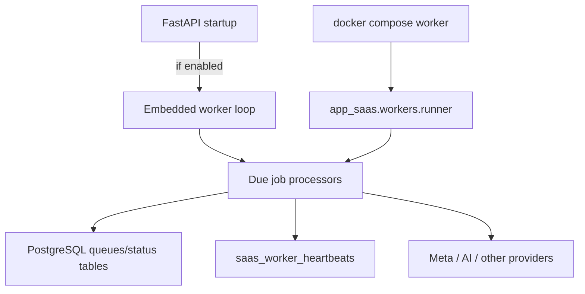
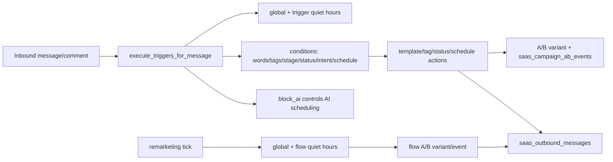
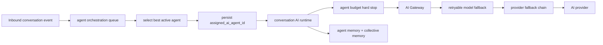
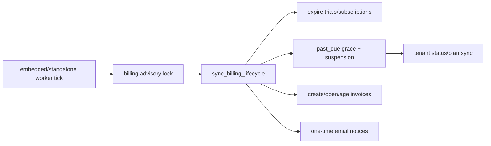
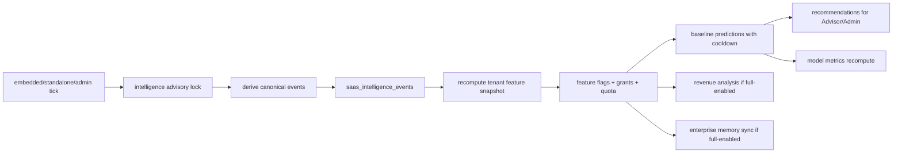
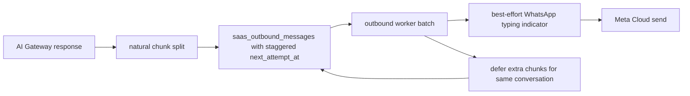
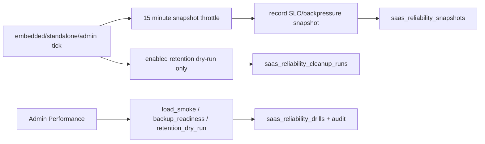

# WORKER_FLOW

Scope: SaaS only.

## Worker Execution

## Processors Detected

- due webhook events
- scheduled trigger messages
- remarketing flows
- AI replies
- agent orchestration
- outbound messages
- billing lifecycle
- intelligence event derivation, feature recompute and prediction generation
- revenue opportunity analysis and enterprise memory sync inside the Intelligence pipeline
- reliability snapshots, SLO checks and retention dry-runs
- Meta token refreshes

## Safety Model

- Assume duplicate/concurrent execution is possible.
- Status transitions must be retry-safe.
- Provider calls must handle partial failure.
- Admin operation endpoints can manually process queues.
- Worker liveness is recorded in `saas_worker_heartbeats` for embedded and standalone workers.
- Webhook ingestion uses per-event savepoints so failed SQL in one event does not abort the whole batch.
- Optional agent orchestration enqueue is isolated with a savepoint when called from ingestion.

## Phase 7 Campaign Worker Flow

- Scheduled trigger messages requeue during global quiet hours instead of failing permanently.
- Remarketing enrollments pause/reschedule during global or flow-local quiet hours.
- Outbound dispatch revalidates approved Meta template status for queued/retried template messages.

## Phase 8 Agent Ownership Worker Flow

- Orchestrator assignment makes the selected agent the conversation AI owner.
- Assigned inactive agents block general fallback until a human releases/reassigns the conversation.
- AI Gateway handles retryable model/provider failures for the assigned agent runtime. If every attempt fails with retryable provider errors, the AI pending reply remains retryable through the existing worker flow.

## Phase 9 Billing Worker Flow

- Billing lifecycle is interval-throttled by `SAAS_BILLING_LIFECYCLE_INTERVAL_MINUTES`.
- Past-due suspension grace is controlled by `BILLING_PAST_DUE_GRACE_DAYS`.
- The lifecycle processor must remain idempotent because API embedded workers and standalone workers can both run.
- Compose defaults the API embedded worker off when the standalone worker service is present. Single-container deployments can still enable the embedded worker explicitly.

## Phase 11 Intelligence Worker Flow

- `workers/intelligence.py` derives events idempotently from existing SaaS tables rather than changing every producer path at once.
- Derived sources currently include conversations, messages, webhooks, outbound messages, trigger executions, campaign A/B events, remarketing enrollments, AI Gateway runs and billing subscriptions.
- The processor uses `pg_try_advisory_xact_lock(hashtext('scentra:intelligence:pipeline'))` to avoid duplicate concurrent runs.
- Automatic predictions stay behind plan/grant/demo/full gating and monthly quota checks.
- Revenue Engine and Enterprise Memory Network run in nested transactions and skip tenants without full feature access. Memory sync also applies tenant memory policy before upserting candidates.
- Revenue/memory worker paths do not send messages, mutate CRM/campaign/workflow runtime, call payment providers, publish prompts or share raw cross-tenant content.
- Model metrics recompute after each tenant pipeline and remain tenant/model scoped.
- Runtime knobs: `SAAS_INTELLIGENCE_WORKER_INTERVAL_MINUTES`, `SAAS_INTELLIGENCE_EVENT_LIMIT`, `SAAS_INTELLIGENCE_LOOKBACK_HOURS`, and `SAAS_INTELLIGENCE_PREDICTION_COOLDOWN_MINUTES`.

## AI Outbound Fragment Flow

- Conversation AI still makes one model call with CRM, memory, Knowledge/RAG, collective memory and recent transcript context.
- Message fragmentation happens after generation, in the outbound queue, so context is not lost between fragments.
- The outbound worker sends at most one multi-chunk AI fragment per conversation per batch and nudges additional due fragments forward to avoid burst delivery after backlog.
- WhatsApp typing indicators are best-effort and require the original inbound Meta provider message id.

## Phase 12 Reliability Worker Flow

- `workers/reliability.py` opens its own DB session and delegates to `reliability.service.process_due_reliability`.
- The processor records snapshots and dry-run cleanup telemetry; it does not call Meta, pause campaigns, mutate queues or delete data automatically.
- Destructive retention remains an explicit admin API action with platform-admin role checks and backend allowlisted SQL.
