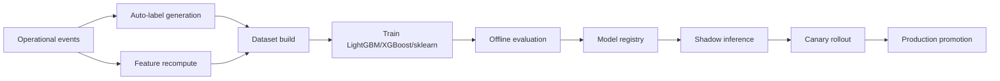

# FASE11_ML_TRAINING_GUIDE_ES

Scope: SaaS only. This explains how Phase 11 models should be trained and promoted safely.

See also `docs/TUTORIAL_FASE11_ENTRENAMIENTO_MODELOS_ES.md` for the step-by-step operator tutorial.

## Current ML Foundation

Already implemented in Scentra Phase 11:

- Unified events: `saas_intelligence_events`.
- Event contracts and replay cursors.
- Feature store: `saas_intelligence_feature_values`.
- Auto-labels: `saas_ml_auto_labels`.
- Training datasets: `saas_ml_training_datasets`.
- Model evaluations: `saas_ml_model_evaluations`.
- Model registry and rollout controls.
- Optional ML profile with MLflow, ML service, BentoML image, XGBoost, LightGBM, scikit-learn and Qdrant.
- Admin `AI Predictivo` controls for labels, feature recompute, dataset build and autolabel training.

Default production behavior:

- API/worker do not load heavy ML packages.
- `SAAS_ML_ENABLED=false` by default.
- Baseline rules remain fallback.
- Shadow/canary must be used before production rollout.

## Models To Train First

1. Lead Scoring V1
   - Goal: probability of conversion and lead temperature.
   - Label examples:
     - converted lead = true
     - pipeline moved to won/closed/sale = true
     - quote requested + purchase/booking = true
   - Features:
     - response time
     - message count
     - asked for price
     - engagement score
     - avg reply speed
     - channel source
     - follow-up count

2. Churn Prediction V1
   - Goal: risk of inactivity/lost customer.
   - Label examples:
     - inactive 45 days = true
     - engagement drop = true
     - unresolved escalation + no reply = true
   - Features:
     - inactivity days
     - negative sentiment ratio
     - response drop
     - ticket frequency
     - engagement decline

3. Smart Remarketing V1
   - Goal: best time/channel/segment/frequency.
   - Label examples:
     - campaign clicked + replied + purchased/booked = success
     - remarketing opened/replied = success
   - Features:
     - open rate
     - click rate
     - best hour
     - best channel
     - campaign engagement

4. Operational Anomaly V1
   - Goal: detect webhook/queue/API degradation.
   - Label examples:
     - webhook failed
     - queue backlog spike
     - outbound failure burst
     - dead-letter growth
   - Features:
     - event failure rate
     - webhook errors 24h
     - dead letters open
     - outbound failed 24h
     - AI failed 24h

## Training Pipeline



## Operational Steps

1. Enable optional ML infrastructure only in staging first.

```powershell
docker compose -f saas-version\docker-compose.saas.yml --profile ml up -d --build
```

2. Configure ML envs for staging.

- `SAAS_ML_ENABLED=true`
- `SAAS_ML_SHADOW_INFERENCE_ENABLED=true`
- `SAAS_ML_AUTO_TRAIN_ENABLED=false` initially
- `SAAS_ML_SERVICE_URL=http://ml-service:8090`
- `SAAS_MLFLOW_TRACKING_URI=http://mlflow:5000`

3. Generate labels from real tenant-safe events.

- Use Admin `AI Predictivo`.
- Or call Admin endpoints for auto-label generation.
- Review label distribution before training.

4. Recompute features.

- Recompute by tenant/model.
- Confirm no missing tenant isolation.

5. Build dataset.

- Build Postgres dataset from labels + features.
- Store manifest and CSV artifact.
- Confirm class balance.

6. Train lightweight model.

- Prefer LightGBM/XGBoost.
- Use sklearn fallback when dataset is small.
- No GPU required.
- No LLM training initially.

7. Evaluate.

Minimum metrics:

- sample count
- precision/recall or ROC AUC when applicable
- calibration
- confusion matrix
- top-feature importances
- drift baseline
- false positive/negative review

8. Register model.

- Register as `shadow`.
- Do not immediately mark production.

9. Shadow inference.

- Compare ML prediction with baseline result.
- Do not let shadow output create customer-facing recommendations automatically.

10. Canary rollout.

- Start with 5-10 percent of eligible traffic.
- Monitor accuracy, latency, drift, cost and complaints.

11. Production promotion.

- Promote only after acceptance.
- Keep rollback artifact and baseline fallback.

## Data Needed

Minimum useful staging targets:

- Lead Scoring: 500-1,000 labeled leads minimum; better at 5,000+.
- Churn: 300-500 churn/non-churn examples minimum; better at 2,000+.
- Remarketing: 1,000+ campaign/trigger outcomes minimum; better when segmented by channel/industry.
- Operational anomaly: enough normal traffic plus known incidents; can start with heuristic labels and anomaly baselines.

Data quality requirements:

- Consistent event capture.
- Tenant IDs present on all rows.
- Conversion/churn outcomes defined per industry.
- Feedback from users/admins on predictions.
- Removal/anonymization of sensitive text for shared/global training.

## Privacy And Multi-Tenant Rules

- Tenant-private training can use that tenant's own events/features.
- Cross-tenant/global models must use anonymized/aggregated features only.
- Do not share raw messages, names, phone numbers, conversations or private documents across tenants.
- Respect privacy delete requests and retention policies.
- Use industry-level cohorts only when sample size is sufficient.

## What We Need Before Selling ML As Production-Quality

- Real tenant-safe labeled data.
- Reviewed auto-label rules per model.
- Class balance checks.
- Offline evaluation reports.
- Shadow/canary acceptance.
- Drift monitoring.
- Cost/latency monitoring.
- Rollback runbook.
- Admin controls for feature flags, quotas and model status.
- Clear product language: "decision support" until validated.

## What We Do Not Need Initially

- GPU infrastructure.
- Training our own LLM.
- Kafka/NATS for first production ML rollout.
- Distributed training.
- External private datasets.

## Recommended Cadence

- Daily: feature recompute and prediction monitoring.
- Weekly: label distribution review.
- Biweekly: retraining candidate in shadow.
- Monthly: model review and promotion/rollback decision.
- Quarterly: drift and feature-policy review by industry.
