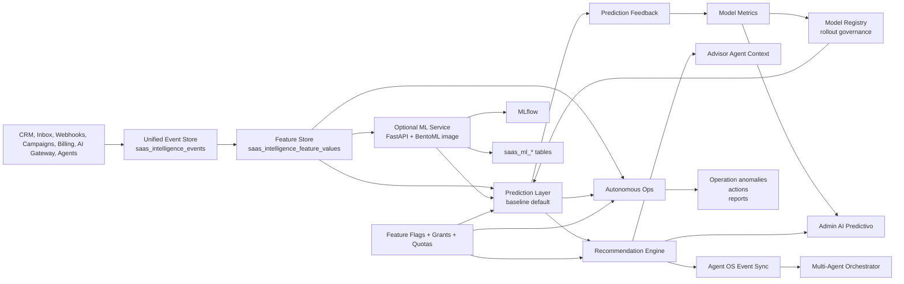

# Scentra Intelligence Engine

Scope: SaaS only. Derived from current `saas-version/` code plus Phase 11 implementation.

Date: 2026-05-27.

## Current Implementation

Phase 11 now has a production-safe hybrid AI + ML foundation plus optional real ML infrastructure. The default SaaS API/worker remain ML-disabled; trained-model work runs only when the optional Docker `ml` profile and `SAAS_ML_ENABLED=true` are explicitly enabled.

Operational training guide:

- `docs/FASE11_ML_TRAINING_GUIDE_ES.md` explains the current training path: events, auto-labels, feature pipelines, Postgres datasets, LightGBM/XGBoost/sklearn training, offline evaluation, registry, shadow inference, canary rollout and production promotion.

Implemented now:

- New migration: `saas-version/migrations/046_saas_intelligence_engine_phase11.sql`.
- New ModelOps migration: `saas-version/migrations/047_saas_intelligence_modelops_phase11.sql`.
- New rollout governance migration: `saas-version/migrations/048_saas_intelligence_model_rollouts_phase11.sql`.
- New ML infrastructure migration: `saas-version/migrations/049_saas_ml_infrastructure_phase11.sql`.
- New ML training strategy migration: `saas-version/migrations/050_saas_ml_training_strategy_phase11.sql`.
- New Multi-Agent OS migration: `saas-version/migrations/051_saas_multi_agent_operating_system_phase11.sql`.
- New Autonomous Operational Intelligence migration: `saas-version/migrations/052_saas_autonomous_operational_intelligence_phase11.sql`.
- New AI Platform Ecosystem migration: `saas-version/migrations/053_saas_ai_platform_ecosystem_phase11.sql`.
- New Enterprise AI Network migration: `saas-version/migrations/054_saas_enterprise_ai_network_phase11.sql`.
- New backend domain: `saas-version/backend/app_saas/intelligence`.
- New backend domain: `saas-version/backend/app_saas/ecosystem`.
- New optional ML service domain: `saas-version/backend/app_saas/ml_service`.
- New Agent OS backend module: `saas-version/backend/app_saas/agents/operating_system.py`.
- New Autonomous Operations backend module: `saas-version/backend/app_saas/intelligence/operations.py`.
- New Enterprise AI Network backend module: `saas-version/backend/app_saas/intelligence/network.py`.
- New tenant API prefix: `/saas/v1/intelligence`.
- New tenant API prefix: `/saas/v1/ecosystem`.
- New admin APIs: `/saas/v1/admin/intelligence/*`.
- New admin UI view: `AI Predictivo`.
- New tenant UI view: `Inteligencia` in `saas-version/frontend/src/IntelligencePanel.jsx`.
- New tenant UI view: `AI Ecosystem` in `saas-version/frontend/src/AiEcosystemPanel.jsx`.
- New tenant overview API: `GET /saas/v1/intelligence/overview`.
- New Advisor briefing API: `GET /saas/v1/advisor/briefing`.
- New premium feature flags in billing/admin catalogs.
- New AI feature grants table for tenant-specific demo/full/disabled mode and quotas.
- New worker: `saas-version/backend/app_saas/workers/intelligence.py`.
- Safe inline event helper: `saas-version/backend/app_saas/intelligence/capture.py`.
- Embedded and standalone workers now run the Intelligence pipeline.
- Admin Operations can manually run `/saas/v1/admin/operations/intelligence/process`.
- Canonical events are now derived idempotently from conversations, messages, webhooks, outbound, trigger executions, campaign A/B events, remarketing enrollments, AI Gateway runs and billing subscriptions.
- CRM outbound messages and billing subscription changes now emit selected Intelligence events inline with worker-compatible replay keys.
- Prediction feedback is stored in `saas_intelligence_prediction_feedback`.
- Model quality snapshots are stored in `saas_intelligence_model_metrics` with sample size, feedback count, accuracy, confidence, error and drift baselines.
- Admin `AI Predictivo` includes ModelOps metrics and manual recompute.
- Admin `AI Predictivo` includes `Model Registry & Rollout` for model registration, model status, shadow/canary/production mode, traffic percent and readiness assessment.
- Admin `AI Predictivo` includes ML infrastructure overview, training dataset readiness and synthetic ML training controls when ML is enabled.
- Admin `AI Predictivo` includes Data Intelligence controls for auto-label generation, feature pipeline recompute, Postgres dataset materialization and autolabel training when ML is enabled.
- The Intelligence worker recomputes model metrics after tenant pipeline runs.
- Prediction runtime blocks disabled/paused models, selects canary registry rows deterministically by traffic percent, and persists shadow/unapproved canary predictions as `shadow` so they do not auto-create recommendations.
- Prediction output records `scoring_engine = baseline_rules` by default. When ML is explicitly enabled and a selected artifact is ready, the runtime can call the ML service; when shadow inference is enabled, the trained candidate runs in parallel and the baseline result remains authoritative.
- ML service endpoints support `/health`, `/models`, `/train/synthetic`, `/datasets/build`, `/train/autolabel`, `/predict`, `/drift/evaluate`, and `/metrics`.
- ML service training supports LightGBM, XGBoost and sklearn fallback for lead scoring, churn prediction, smart remarketing and operational anomaly detection.
- Postgres auto-label training joins `saas_ml_auto_labels` with `saas_intelligence_feature_values`, writes dataset CSV/manifest artifacts, records `saas_ml_training_datasets`, trains a lightweight tabular model, and records `saas_ml_model_evaluations`.
- MLflow experiment logging and BentoML model packaging are available inside the optional ML image.
- Qdrant is available in the optional `ml` profile for future vector infrastructure, but current Knowledge/RAG remains Postgres sparse-vector + lexical.
- Prediction generation and persisted recommendation creation are gated separately. Demo prediction previews can run through `intelligence_demo`, while `saas_intelligence_recommendations` requires `predictive_recommendations` access/quota and records `recommendation_gate` metadata on the prediction output.
- Tenant users can inspect grants, feature-store snapshots, predictions, recommendations, feedback and model metrics from the client app.
- Tenant users can recompute feature snapshots, generate gated baseline predictions, submit feedback and dismiss recommendations through existing tenant APIs.
- Dashboard, Inbox and CRM now surface predictive signals through latest-prediction strips, predictive badges, `Churn` filtering, CRM `predictive_intelligence`, and conversation-level prediction actions.
- Advisor context now includes latest intelligence predictions and open recommendations.
- The floating Advisor now loads a compact briefing with predictive summaries, proactive insights, recommendations, actions, activity, metrics and memory without auto-executing actions.
- Agent OS now exposes `/saas/v1/agents/os` for multi-agent coverage, memory layers, event subscriptions, tool-run traces, runtime traces, orchestrator state and premium/demo status.
- Agent OS event sync can convert Intelligence predictions/recommendations into orchestrator jobs when full premium mode is enabled; demo mode previews candidates without enqueuing.
- Agent OS tool runs are approval-first and create action drafts by default; no side-effect tool is executed directly by the control-plane.
- Autonomous Operations now exposes `/saas/v1/intelligence/operations/*` for AI Operations Center, AI Control Center, operational anomaly analysis, supervised action approvals and controlled execution records.
- Autonomous Operations detects webhook, outbound, dead-letter, Meta subscription, campaign, trigger, inactivity, lead-priority and worker-degradation signals from existing SaaS tables.
- Autonomous Operations seeds tenant playbooks for self-healing, optimization, CRM recovery and operational triage.
- Autonomous Operations supports autonomy Levels 0-4, but demo mode forces auto-remediation and low-risk auto-execute off.
- Current autonomous action execution is deliberately supervised/control-plane first and does not directly mutate Meta, queues, campaigns, CRM or billing.
- AI Platform Ecosystem now exposes `/saas/v1/ecosystem/*` for marketplace, installations, plugin center, tool registry, event subscriptions, developer apps, SDK manifest, external integrations, tenant AI apps, metrics and overview.
- Enterprise AI Network now exposes `/saas/v1/intelligence/network/*` for Industry Intelligence Center, anonymized benchmarks, tenant benchmark comparisons, vertical insights, vertical advisors, AI playbooks, industry model metadata and aggregate-only knowledge network.
- Enterprise AI Network stores no raw peer messages/conversations and uses a minimum cohort sample threshold before publishing aggregate benchmark rows.
- Ecosystem tables store marketplace items/installations, plugin manifests, tool metadata, developer apps, external integration metadata, AI apps, event subscriptions, traces and metrics.
- Ecosystem features are premium-gated through `ai_marketplace`, `ai_plugin_center`, `ai_developer_console`, `ai_tool_registry`, `ai_app_framework`, or umbrella `ai_premium`.
- Demo mode can preview ecosystem surfaces; install/create/update actions require full mode.
- Plugin and AI app manifests are metadata-only. The API/worker do not execute untrusted plugin code.
- Developer app API keys are stored hashed and raw keys are shown only once.
- Kimi is already an official AI Gateway provider in code and migration `023`; Phase 11 does not duplicate it.
- Phase 10 vertical packs were extended with retail, ecommerce, support, automotive and financial services so Phase 11 vertical intelligence can route those industries through real onboarding codes instead of falling back to general.

Not implemented / not enabled by default:

- No external event broker was added.
- No Kafka/NATS was added.
- No ML dependency was added to the default API/worker image; ML dependencies live in `Dockerfile.ml` only.
- No production-certified model artifact is shipped. Synthetic and Postgres auto-label models are bootstrap artifacts for infrastructure validation until label quality and staged rollout are accepted.
- Registered external artifact URIs are executed only when `SAAS_ML_ENABLED=true` and the ML service can load the artifact; otherwise baseline fallback remains in force.
- No automated decision executes without human/product gating.
- No uncontrolled self-healing executes provider or queue mutations from the Autonomous Operations layer.
- No untrusted plugin runtime, external AI app execution sandbox or public developer API gateway is enabled yet; the ecosystem layer is a governed control-plane.
- Enterprise AI Network playbooks are not executable automation. They are sector recommendations/drafts and do not activate triggers, flows or campaigns.
- Not every producer writes events inline yet; the current architecture combines limited inline CRM/Billing capture with the derived-event worker to reduce risk and preserve existing domain contracts.
- Inline producer coverage is intentionally limited to CRM outbound and billing subscription changes; runtime smoke validated this first pattern, but broader producer coverage remains incremental future work.
- Broader production acceptance still needs real tenant/provider traffic, reviewed auto-label quality, staged shadow/canary/full rollout, drift/cost alerting and trained-model validation.

## Core Architecture

## Unified Event System

Current foundation:

- Events are stored in `saas_intelligence_events`.
- Event contracts are stored in `saas_intelligence_event_contracts`.
- Replay cursors are stored in `saas_intelligence_event_replay_cursors`.
- Events are tenant-scoped and can be idempotent through `replay_key`.
- Supported schema fields: `event_type`, `source`, `channel`, `entity_type`, `entity_id`, `conversation_id`, `customer_key`, `payload_json`, `correlation_id`, `occurred_at`.
- Initial endpoint: `POST /saas/v1/intelligence/events`.
- Automatic derivation now runs from `workers/intelligence.py` and Admin Operations.
- Derived sources: `saas_conversations`, `saas_messages`, `saas_webhook_events`, `saas_outbound_messages`, `saas_trigger_executions`, `saas_campaign_ab_events`, `saas_remarketing_enrollments`, `saas_ai_runs`, and `saas_billing_subscriptions`.
- Inline sources: CRM outbound message creation emits `message.sent`; billing checkout/subscription state changes emit `billing.subscription.changed`.
- Inline capture uses nested transactions and returns `None` on telemetry failure, preserving the original CRM/billing write.

Recommended canonical event names:

- `message.received`
- `message.sent`
- `lead.created`
- `lead.converted`
- `trigger.executed`
- `workflow.executed`
- `campaign.sent`
- `campaign.clicked`
- `conversation.closed`
- `remarketing.opened`
- `ai.prediction.generated`
- `ai.prediction.feedback_recorded`
- `ai.recommendation.generated`
- `ai.insight.generated`
- `ai.operations.analysis_completed`
- `ai.autonomous_action.generated`
- `ai.autonomous_action.approved`
- `ai.autonomous_action.executed`
- `agent.assigned`
- `billing.subscription.changed`
- `integration.health.changed`

Worker controls:

- `SAAS_INTELLIGENCE_WORKER_INTERVAL_MINUTES`
- `SAAS_INTELLIGENCE_EVENT_LIMIT`
- `SAAS_INTELLIGENCE_LOOKBACK_HOURS`
- `SAAS_INTELLIGENCE_PREDICTION_COOLDOWN_MINUTES`

Future event-bus strategy:

- Phase 11 uses PostgreSQL for reproducible bootstrap.
- Add NATS JetStream first when event fanout/replay is needed with lower ops complexity.
- Add Kafka/Redpanda when analytics volume, long retention, and stream processing exceed Postgres/NATS.
- Keep PostgreSQL as system-of-record for audit/replay checkpoints.

## Feature Store

Current table: `saas_intelligence_feature_values`.

Current baseline and training features:

- `conversations`
- `hot_leads`
- `avg_lead_score`
- `active_7d`
- `inactive_14d`
- `inactivity_days`
- `avg_response_time_minutes`
- `inbound_30d`
- `outbound_30d`
- `engaged_conversations_30d`
- `ai_failed_24h`
- `webhook_errors_24h`
- `dead_letters_open`
- `outbound_failed_24h`
- `campaigns`
- `active_triggers`
- `active_remarketing`
- `response_time`
- `message_count`
- `asked_for_price`
- `engagement_score`
- `avg_reply_speed`
- `channel_source_score`
- `followup_count`
- `negative_sentiment_ratio`
- `response_drop`
- `ticket_frequency`
- `engagement_decline`
- `open_rate`
- `click_rate`
- `best_hour`
- `best_channel_score`
- `campaign_engagement`
- `event_failure_rate`

Current automation:

- Feature snapshots are recomputed by tenant from the Intelligence worker.
- Training feature pipelines can recompute subject-level conversation/customer features for `lead_scoring`, `churn_prediction`, and `smart_remarketing`, plus tenant-level operational features.
- Feature rows include `feature_set_key`, `feature_version`, and `quality_json` metadata for reproducible dataset builds.
- The worker uses a PostgreSQL advisory lock to avoid duplicate concurrent embedded/standalone runs.
- Prediction generation has a cooldown and still consumes quota through the existing usage path.

Requested target features to expand:

- `engagement_score`
- `conversion_probability`
- `sentiment_score`
- `lead_temperature`
- `churn_risk_score`
- `campaign_response_rate`
- `best_send_time_score`
- `next_best_action_score`
- `agent_quality_score`
- `forecast_ai_cost`

Multi-tenant policy:

- Every feature row has `tenant_id`.
- Subject isolation uses `subject_type` + `subject_id`.
- Do not compute cross-tenant personalized features unless the data is anonymized and explicitly approved.
- Shared/global models can exist only with tenant-segregated features and no raw tenant payload leakage.

## Prediction Layer

Current endpoint:

- `GET /saas/v1/intelligence/overview`
- `POST /saas/v1/intelligence/predict`
- `POST /saas/v1/intelligence/predictions/{prediction_id}/feedback`
- `GET /saas/v1/intelligence/model-metrics`

Current prediction types:

- `lead_scoring`
- `churn_prediction`
- `smart_remarketing`
- `operational_anomaly`

Current model type:

- Rule-based baseline models registered in `saas_intelligence_model_registry`.
- These are safe baselines for production gating and UX; synthetic/autolabel trained models are infrastructure bootstrap artifacts until production labels validate them.
- Automatic baseline predictions are generated only when the corresponding feature is enabled through plan/tenant/grant/demo/full mode and quota checks pass.
- Feedback can be attached to persisted predictions and immediately refreshes tenant/model metrics.
- Current metrics are governance baselines, not proof of trained ML performance.
- Optional ML service inference can replace or shadow baseline scoring only when `SAAS_ML_ENABLED=true`, the selected registry row has a loadable artifact, and the ML service returns a ready result before timeout.
- Shadow inference stores its output under `output_json.ml_inference` and never changes the baseline score, recommendation gate, or tenant-facing business decision.

Current rollout governance:

- `saas_intelligence_model_registry` stores `rollout_mode`, `traffic_percent`, `min_labeled_count`, `min_accuracy`, `max_drift_score`, `promotion_status`, approval metadata and shadow mode.
- `saas_intelligence_model_rollout_events` stores auditable registry changes.
- Admin can register models, list models, check production readiness and patch rollout controls.
- Disabled/paused models cannot generate predictions.
- Canary routing is deterministic by tenant/prediction/subject/window and `traffic_percent`; canary `100%` selects the candidate registry row and canary `0%` falls back to the production baseline.
- Shadow/unapproved canary predictions are stored with `status = 'shadow'` and do not create recommendations automatically.
- Current canary routing selects registry metadata and can execute optional ML service inference when enabled. If ML is disabled, unavailable, or not ready, the runtime falls back to `baseline_rules`.

Current optional ML service:

- Service path: `saas-version/backend/app_saas/ml_service`.
- Image/deps: `saas-version/backend/Dockerfile.ml` and `requirements-ml.txt`.
- Endpoints: `/health`, `/models`, `/train/synthetic`, `/datasets/build`, `/train/autolabel`, `/predict`, `/drift/evaluate`, `/metrics`.
- Model families: lead scoring, churn prediction, smart remarketing, operational anomaly detection.
- Frameworks: LightGBM, XGBoost, sklearn fallback.
- Registry/observability: MLflow logging, BentoML packaging, Prometheus metrics, `saas_ml_training_jobs`, `saas_ml_model_artifacts`, `saas_ml_inference_runs`, and `saas_ml_drift_snapshots`.
- Dataset/evaluation tracking: `saas_ml_auto_labels`, `saas_ml_feature_sets`, `saas_ml_feature_pipeline_runs`, `saas_ml_training_datasets`, and `saas_ml_model_evaluations`.
- Rollout: disabled by default; use shadow first, then canary, then full production after labeled-data acceptance.

Future ML services:

- `lead-scoring-service`: LightGBM/CatBoost/XGBoost over CRM and engagement features.
- `churn-service`: gradient boosting plus survival/time-window features.
- `campaign-optimization-service`: uplift/response models and bandit experiments.
- `trigger-optimization-service`: conversion and suppression models.
- `anomaly-service`: River/scikit-learn incremental anomaly detection.
- `routing-service`: smart routing by channel, agent, SLA, intent and tenant policy.
- `sentiment-intent-service`: low-cost classifier with Mistral or classical model fallback.
- `forecast-service`: Prophet/stats models for usage/cost forecasts.

## LLM Orchestration

Current code-derived facts:

- AI Gateway lives under `app_saas/ai_gateway`.
- Providers in code: Gemini/Google, Groq, Mistral, OpenRouter, Kimi.
- Kimi uses `KIMI_API_KEY`, base URL `https://api.moonshot.ai/v1`, OpenAI-compatible adapter, default `kimi-k2.6`.
- Advisor route defaults include Kimi for `advisor.insights`.

Recommended provider roles:

- Gemini: summaries, multimodal/context summaries, executive insights.
- Kimi: deep reasoning, long-context Advisor analysis, strategic recommendations.
- Mistral: low-cost classification, intent, routing and structured extraction.
- OpenRouter: fallback and provider diversity.

Do not train proprietary LLMs initially. Use provider routing, caching, compression, evals and governance first.

## Premium AI Feature Layer

Implemented feature flags:

- `intelligence_demo`
- `ai_premium`
- `ml_predictions`
- `lead_scoring_ml`
- `churn_prediction`
- `smart_remarketing`
- `ai_operational_intelligence`
- `predictive_recommendations`
- `advanced_analytics`
- `ai_advisors_premium`
- `autonomous_operations`
- `ai_self_healing`
- `ai_control_center`

Control layers:

- Plan-level: `saas_plan_limits.feature_flags_json`.
- Tenant override: `saas_tenant_feature_flags`.
- Intelligence grant: `saas_intelligence_feature_grants`.
- Usage: `saas_intelligence_usage`.
- Full mode requires explicit plan/tenant/grant enablement.
- Demo mode can expose limited previews via `intelligence_demo`.

Admin can now:

- See tenant intelligence state.
- Enable/disable demo mode.
- Set feature mode: disabled/demo/full.
- Set monthly quota.
- Audit changes through `saas_audit_events`.

## Admin UX

Admin view: `AI Predictivo`.

Panels:

- Tenant metrics: predictions 30d, recommendations open, monthly usage.
- Per-tenant feature controls.
- ML Infrastructure: enabled/shadow/auto-train flags, ML service URL, MLflow URI, Qdrant URL, jobs, artifacts, inference runs and drift snapshots.
- Training readiness: labeled prediction feedback plus auto-label counts/readiness by tenant/model/prediction type with minimum-label and label-diversity checks.
- Synthetic ML training: task, model key, framework, sample size, seed and optional registry registration in shadow mode.
- Data Intelligence training: auto-label generation, feature pipeline recompute, Postgres dataset materialization, and autolabel model training.
- ModelOps metrics: model key, prediction type, sample count, feedback count, accuracy and drift baseline.
- Model registry rollout: status, rollout mode, traffic percent, readiness, feedback, accuracy and drift.
- Feature catalog.

## Tenant UX

Tenant view: `Inteligencia`.

Panels:

- Executive daily, weekly and operational summaries from `/intelligence/overview`.
- Predictive dashboard cards for lead scoring, churn, smart remarketing and operational anomalies.
- AI premium grants and usage by feature.
- Feature-store snapshot values for the active tenant.
- Prediction actions for `lead_scoring`, `churn_prediction`, `smart_remarketing`, and `operational_anomaly`.
- Persisted predictions with score, label, model, rollout status and feedback controls.
- Open recommendations with dismiss action.
- Tenant model metrics from existing ModelOps endpoints.
- AI Operations Center for anomalies, playbooks, operational reports and supervised autonomous actions.
- AI Control Center for autonomy level, sensitivity, daily action limits, approval threshold, auto-remediation and Level 4 low-risk policy.

Other product surfaces:

- Dashboard shows latest predictive signals and open recommendation counts.
- Inbox shows predictive badges, including ML conversion probability and churn risk.
- Inbox includes a `Churn` smart filter for high-risk conversations.
- CRM side panel shows lead score, conversion probability, engagement, churn risk, retention priority, suggested action and recommended remarketing timing.
- CRM side panel can request conversation-level lead scoring, churn and smart remarketing predictions through the existing gated prediction API.
- Floating Advisor shows proactive predictive briefing from `/advisor/briefing`.
- AI Agents shows an `Agent OS` tab with core agent coverage, memory layers, event-driven subscriptions, inter-agent messages, tool-run traces and runtime observability.

## Multi-Agent Operating System

Current module: `saas-version/backend/app_saas/agents/operating_system.py`.

Implemented:

- Agent OS overview over the existing registry/governance/orchestrator/runtime.
- Core-agent coverage for advisor, sales, CRM intelligence, retention, campaign strategist, operations, executive summary, knowledge and workflow architect.
- Memory architecture snapshot: short-term conversation memory, long-term memory archives, semantic Knowledge/RAG chunks, episodic events/jobs/tool runs, and tenant collective memory.
- Inter-agent messages through `saas_ai_agent_messages`.
- Runtime traces through `saas_ai_agent_runtime_traces`.
- Tool-run traces through `saas_ai_agent_tool_runs`.
- Event subscriptions through `saas_ai_agent_event_subscriptions`.
- Intelligence-to-Agent OS sync from recent predictions/recommendations into orchestrator jobs.
- Premium/demo gating through `multi_agent_os`, `event_driven_agents`, `agent_tool_tracing`, `ai_premium` and existing plan/tenant flags.

Safety:

- Agent OS does not bypass the existing one-AI-owner conversation model.
- Event sync writes orchestrator jobs only in full premium mode; demo mode previews candidates without enqueuing.
- Tool runs create human-approval Advisor action drafts by default and do not execute side-effect tools directly.
- Worker sync is wrapped in nested transactions so Agent OS failures do not break Intelligence, Meta, CRM, trigger or webhook processing.

## Autonomous Operational Intelligence

Current module: `saas-version/backend/app_saas/intelligence/operations.py`.

Implemented:

- Tenant AI operations center over events, feature state, queues, worker heartbeats, Meta subscription checks, campaign/trigger telemetry, CRM activity and latest predictive recommendations.
- Tenant policies in `saas_ai_operation_policies` with autonomy level, sensitivity, action limits, approval threshold, auto-remediation and low-risk auto-execute settings.
- Tenant playbooks in `saas_ai_operation_playbooks` for webhook retry planning, outbound queue triage, Meta subscription review, Meta token health, trigger/campaign optimization, churn recovery, lead prioritization and queue degradation triage.
- Anomalies in `saas_ai_operation_anomalies` with severity, confidence, evidence and recommended playbook.
- Action records in `saas_ai_operation_actions` with approval state, rollback metadata, risk level, confidence and result JSON.
- Operational reports in `saas_ai_operation_reports` with findings and recommendations.
- Worker integration through `workers/intelligence.py` using nested transactions.
- Tenant UI sections for AI Operations Center, AI Control Center, autonomous actions and operational reports.

Autonomy model:

- Level 0: insights only.
- Level 1: recommendations.
- Level 2: suggested actions.
- Level 3: semi-autonomous preparation.
- Level 4: low-risk/report-only controlled execution when full mode and policy allow it.

Safety:

- Full mode is required for persisted auto-remediation or low-risk auto-execute.
- Demo mode can preview/analyze but forces both auto execution flags off.
- Current execution records controlled results and does not directly mutate Meta, queues, campaigns, CRM or billing.
- Medium/high-risk playbooks remain approval-first and rollback-documented.
- This layer is premium-gated through `autonomous_operations`, `ai_self_healing`, `ai_control_center` and the umbrella `ai_premium` state.

## Enterprise AI Network And Vertical Intelligence

Current module: `saas-version/backend/app_saas/intelligence/network.py`.

Implemented:

- Privacy-safe industry intelligence for tenant industry codes.
- New vertical packs/codes for retail, ecommerce, support, automotive and financial services in addition to Phase 10 packs.
- Industry model metadata in `saas_ai_vertical_industry_models`.
- Anonymous industry benchmark aggregates in `saas_ai_vertical_benchmarks`.
- Tenant-scoped benchmark comparisons in `saas_ai_vertical_tenant_benchmarks`.
- Tenant-scoped insights in `saas_ai_vertical_insights`.
- Published AI playbooks in `saas_ai_vertical_playbooks`.
- Aggregate-only knowledge-network nodes in `saas_ai_knowledge_network`.
- Tenant-private network metric snapshots in `saas_ai_network_metrics`.
- Tenant endpoints: `/intelligence/network/center`, `/intelligence/network/refresh`, `/intelligence/network/playbooks`.
- Worker integration with skip-safe nested transactions for tenants without full access.
- Tenant `Inteligencia` UI sections: Industry Intelligence Center, Benchmark Dashboard, Industry Insights Panel, AI Playbook Marketplace, Industry AI Models and AI Knowledge Network.

Privacy:

- No raw messages, conversations, tenant names, private content or sensitive data are shared cross-tenant.
- Benchmark aggregates require minimum sample count `3`.
- Full persisted refresh requires `enterprise_ai_network`, `cross_tenant_intelligence`, or umbrella `ai_premium` in full mode.
- Demo mode can preview comparisons and playbooks without persisting full benchmark state.
- Playbooks are recommendations only and do not auto-activate campaigns, triggers or flows.

Safety behavior:

- The UI calls existing tenant APIs only; backend role checks, tenant filters, feature grants, quotas and model rollout status remain authoritative.
- Prediction actions are disabled in the UI when the required feature is not enabled in the loaded Intelligence state.
- The panel reloads when the active tenant changes.

Safety:

- Platform admin auth only.
- Mutation endpoint requires `superadmin`, `platform_admin`, or `billing_admin`.
- Tenant auth and platform admin auth remain separated.

## APIs

Tenant:

- `GET /intelligence/catalog`
- `GET /intelligence/state`
- `GET /intelligence/overview`
- `POST /intelligence/events`
- `GET /intelligence/features`
- `POST /intelligence/features/recompute`
- `POST /intelligence/predict`
- `GET /intelligence/predictions`
- `GET /intelligence/feedback`
- `POST /intelligence/predictions/{prediction_id}/feedback`
- `GET /intelligence/model-metrics`
- `GET /intelligence/recommendations`
- `POST /intelligence/recommendations/{recommendation_id}/dismiss`
- `GET /intelligence/network/center`
- `POST /intelligence/network/refresh`
- `GET /intelligence/network/playbooks`
- `GET /intelligence/operations/center`
- `PATCH /intelligence/operations/control`
- `POST /intelligence/operations/analyze`
- `GET /intelligence/operations/actions`
- `POST /intelligence/operations/actions/{action_id}/approve`
- `POST /intelligence/operations/actions/{action_id}/execute`
- `POST /intelligence/operations/actions/{action_id}/dismiss`
- `GET /advisor/briefing`
- `GET /agents/os`
- `GET|POST /agents/os/messages`
- `POST /agents/os/event-sync`
- `GET|POST /agents/{agent_id}/tool-runs`

Admin:

- `GET /admin/intelligence/catalog`
- `GET /admin/intelligence/tenants`
- `GET /admin/intelligence/tenants/{tenant_id}`
- `PATCH /admin/intelligence/tenants/{tenant_id}/features`
- `GET /admin/intelligence/model-metrics`
- `POST /admin/intelligence/model-metrics/recompute`
- `GET /admin/intelligence/models`
- `POST /admin/intelligence/models`
- `GET /admin/intelligence/models/{model_key}/assessment`
- `PATCH /admin/intelligence/models/{model_key}`
- `GET /admin/intelligence/training-dataset`
- `GET /admin/intelligence/mlops`
- `POST /admin/intelligence/ml-training/synthetic`
- `POST /admin/intelligence/auto-labels/generate`
- `POST /admin/intelligence/feature-pipelines/recompute`
- `POST /admin/intelligence/ml-datasets/build`
- `POST /admin/intelligence/ml-training/autolabel`

Internal ML service:

- `GET /health`
- `GET /models`
- `POST /train/synthetic`
- `POST /datasets/build`
- `POST /train/autolabel`
- `POST /predict`
- `POST /drift/evaluate`
- `GET /metrics`

## Database Entities

New in migration `046`:

- `saas_intelligence_events`
- `saas_intelligence_feature_values`
- `saas_intelligence_predictions`
- `saas_intelligence_recommendations`
- `saas_intelligence_feature_grants`
- `saas_intelligence_model_registry`
- `saas_intelligence_usage`

New in migration `047`:

- `saas_intelligence_prediction_feedback`
- `saas_intelligence_model_metrics`

New in migration `048`:

- rollout governance columns on `saas_intelligence_model_registry`
- `saas_intelligence_model_rollout_events`

New in migration `049`:

- `saas_ml_training_jobs`
- `saas_ml_model_artifacts`
- `saas_ml_inference_runs`
- `saas_ml_drift_snapshots`

New in migration `050`:

- `saas_intelligence_event_contracts`
- `saas_intelligence_event_replay_cursors`
- feature metadata columns on `saas_intelligence_feature_values`
- `saas_ml_auto_labels`
- `saas_ml_feature_sets`
- `saas_ml_feature_pipeline_runs`
- `saas_ml_training_datasets`
- `saas_ml_model_evaluations`

New in migration `051`:

- `saas_ai_agent_messages`
- `saas_ai_agent_runtime_traces`
- `saas_ai_agent_tool_runs`
- `saas_ai_agent_event_subscriptions`
- Agent OS premium flags in `saas_plan_limits.feature_flags_json`

New in migration `052`:

- `saas_ai_operation_policies`
- `saas_ai_operation_playbooks`
- `saas_ai_operation_anomalies`
- `saas_ai_operation_actions`
- `saas_ai_operation_reports`
- Autonomous Operations premium flags in `saas_plan_limits.feature_flags_json`

New in migration `054`:

- `saas_ai_vertical_industry_models`
- `saas_ai_vertical_benchmarks`
- `saas_ai_vertical_tenant_benchmarks`
- `saas_ai_vertical_insights`
- `saas_ai_vertical_playbooks`
- `saas_ai_knowledge_network`
- `saas_ai_network_metrics`
- Enterprise AI Network premium flags in `saas_plan_limits.feature_flags_json`

Existing entities used:

- `saas_tenants`
- `saas_plan_limits`
- `saas_tenant_feature_flags`
- `saas_conversations`
- `saas_messages`
- `saas_ai_runs`
- `saas_webhook_events`
- `saas_dead_letter_events`
- `saas_outbound_messages`
- `saas_crm_triggers`
- `saas_remarketing_enrollments`

## Framework Recommendations

ML:

- LightGBM or CatBoost: primary tabular ML for lead scoring, churn and campaign response once enough labeled tenant data exists.
- XGBoost: strong alternative for tabular baselines and portability.
- scikit-learn: baselines, preprocessing, calibration, anomaly models.
- River: online/incremental learning and streaming anomaly detection.
- Prophet: simple business forecasting for usage/cost/time-series when explainability matters.
- PyTorch: later deep learning experiments only after classical models saturate.
- TensorFlow: not preferred initially unless team/platform standardizes on it.
- MLflow: model registry, experiment tracking and promotion workflow.

LLM orchestration:

- LangGraph: recommended for deterministic stateful agents, durable execution, human-in-the-loop and persistence.
- LlamaIndex: recommended for RAG/context engine if current local sparse retrieval outgrows custom code.
- DSPy: later for prompt/program optimization after eval datasets exist.
- LangChain: useful integration layer; avoid making it the core abstraction unless needed.
- Haystack: solid RAG pipelines, but overlaps with LlamaIndex for this stack.
- Semantic Kernel: better if a Microsoft/.NET ecosystem becomes strategic.
- CrewAI/AutoGen: keep out of core production path initially; useful for labs/prototypes but harder to govern deterministically.

Vector DB:

- Current: Postgres sparse-vector/lexical retrieval.
- Next: pgvector for low-ops semantic vectors in existing Postgres.
- Scale: Qdrant for dedicated vector search with payload filtering and managed/self-host options.
- Pinecone: managed option if budget and vendor dependency are acceptable.
- Weaviate/Milvus: powerful but more operational surface; use only when their ecosystem features are needed.

Event streaming:

- Current: PostgreSQL event store.
- Near term: NATS JetStream for persisted streams and replay with moderate ops complexity.
- High scale: Kafka/Redpanda for durable event streaming, analytics fanout and long-retention pipelines.
- RabbitMQ: good task queues, less ideal as primary analytics event log.
- Redis Streams: useful for lightweight queues; not primary audit/event backbone.

Analytics DB:

- ClickHouse: preferred for real-time SaaS analytics, events, observability and high-cardinality aggregations.
- BigQuery: good managed warehouse if GCP/cloud BI dominates.
- TimescaleDB: good time-series extension if staying Postgres-centric.
- Elasticsearch/OpenSearch: log/search use cases, not primary metrics warehouse.

Observability:

- OpenTelemetry: vendor-neutral traces, metrics and logs.
- Prometheus + Grafana: infra/service metrics and alerting.
- Langfuse: LLM/agent tracing, prompt/version/eval visibility.
- Phoenix/Arize: ML/RAG eval and drift monitoring when model volume grows.
- Weights & Biases: experimentation tracking if ML team workflow needs it.
- MLflow: model registry and lifecycle.

Model serving:

- Current: FastAPI baseline.
- Current optional profile: BentoML for model packaging plus FastAPI service endpoints. Add batching/deployment hardening after production traffic acceptance.
- Ray Serve: later for high-scale multi-model serving and distributed routing.
- TorchServe/Triton: only when GPU/deep-learning inference becomes central.

## Cost Optimization

Use these before expensive model work:

- Semantic cache for repeated Advisor/recommendation prompts.
- Batch inference for nightly feature recompute and predictions.
- Async inference workers for non-urgent predictions.
- Context compression before long-context Kimi calls.
- Provider routing by task type and cost/latency.
- Mistral/classical models for classification before LLM reasoning.
- Strict token monitoring via `saas_ai_runs`.
- Demo mode with truncated history and limited recommendation output.

## Roadmap For Intelligence

### Phase 1: Data Foundation

Objective: make every important SaaS action measurable.

- Normalize event schema and event type catalog.
- Instrument CRM, inbox, webhooks, campaigns, billing, AI runs and agents into events.
- Keep Postgres event store first; evaluate NATS JetStream after fanout needs.
- Testing: event idempotency, tenant isolation, replay key collisions.
- Premium gating: no predictions yet; demo state only.

### Phase 2: AI Gateway Hardening

Objective: make provider routing measurable and cost-aware.

- Keep Gemini/Kimi/Mistral/OpenRouter adapters.
- Add task-policy metadata for reasoning/classification/summaries.
- Add provider health, cost estimates, per-route fallback stats.
- Testing: missing credentials, fallback, token accounting.
- Premium gating: AI premium routes by plan/grant.

### Phase 3: Advisor Agent + Intelligence Context

Objective: Advisor reads predictive context safely.

- Feed latest predictions/recommendations into Advisor context.
- Use Kimi for deep reasoning and Gemini for executive summaries.
- Keep actions as drafts requiring approval.
- Testing: no hallucinated metrics, recommendations reflect persisted predictions.
- Premium gating: full Advisor intelligence requires `ai_advisors_premium`; demo is limited.

### Phase 4: Feature Store

Objective: reusable feature layer for ML and analytics.

- Expand tenant/conversation/customer/campaign/trigger features.
- Add freshness, windowing and recompute workers.
- Add caching for frequently read features.
- Testing: feature correctness snapshots and stale-feature detection.
- Premium gating: advanced features hidden unless enabled.

### Phase 5: Lead Scoring

Objective: predict commercial priority.

- Baseline rules now; train LightGBM/CatBoost when enough labels exist.
- Use CRM stage, response time, interactions, campaign history and conversion labels.
- Rollout: shadow mode, compare to existing lead_score, then full.
- Observability: precision@k, conversion uplift, drift by tenant.
- Premium gating: `lead_scoring_ml`.

### Phase 6: Churn Prediction

Objective: detect abandonment risk.

- Features: inactivity, sentiment, unresolved SLA, campaign fatigue, channel drop.
- Model: LightGBM/CatBoost plus calibrated probability.
- Rollout: shadow, Advisor-only, then automation suggestions.
- Observability: recall on churn labels, false positives, retention uplift.
- Premium gating: `churn_prediction`.

### Phase 7: Smart Remarketing

Objective: optimize channel, message, time and frequency.

- Predict best send window and segment priority.
- Recommend templates and suppression/cooldown.
- Integrate with campaign preflight before sending.
- Testing: quiet-hours compliance, Meta template status, anti-spam limits.
- Premium gating: `smart_remarketing`.

### Phase 8: Operational Intelligence

Objective: predict failures before they affect customers.

- Webhook failure prediction.
- Queue anomaly detection.
- Meta/API instability signals.
- Tenant risk scoring.
- Observability: anomaly precision, alert noise, time-to-detect.
- Premium gating: `ai_operational_intelligence`.

### Phase 9: Multi-Agent Intelligence

Objective: agents use shared predictions safely.

- Agent routing uses predictive features and one-AI-owner rules.
- Agent memory stays individual plus collective.
- Tool approval remains enforced.
- Observability: cost per resolution, tool failure rate, CSAT proxy.
- Premium gating: `ai_premium`, `ai_agents`, `ai_advisors_premium`.

### Phase 10: AI Operating System

Objective: enterprise intelligence control plane.

- Admin can license, quota, audit, evaluate, rollback and monitor AI/ML.
- Model registry and model stages become operational.
- Add model drift, prompt drift, provider cost forecast and release gates.
- Testing: tenant isolation, rollback, shadow/full mode, billing hooks.
- Premium gating: plan, tenant, feature flag, grant, quota and contract.

## Anti-Patterns

- Do not make LLMs responsible for all predictions.
- Do not train tenant-specific models before data volume and privacy policy are ready.
- Do not treat Phase 17 aggregate federated signals as production model approval; they still require ModelOps review, shadow/canary rollout and privacy acceptance.
- Do not auto-execute recommendations without preflight/approval.
- Do not bypass billing/feature flags.
- Do not store raw cross-tenant features in shared model artifacts.
- Do not add Kafka/Ray/Triton before operational need is proven.
- Do not let two AI owners answer one conversation.

## Official References Used For Architecture Review

- LangGraph docs: https://docs.langchain.com/oss/python/langgraph/overview
- MLflow Model Registry docs: https://mlflow.org/docs/latest/ml/model-registry/
- Qdrant docs: https://qdrant.tech/documentation/
- ClickHouse real-time analytics docs: https://clickhouse.com/use-cases/real-time-analytics
- OpenTelemetry docs: https://opentelemetry.io/docs/
- Langfuse observability docs: https://langfuse.com/docs/observability/overview
- BentoML docs: https://docs.bentoml.com/en/latest/
- Ray Serve docs: https://docs.ray.io/en/latest/serve/index.html
- Apache Kafka intro: https://kafka.apache.org/intro
- NATS JetStream docs: https://docs.nats.io/nats-concepts/jetstream
- LlamaIndex RAG docs: https://docs.llamaindex.ai/en/stable/understanding/rag/
